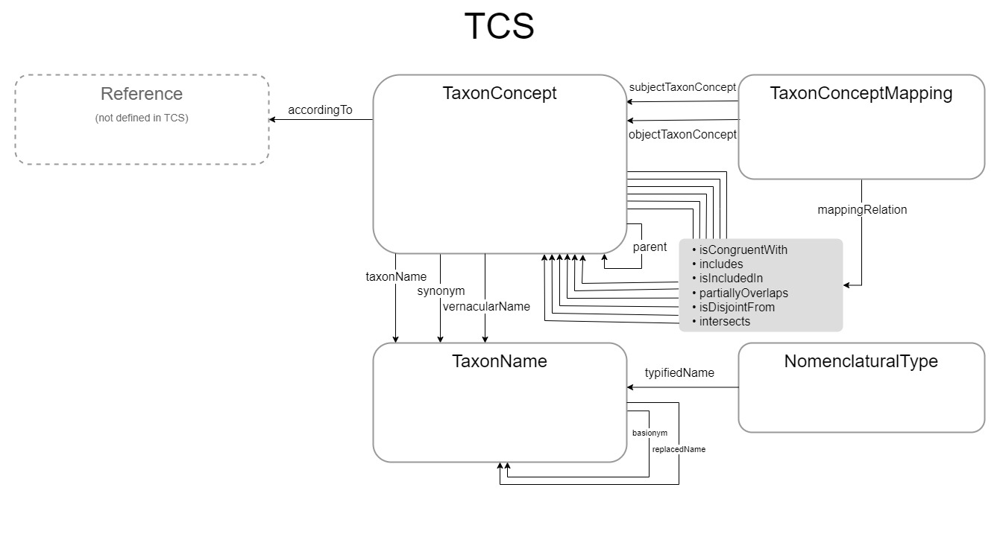
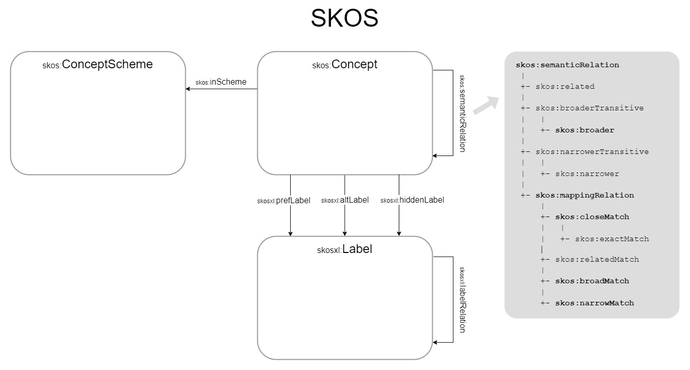
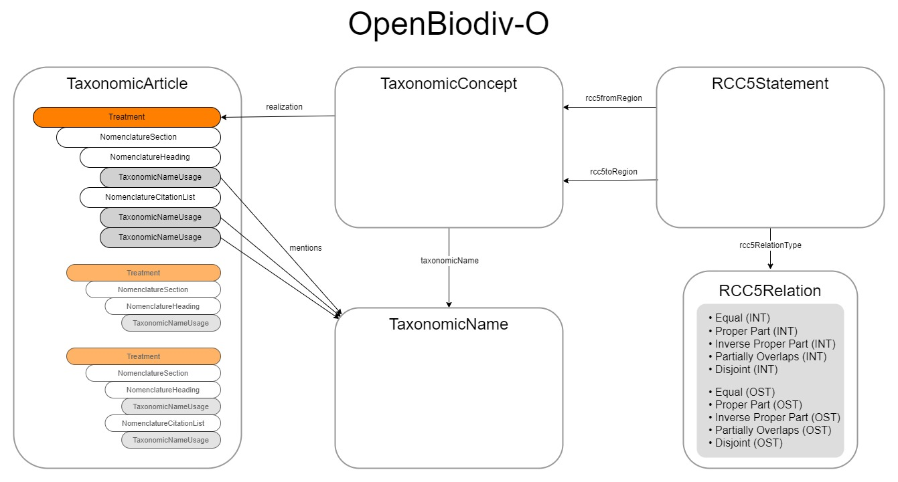

# Feature report 

## Introduction

The Taxon Concept Schema (TCS) is the TDWG standard for exchanging taxonomic
data. It is one of the '2005' group of standards, together with Access to
Biological Collections Data (ABCD) and Structured Descriptive Data (SDD), that
consists of an XML Schema. Unlike ABCD, TCS did not have a dedicated group of
users or maintainers and has not been maintained since shortly after it was
ratified. Any problems that people might have with TCS were never fixed, because
there was no mechanism for making formal changes to the XML Schema.

As TCS is an XML Schema, data delivered as TCS has to be XML, which was the
predominant format for data exchange at the time. A few years after TCS was
ratified, another format, Comma-delimited Values (CSV), became people's
preferred format for shipping around large amounts of data, at least in the
Biodiversity Data domain. Another issue people have with TCS is that it can only
be used for complete data sets and not for individual Taxon Concepts or Taxon
Names.

Since Darwin Core was ratified in 2009, the Darwin Core Taxon class has been the
main vehicle for shipping around taxonomic data. Darwin Core, because it is a
vocabulary standard, can be delivered in various formats, including CSV.

There has been dissatisfaction with the Darwin Core Taxon class for exchanging
taxonomic data, however, predominantly because people feel it is too permissive.
Darwin Core Taxon data may be syntactically correct but have a meaning that is
incompatible with the consumer's data model. The Darwin Core Taxon class also
has references to objects that are not defined and its implementation allows for
data artefacts that are not taxa by any definition, including that of the Darwin
Core Taxon itself.

These issues were the reason that the Darwin Core RDF Guide (Darwin Core and
RDF/OWL Task Groups 2015
[\[darwin_core_and_rdfowl_task_groups_darwin_2015\]](../bibliography/#darwin_core_and_rdfowl_task_groups_darwin_2015))
concluded that the creation of functional `dwc:Taxon` instances described using
RDF was not possible at the time of writing and that the task of describing
taxonomic entities would have to be an effort outside of Darwin Core. TCS 2 is
that effort.

In 2017, the Vocabulary Maintenance Standard (VMS) and Standard Documentation
Standard (SDS) were ratified, which established a mechanism by which existing
TDWG standards should be maintained and documented. In 2018, the then Taxonomic
Names and Concepts Interest Group (TNC)—which was also responsible for the
creation of TCS 1—set out to review TCS, the TDWG Taxon Concept and Taxon Name
LSID Ontologies, the Darwin Core Taxon class and other systems for exchanging
taxonomic data that were out there. In 2020, a new charter for the TNC was
ratified, which made the TNC the Interest Group that maintains TCS and which
lead to a change of the name of the Interest Group to TCS Maintenance Group. A
charter for the TCS 2 Task Group, to create the new version of TCS, was ratified
in 2021.

TCS 2, which we now bring to public review, takes TCS out of its XML Schema and
converts it to a vocabulary standard, like Darwin Core, that does not impose a
data format and can be maintained under the VMS.

## Parameters

The purpose of the current work is to make TCS useable again by changing it from
an XML Schema to a vocabulary standard. Changes we propose are as far as
possible only structural and do not affect the meaning of terms. Because TCS 2
is a vocabulary standard we have had to provide new definitions for many of the
terms, as in TCS 1 the meaning of elements and attributes was largely implicit,
but the Taxon Concept and Taxon Name in TCS 2 are the Taxon Concept and Taxon
Name in TCS 1 and the same goes for all other terms. No completely new terms
have been added.

Where possible, we borrow terms from other existing standards, rather than
defining them in TCS. The parsed name properties, as well as some other Taxon
Name properties, are borrowed from Darwin Core and some Taxon Concept properties
from Dublin Core. There are some other terms which have been defined in TCS as
IRI properties, which have literal equivalents in Darwin Core. In most cases,
they will share the same label.

While the formal TDWG standard we are replacing is an XML Schema (XSD), we were
influenced by and borrowed from the TDWG [Taxon
Concept](https://github.com/tdwg/ontology/blob/master/ontology/voc/TaxonConcept.rdf)
and [Taxon
Name](https://github.com/tdwg/ontology/blob/master/ontology/voc/TaxonName.rdf)
LSID Ontologies, (with non-resolving URIs:
`http://rs.tdwg.org/ontology/voc/TaxonConcept` and
`http://rs.tdwg.org/ontology/voc/TaxonName`), which were primarily developed by
Roger Hyam. These were a rather precise translation of the TCS XML Schema into
OWL ontologies. Because the TDWG Ontologies were never standardized, we could
not directly import terms from them, but, conceptually, much from the TDWG
Ontologies can be found back in TCS 2.

## Changes
 
The most important change is that while in TCS 1 only the `Name` element is required—and then a `Name` can either be a text
node, so a string, or a reference (`ref`) to a `TaxonName` element with an `id`
attribute—and the `AccordingTo` element is not, in TCS 2 both `taxonName` and
`accordingTo` are required and both properties are IRI or object properties.
Every TCS 2 Taxon Concept object has to have a source, or `accordingTo`, which
is a publication or other other form of communication where a taxon is defined
in a certain way. This means that every Taxon Concept is traceable to a source
and identifiable. Every TaxonConcept also must have a label and, while there are
alternative properties, like `dcterms:title` and `dwc:scientificName`, for
providing labels we think that for interoperability of TCS data sets it is
important that the label is always provided with the same property. Therefore,
the `taxonName` property is also required.

The most important structural change we made was dismantling the Taxon
Relationship object that both TCS 1 and the Taxon Concept Ontology have. We want
TCS to be a vocabulary standard, i.e. a set of terms and definitions, so TCS
should not prescribe a certain syntax.

Another problem with an all-purpose relationship object is that it obscures the
nature of the relationship. Not all relationship types in TCS 1 are
relationships between Taxon Concepts, some are relationships between Taxon
Concepts and Taxon Names. Also, relationships between Taxon Names in TCS 1 are
elements (owl:objectProperty in the TDWG Taxon Name LSID Ontology), while
relationships between Taxon Concepts (and some between Taxon Concepts and Taxon
Names) are values in an enumeration (owl:Class in the TDWG Taxon Concept LSID
Ontology).

By elevating the values from the Taxon Relationship Type enumeration to
first-class TCS properties and leaving the syntax out of the standard, people
can choose whether to connect them to the subject Taxon Concept, or use them in
a utility object outside TCS, for example the Darwin Core Resource Relationship
class. The shape of the data may dictate the use of a relationship object, but
the terms have the same meaning, regardless of the syntax.

The one thing that really needed to be fixed in TCS was the 'has synonym'
relationship type. The documentation of the term in TCS 1 already identifies
'has synonym' as a mixed concept:

> The target concept is considered a synonym of the current concept. This is an
> ambiguous relationship. It can mean: 1) a nomenclatural relationship where all
> that is implied is that the type of the target concept is included in the
> current circumscription. This is more precisely expressed as a
> SpecimenCircumscription (for heterotypic synonyms) or as TaxonName basionym
> relationships (for homotypic synonyms) 2) a concept relationship where some
> part of (or all of) the target concept is included in the current
> circumscription. This is more precisely expressed using the set relationships
> such as 'is congruent to'. This is intended for handling legacy data.

To resolve this issue, we have split the term into `synonym` (for meaning 1) and
`intersects` (for meaning 2). `intersects` is a mapping property that is the
union of the `isCongruentWith`, `includes`, `isIncludedIn` and
`partiallyOverlaps` (and the opposite of `isDisjointFrom`) mapping properties
and thus can be used when the exact nature of the relationship is not known, or
not indicated. We have found that this relation is not only useful for dealing
with references to other treatments in the nomenclature section of a treatment
(what the TCS 1 definition calls 'legacy data'), but for any references to other
treatments, *e.g.* the references in a Catalogue of Life entry (see the
[_Megalorhipida leucodactylus_
example](https://github.com/tdwg/tcs2/blob/master/examples/megalorhipida-leucodactylus-sec-gielis-et-hobern-2020.ttl)).

We currently recognise the following relations between the major entities in
TCS:

### Relationships between Taxon Concepts (taxa)

#### Hierarchical relationships

- tcs:parent

#### Horizontal relationships*

- tcs:isCongruentWith
- tcs:includes
- tcs:isIncludedIn
- tcs:partiallyOverlaps
- tcs:isDisjointWith
- tcs:intersects

*Horizontal relationships between Taxon Concepts are relationships
between Taxon Concepts in different taxonomies (or different versions of a
taxonomy), or between Taxon Concepts in rank-free systems, e.g., cladograms.

### Relationships between Taxon Concepts and Taxon Names

- tcs:taxonName
- tcs:synonym
- tcs:vernacularName

### Relationships between Taxon Names

- tcs:basionym
- tcs:replacedSynonym
- tcs:basedOn
- tcs:conservedAgainst
- tcs:laterHomonymOf

We have included a TaxonConceptMapping class, as it is often useful to have
objects for Taxon Concept mappings that can be shared. The TaxonConceptMapping
class replaces the TaxonRelationshipAssertion element in TCS 1, but is only to
be used with the relationship types that TCS 1 calls 'set relationships'. In TCS
2, the properties that can be used as object for the `mappingRelation` property
are the mapping properties, *i.e.* `isCongruentWith`, `includes`,
`isIncludedIn`, `partiallyOverlaps`, `isDisjointFrom` and `intersects`.

 

## Terms omitted from the initial release

The most significant thing that has been left out of TCS 2 for now is the
circumscription or definition of taxa. TCS 1 has the `CharacterCircumscription`
and `SpecimenCircumscription` elements, translated to `DescribedBy` and
`CircumscribedBy`, respectively, in the TDWG Ontology. These have been left out
of the initial release of TCS 2, because we are not aware of any systems using
them and because it is not immediately apparent how they should be used,
especially for `CharacterCircumscription`, or that they are the only and best
way to express circumscription in TCS. Just because it is not included yet does
not mean circumscription is not important. The TCS Maintenance Group has every
intention of adding circumscription to TCS at a later stage in a separate
effort. If we are to include circumscription in TCS, it should be done in a way
that it is operational and computer-tractable. Lists of characters (or
descriptions) and lists of specimens are better accommodated in other TDWG
standards, like Plinian Core and SDD.

All parsed name terms, except 'uninomial', are in Darwin Core and have been
borrowed from there. We think that, if people have a need for a 'uninomial'
term, it might be best to have that in Darwin Core as well.

Finally, several of the relations in the Taxon Relationship Type enumeration
have not (yet) been included as properties. Some of these are negations of
adopted terms that are in groups of more than two, making their meaning
ambiguous, e.g. `does not include`. Others, like the hybrid parent terms seem to
have more to do with the format of hybrid formulas than with relationships
between taxa, and yet others, e.g., `anamorph of`, only apply to certain groups
of organisms and are not used in systems designed specifically for these groups.

## Place in TDWG ecosystem

Unlike other TDWG standards like Audiovisual Core and Latimer Core—and also
unlike the time when TCS shared the stage with ABCD and SDD—TCS does not have
its own subdomain within the TDWG infrastructure but falls completely within the
domain that is also covered by Darwin Core. TCS shines where the data becomes more structured and more semantic.

The figure below shows the application profiles that already exist or are being
planned in the domain that is covered by Darwin Core.

On the left is occurrence or specimen data and on the right is taxonomic and
nomenclatural data. From top to bottom, or from Darwin Core Archive to
Frictionless Data Package to RDF, the structure of and semantics in the data
increases.

The niche of TCS is in the bottom-right of the figure. It has already been said
before that the Darwin Core Taxon class does not work with RDF and that TCS is
meant to fill the gap. It is to be expected that the Darwin Core Data Package
(DwC-DP) will not have an equivalent to the Darwin Core Archive Taxon Core,
because the Catalogue of Life Data Package (CoLDP) already occupies that space.
CoLDP has got two different schemas, one with a NameUsage table, which is
equivalent to the Darwin Core Taxon, and another with Taxon and Name tables,
which are equivalent to the TCS Taxon Concept and Taxon Name respectively. The
latter schema is already very nearly TCS compliant. It is therefore the
intention that we won't develop a TDWG TCS Data Package, but that we work with
Catalogue of Life to make ColDP fully TCS compliant, so that CoLDP can be the
Data Package application profile for TCS.

## Broader context: SKOS and OpenBiodiv-O

TCS can be usefully compared with SKOS (Simple Knowledge Organization System),
with the Taxon Concept equivalent to the `skos:Concept` and the Taxon Name to
the `skosxl:Label`. The taxonomy or publication the Taxon Concepts are in can be
compared to the `skos:ConceptScheme` and therefore the `accordingTo` property to
the `skos:inScheme` property. `taxonName`, `synonym` and `vernacularName` can be
seen as `skosxl:prefLabel`, `skosxl:hiddenLabel` and `skosxl:altLabel`
respectively. Relationships between names are `skosxl:labelRelation` properties
and relationships between taxa `skos:semanticRelation` properties, with the
hierarchical relationships being `skos:broader` and `skos:narrower` and the
horizontal ones `skos:mappingRelation`s. In SKOS, `skos:broader` and
`skos:narrower` are used between Concepts in the same Concept Scheme, while the
`skos:mappingRelation` properties are used to map Concepts from different
Concept Schemes. Likewise, in TCS, hierarchical relationship terms are only used
within the same taxonomy, while the horizontal relationship terms are primarily
used to align Taxon Concepts between different taxonomies or different versions
of a taxonomy.

 

**Table 1**: Mapping of TCS relations to SKOS terms

| TCS | SKOS|
|-|-|
| **tcs:TaxonConcept** | **skos:Concept** |
| tcs:accordingTo | skos:inScheme |
| | |
| tcs:taxonName | skosxl:prefLabel |
| tcs:synonym | skosxl:hiddenLabel |
| tcs:vernacularName | skosxl:altLabel |
| | |
| tcs:parent | skos:broader |
| | |
| tcs:isCongruentWith | skos:closeMatch |
| tcs:includes | skos:narrowMatch |
| tcs:isIncludedIn | skos:broadMatch |
| tcs:partiallyOverlaps | skos:relatedMatch |
| tcs:isDisjointWith | skos:relatedMatch |
| tcs:intersects | skos:relatedMatch |
| | |
| **tcs:TaxonName** | **skosxl:Label** |
| tcs:nameString | skosxl:literalForm |
| | |
| tcs:basionym | skosxl:labelRelation |
| tcs:replacedSynonym | skosxl:labelRelation |
| tcs:conservedAgainst | skosxl:labelRelation |
| tcs:spellingCorrectionOf | skosxl:labelRelation |
| tcs:laterHomonymOf | skosxl:labelRelation |

  

The OpenBiodiv Ontology (OpenBiodiv-O) defines the `TaxonomicConcept` as a Work
under the FRBR (Functional Requirements for Bibliographic Records) data model as
well as a SKOS Concept. A `Work` in FRBR is the product of an intellectual
process of one or more persons, about which only indirect evidence is at our
hand. The Expression that realises this Work is the Treatment. While in FRBR a
Work can have more than one Expression, there is a one-to-one relationship
between Taxonomic Concepts and Treatment. This is exactly how we think of Taxon
Concepts in TCS and forms a nice bridge between Taxon (or Taxonomic) Concepts
and the literature. Librarians among us will recognise FRBR as the data model,
or one of the data models, behind RDA (Resource Description and Access), a
cataloguing standard that is used world-wide.

One or more Treatments are contained in a `TaxonomicArticle`. Therefore, the
`accordingTo` property in TCS can point to either a Taxonomic Article or an
individual Treatment. It should be noted that the Taxonomic Article and
everything contained in it have no counterparts in TCS and that TCS relies on
other specifications for those.

In other respects, TCS is a bit broader than OpenBiodiv-O. Every
`OperationalTaxonomicUnit`, which is a superclass of `TaxonomicConcept` in
OpenBiodiv-O, can be expressed as a TCS Taxon Concept, if there is a reason to
do so. Also, there are categories of Taxon Concepts that TCS needs to be able to
deal with, like entries in Catalogue of Life or AviBase, that, while fitting the
definition of a Taxonomic Concept, can (probably) not be expressed in
OpenBiodiv-O.

The `RCC5Statement` in OpenBiodiv-O is equivalent to the `TaxonConceptMapping`
in TCS.

 

  

## Appendix 1: Mapping of TCS 1 and TDWG Ontology terms

### Taxon Concept

TCS 1 | TDWG Ontology | TCS 2
-|-|-
/DataSet/TaxonConcepts/TaxonConcept | [tc:TaxonConcept](https://github.com/tdwg/tnc/blob/5d3950009e2462e7d8c930dc08f4733738b9133d/tcs-docs/TaxonConcept.ttl#L36) | **[TaxonConcept](https://github.com/tdwg/tcs2/tree/master/docs/tcs-terms#tcstaxonconcept)**
/DataSet/TaxonConcepts/TaxonConcept/@type | &mdash; | &mdash;
/DataSet/TaxonConcepts/TaxonConcept/Rank | [tc:rankString](https://github.com/tdwg/tnc/blob/5d3950009e2462e7d8c930dc08f4733738b9133d/tcs-docs/TaxonConcept.ttl#L142) | [dwc:verbatimTaxonRank](https://github.com/tdwg/tcs2/tree/master/docs/tcs-terms#dwcverbatimtaxonrank)
/DataSet/TaxonConcepts/TaxonConcept/Rank/@code | [tc:rank](https://github.com/tdwg/tnc/blob/5d3950009e2462e7d8c930dc08f4733738b9133d/tcs-docs/TaxonConcept.ttl#L157) | [taxonomicRank](https://github.com/tdwg/tcs2/tree/master/docs/tcs-terms#tcstaxonomicrank)
/DataSet/TaxonConcepts/TaxonConcept/Name | [tc:nameString](https://github.com/tdwg/tnc/blob/5d3950009e2462e7d8c930dc08f4733738b9133d/tcs-docs/TaxonConcept.ttl#L72) | [dcterms:title](https://github.com/tdwg/tcs2/tree/master/docs/tcs-terms#dctermstitle) \| [dwc:scientificName](https://github.com/tdwg/tcs2/tree/master/docs/tcs-terms#dwcscientificname) \| [dwc:vernacularName](https://github.com/tdwg/tcs2/tree/master/docs/tcs-terms#dwcvernacularname)
/DataSet/TaxonConcepts/TaxonConcept/Name/@ref | [tc:hasName](https://github.com/tdwg/tnc/blob/5d3950009e2462e7d8c930dc08f4733738b9133d/tcs-docs/TaxonConcept.ttl#L65) | [taxonName](https://github.com/tdwg/tcs2/tree/master/docs/tcs-terms#tcstaxonname)
/DataSet/TaxonConcepts/TaxonConcept/AccordingTo/AccordingToDetailed | [tc:accordingTo](https://github.com/tdwg/tnc/blob/5d3950009e2462e7d8c930dc08f4733738b9133d/tcs-docs/TaxonConcept.ttl#L50) | [accordingTo](https://github.com/tdwg/tcs2/tree/master/docs/tcs-terms#tcsaccordingto)
/DataSet/TaxonConcepts/TaxonConcept/AccordingTo/AccordingToSimple | [tc:accordingToString](https://github.com/tdwg/tnc/blob/5d3950009e2462e7d8c930dc08f4733738b9133d/tcs-docs/TaxonConcept.ttl#L58) | &mdash;
/DataSet/TaxonConcepts/TaxonConcept/SpecimenCircumscription | [tc:circumscribedBy](https://github.com/tdwg/tnc/blob/5d3950009e2462e7d8c930dc08f4733738b9133d/tcs-docs/TaxonConcept.ttl#L80) | &mdash;
/DataSet/TaxonConcepts/TaxonConcept/CharacterCircumscription | [tc:describedBy](https://github.com/tdwg/tnc/blob/5d3950009e2462e7d8c930dc08f4733738b9133d/tcs-docs/TaxonConcept.ttl#L87) | &mdash;

### Taxon Relationship / Taxon Relationship Assertion

* TaxonConceptMapping in TCS 2 is only used for the subset of relationship types that TCS 1 calls set relationships.

TCS 1 | TDWG Ontology | TCS 2*
-|-|-
/DataSet/TaxonConcepts/TaxonConcept/TaxonRelationships/TaxonRelationship \| /DataSet/TaxonRelationshipAssertions/TaxonRelationshipAssertion | [tc:Relationship](https://github.com/tdwg/tnc/blob/5d3950009e2462e7d8c930dc08f4733738b9133d/tcs-docs/TaxonConcept.ttl#L42) | [TaxonConceptMapping](https://github.com/tdwg/tcs2/tree/master/docs/tcs-terms#tcstaxonconceptmapping)
/DataSet/TaxonConcepts/TaxonConcept/Relationships/Relationship/@type \| /DataSet/TaxonRelationshipAssertions/TaxonRelationshipAssertion/@type | [tc:relationshipCategory](https://github.com/tdwg/tnc/blob/5d3950009e2462e7d8c930dc08f4733738b9133d/tcs-docs/TaxonConcept.ttl#L128) | [mappingRelation](https://github.com/tdwg/tcs2/tree/master/docs/tcs-terms#tcsmappingrelation)
/DataSet/TaxonRelationshipAssertions/TaxonRelationshipAssertion/FromTaxonConcept | [tc:fromTaxon](https://github.com/tdwg/tnc/blob/5d3950009e2462e7d8c930dc08f4733738b9133d/tcs-docs/TaxonConcept.ttl#L94) | [subjectTaxonConcept](https://github.com/tdwg/tcs2/tree/master/docs/tcs-terms#tcssubjecttaxonconcept)
/DataSet/TaxonRelationshipAssertions/TaxonRelationshipAssertion/ToTaxonConcept \| /DataSet/TaxonConcepts/TaxonConcept/TaxonRelationships/TaxonRelationship/ToTaxonConcept | [tc:toTaxon](https://github.com/tdwg/tnc/blob/5d3950009e2462e7d8c930dc08f4733738b9133d/tcs-docs/TaxonConcept.ttl#L134) | [objectTaxonConcept](https://github.com/tdwg/tcs2/tree/master/docs/tcs-terms#tcsobjecttaxonconcept)
/DataSet/TaxonRelationshipAssertions/TaxonRelationshipAssertion/AccordingTo | &mdash; | [mappingAccordingTo](https://github.com/tdwg/tcs2/tree/master/docs/tcs-terms#tcsmappingaccordingto)

### Relationship Type vocabulary

TCS 1 | TDWG Ontology | TCS 2 
-|-|-
is congruent to | [tc:IsCongruentTo](https://github.com/tdwg/tnc/blob/5d3950009e2462e7d8c930dc08f4733738b9133d/tcs-docs/TaxonConcept.ttl#L252) | [isCongruentWith](https://github.com/tdwg/tcs2/tree/master/docs/tcs-terms#tcsiscongruentwith)
is not congruent to | [tc:IsNotCongruentTo](https://github.com/tdwg/tnc/blob/5d3950009e2462e7d8c930dc08f4733738b9133d/tcs-docs/TaxonConcept.ttl#L299) | &mdash;
includes | [tc:Includes](https://github.com/tdwg/tnc/blob/5d3950009e2462e7d8c930dc08f4733738b9133d/tcs-docs/TaxonConcept.ttl#L222) | [includes](https://github.com/tdwg/tcs2/tree/master/docs/tcs-terms#tcsincludes)
does not include | [tc:DoesNotInclude](https://github.com/tdwg/tnc/blob/5d3950009e2462e7d8c930dc08f4733738b9133d/tcs-docs/TaxonConcept.ttl#L178) | &mdash;
excludes | [tc:Excludes](https://github.com/tdwg/tnc/blob/5d3950009e2462e7d8c930dc08f4733738b9133d/tcs-docs/TaxonConcept.ttl#L191) | [isDisjointFrom](https://github.com/tdwg/tcs2/tree/master/docs/tcs-terms#tcsisdisjointfrom)
is included in | [tc:IsIncludedIn](https://github.com/tdwg/tnc/blob/5d3950009e2462e7d8c930dc08f4733738b9133d/tcs-docs/TaxonConcept.ttl#L286) | [isIncludedIn](https://github.com/tdwg/tcs2/tree/master/docs/tcs-terms#tcsisincludedin)
is not included in | [tc:IsNotIncludedIn](https://github.com/tdwg/tnc/blob/5d3950009e2462e7d8c930dc08f4733738b9133d/tcs-docs/TaxonConcept.ttl#L306) | &mdash;
overlaps | [tc:Overlaps](https://github.com/tdwg/tnc/blob/5d3950009e2462e7d8c930dc08f4733738b9133d/tcs-docs/TaxonConcept.ttl#L357) | [partiallyOverlaps](https://github.com/tdwg/tcs2/tree/master/docs/tcs-terms#tcspartiallyoverlaps)
does not overlap | [tc:DoesNotOverlap](https://github.com/tdwg/tnc/blob/5d3950009e2462e7d8c930dc08f4733738b9133d/tcs-docs/TaxonConcept.ttl#L184) | &mdash;
 | | 
is child taxon of | [tc:IsChildTaxonOf](https://github.com/tdwg/tnc/blob/5d3950009e2462e7d8c930dc08f4733738b9133d/tcs-docs/TaxonConcept.ttl#L245) | [parent](https://github.com/tdwg/tcs2/tree/master/docs/tcs-terms#tcsparent)
is parent taxon of | [tc:IsParentTaxonOf](https://github.com/tdwg/tnc/blob/5d3950009e2462e7d8c930dc08f4733738b9133d/tcs-docs/TaxonConcept.ttl#L312) | [child](https://github.com/tdwg/tcs2/tree/master/docs/tcs-terms#tcschild)
 | | 
is anamorph of | [tc:IsAnamorphOf](https://github.com/tdwg/tnc/blob/5d3950009e2462e7d8c930dc08f4733738b9133d/tcs-docs/TaxonConcept.ttl#L237) | &mdash;
is teleomorph of | [tc:IsTeleomorphOf](https://github.com/tdwg/tnc/blob/5d3950009e2462e7d8c930dc08f4733738b9133d/tcs-docs/TaxonConcept.ttl#L340) | &mdash;
 | | 
is second parent of | [tc:IsSecondParentOf](https://github.com/tdwg/tnc/blob/5d3950009e2462e7d8c930dc08f4733738b9133d/tcs-docs/TaxonConcept.ttl#L319) | &mdash;
is female parent of | [tc:IsFemaleParentOf](https://github.com/tdwg/tnc/blob/5d3950009e2462e7d8c930dc08f4733738b9133d/tcs-docs/TaxonConcept.ttl#L259) | &mdash;
is first parent of | [tc:IsFirstParentOf](https://github.com/tdwg/tnc/blob/5d3950009e2462e7d8c930dc08f4733738b9133d/tcs-docs/TaxonConcept.ttl#L265) | &mdash;
is male parent of | [tc:IsMaleParentOf](https://github.com/tdwg/tnc/blob/5d3950009e2462e7d8c930dc08f4733738b9133d/tcs-docs/TaxonConcept.ttl#292) | &mdash;
is hybrid parent of | [tc:sHybridParentOf](https://github.com/tdwg/tnc/blob/5d3950009e2462e7d8c930dc08f4733738b9133d/tcs-docs/TaxonConcept.ttl#279) | &mdash;
is hybrid child of | [tc:IsHybridChildOf](https://github.com/tdwg/tnc/blob/5d3950009e2462e7d8c930dc08f4733738b9133d/tcs-docs/TaxonConcept.ttl#272) | &mdash;
 | | 
is ambiregnal of | [tc:IsAmbiregnalOf](https://github.com/tdwg/tnc/blob/5d3950009e2462e7d8c930dc08f4733738b9133d/tcs-docs/TaxonConcept.ttl#228) | &mdash;
 | | 
is vernacular for | [tc:IsVernacularFor](https://github.com/tdwg/tnc/blob/5d3950009e2462e7d8c930dc08f4733738b9133d/tcs-docs/TaxonConcept.ttl#348) | &mdash;
has vernacular | [tc:HasVernacular](https://github.com/tdwg/tnc/blob/5d3950009e2462e7d8c930dc08f4733738b9133d/tcs-docs/TaxonConcept.ttl#212) | [vernacularName](https://github.com/tdwg/tcs2/tree/master/docs/tcs-terms#tcsvernacularname)
has synonym | [tc:HasSynonym](https://github.com/tdwg/tnc/blob/5d3950009e2462e7d8c930dc08f4733738b9133d/tcs-docs/TaxonConcept.ttl#L198) | [synonym](https://github.com/tdwg/tcs2/tree/master/docs/tcs-terms#tcssynonym) \| [intersects](https://github.com/tdwg/tcs2/tree/master/docs/tcs-terms#tcsintersects)

### Taxon Concept type vocabulary

TCS 1 | TDWG Ontology | TCS 2
-|-|-
original | &mdash; | &mdash;
revision | &mdash; | &mdash;
incomplete | &mdash; | &mdash;
aggregate | &mdash; | &mdash;
nominal | &mdash; | &mdash;

### Taxonomic Rank vocabulary

* TCS 2 recommends the [Taxonomic Rank GBIF Vocabulary](https://rs.gbif.org/vocabulary/gbif/rank.xml)

#### TaxonomicRankAboveSuperfamilyEnum

TCS 1 | TDWG Ontology | TCS 2*
-|-|-
dom | &mdash; | [domain](http://rs.gbif.org/vocabulary/gbif/rank/domain)
superreg | &mdash; | &mdash;
reg | &mdash; | [kingdom](http://rs.gbif.org/vocabulary/gbif/rank/kingdom)
subreg | &mdash; | [subkingdom](http://rs.gbif.org/vocabulary/gbif/rank/subkingdom)
infrareg | &mdash; | &mdash;
superphyl_div | &mdash; | [superphylum](http://rs.gbif.org/vocabulary/gbif/rank/superphylum)
phyl_div | &mdash; | [phylum](http://rs.gbif.org/vocabulary/gbif/rank/phylum)
subphyl_div | &mdash; | [subphylum](http://rs.gbif.org/vocabulary/gbif/rank/subphylum)
infraphyl_div | &mdash; | &mdash;
supercl | &mdash; | [superclass](http://rs.gbif.org/vocabulary/gbif/rank/superclass)
cl | &mdash; | [class](http://rs.gbif.org/vocabulary/gbif/rank/class)
subcl | &mdash; | [subclass](http://rs.gbif.org/vocabulary/gbif/rank/subclass)
infracl | &mdash; | &mdash;
&mdash; | &mdash; | [supercohort](http://rs.gbif.org/vocabulary/gbif/rank/supercohort)
&mdash; | &mdash; | [cohort](http://rs.gbif.org/vocabulary/gbif/rank/cohort)
&mdash; | &mdash; | [subcohort](http://rs.gbif.org/vocabulary/gbif/rank/subcohort)
superord | &mdash; | [superorder](http://rs.gbif.org/vocabulary/gbif/rank/superorder)
ord | &mdash; | [order](http://rs.gbif.org/vocabulary/gbif/rank/order)
subord | &mdash; | [suborder](http://rs.gbif.org/vocabulary/gbif/rank/suborder)
infraord | &mdash; | [infraorder](http://rs.gbif.org/vocabulary/gbif/rank/infraorder)
taxsupragen | &mdash; | &mdash;

#### TaxonomicRankFamilyGroupEnum

TCS 1 | TDWG Ontology | TCS 2*
-|-|-
superfam | &mdash; | [superfamily](http://rs.gbif.org/vocabulary/gbif/rank/superfamily)
fam | &mdash; | [family](http://rs.gbif.org/vocabulary/gbif/rank/family)
subfam | &mdash; | [subfamily](http://rs.gbif.org/vocabulary/gbif/rank/subfamily)
infrafam | &mdash; | &mdash;

#### TaxonomicRankFamilySubdivisionEnum

TCS 1 | TDWG Ontology | TCS 2*
-|-|-
supertrib | &mdash; | &mdash;
trib | &mdash; | [tribe](http://rs.gbif.org/vocabulary/gbif/rank/tribe)
subtrib | &mdash; | [subtribe](http://rs.gbif.org/vocabulary/gbif/rank/subtribe)
infratrib | &mdash; | &mdash;

#### TaxonomicRankGenusGroupEnum

TCS 1 | TDWG Ontology | TCS 2*
-|-|-
gen | &mdash; | [genus](http://rs.gbif.org/vocabulary/gbif/rank/genus)
subgen | &mdash; | [subgenus](http://rs.gbif.org/vocabulary/gbif/rank/subgenus)
infragen | &mdash; | &mdash;

#### TaxonomicRankGenusSubdivisionEnum

TCS 1 | TDWG Ontology | TCS 2*
-|-|-
sect | &mdash; | [section](http://rs.gbif.org/vocabulary/gbif/rank/section)
subsect | &mdash; | [subsection](http://rs.gbif.org/vocabulary/gbif/rank/subsection)
ser | &mdash; | [series](http://rs.gbif.org/vocabulary/gbif/rank/series)
subser | &mdash; | [subseries](http://rs.gbif.org/vocabulary/gbif/rank/subseries)
aggr | &mdash; | [speciesAggregate](http://rs.gbif.org/vocabulary/gbif/rank/speciesAggregate)
taxinfragen | &mdash; | &mdash;

#### TaxonomicRankSpeciesGroupEnum

TCS 1 | TDWG Ontology | TCS 2*
-|-|-
sp | &mdash; | [species](http://rs.gbif.org/vocabulary/gbif/rank/species)
subsp_aggr | &mdash; | [subspecificAggregate](http://rs.gbif.org/vocabulary/gbif/rank/subspecificAggregate)
subsp | &mdash; | [subspecies](http://rs.gbif.org/vocabulary/gbif/rank/subspecies)

#### TaxonomicRankBelowSubspeciesEnum

TCS 1 | TDWG Ontology | TCS 2*
-|-|-
bv | &mdash; | &mdash;
pv | &mdash; | &mdash;
var | &mdash; | [variety](http://rs.gbif.org/vocabulary/gbif/rank/variety)
subvar | &mdash; | [subvariety](http://rs.gbif.org/vocabulary/gbif/rank/subvariety)
subsubvar | &mdash; | &mdash;
fm | &mdash; | [form](http://rs.gbif.org/vocabulary/gbif/rank/form)
subfm | &mdash; | [subform](http://rs.gbif.org/vocabulary/gbif/rank/subform)
subsubfm | &mdash; | &mdash;
fsp | &mdash; | &mdash;
taxinfrasp | &mdash; | &mdash;
cand | &mdash; | &mdash;
infrasp | &mdash; | &mdash;

#### TaxonomicRankCultivatedPlants

TCS 1 | TDWG Ontology | TCS 2*
-|-|-
cvgroup | &mdash; | [cultivarGroup](http://rs.gbif.org/vocabulary/gbif/rank/cultivarGroup)
grex | &mdash; | &mdash;
cv | &mdash; | [cultivar](http://rs.gbif.org/vocabulary/gbif/rank/cultivar)
convar | &mdash; | &mdash;
graftchimaera | &mdash; | &mdash;
denomclass | &mdash; | &mdash;

TCS 1 | TDWG Ontology | TCS 2
-|-|-
&mdash; | &mdash; | [strain](http://rs.gbif.org/vocabulary/gbif/rank/strain)

### Taxon Name

TCS 1 | TDWG Ontology | TCS 2 
-|-|-
/DataSet/TaxonNames/TaxonName | [tn:TaxonName](https://github.com/tdwg/tnc/blob/5d3950009e2462e7d8c930dc08f4733738b9133d/tcs-docs/TaxonName.ttl#L29) | **[TaxonName](https://github.com/tdwg/tcs2/tree/master/docs/tcs-terms#tcstaxonname)**
/DataSet/TaxonNames/TaxonName/@nomenclaturalCode | [tn:nomenclaturalCode](https://github.com/tdwg/tnc/blob/5d3950009e2462e7d8c930dc08f4733738b9133d/tcs-docs/TaxonName.ttl#L173) | [nomenclaturalCode](https://github.com/tdwg/tcs2/tree/master/docs/tcs-terms#tcsnomenclaturalcode)
/DataSet/TaxonNames/TaxonName/@isAnamorphic | &mdash; | &mdash;
/DataSet/TaxonNames/TaxonName/Simple |   [tn:nameComplete](https://github.com/tdwg/tnc/blob/5d3950009e2462e7d8c930dc08f4733738b9133d/tcs-docs/TaxonName.ttl#L161) | [nameString](https://github.com/tdwg/tcs2/tree/master/docs/tcs-terms#tcsnameString)
/DataSet/TaxonNames/TaxonName/Rank | [tn:rankString](https://github.com/tdwg/tnc/blob/5d3950009e2462e7d8c930dc08f4733738b9133d/tcs-docs/TaxonName.ttl#L321) | [dwc:verbatimTaxonRank](https://github.com/tdwg/tcs2/tree/master/docs/tcs-terms#dwcverbatimtaxonrank)
/DataSet/TaxonNames/TaxonName/Rank/@code | [tn:rank](https://github.com/tdwg/tnc/blob/5d3950009e2462e7d8c930dc08f4733738b9133d/tcs-docs/TaxonName.ttl#L309) | [taxonRank](https://github.com/tdwg/tcs2/tree/master/docs/tcs-terms#tcstaxonomicrank)
/DataSet/TaxonNames/TaxonName/CanonicalName/Uninomial | [tn:uninomial](https://github.com/tdwg/tnc/blob/5d3950009e2462e7d8c930dc08f4733738b9133d/tcs-docs/TaxonName.ttl#L257) | &mdash;
/DataSet/TaxonNames/TaxonName/CanonicalName/Genus | [tn:genusPart](https://github.com/tdwg/tnc/blob/5d3950009e2462e7d8c930dc08f4733738b9133d/tcs-docs/TaxonName.ttl#L110) | [dwc:genericName](https://github.com/tdwg/tcs2/tree/master/docs/tcs-terms#dwcgenericname)
/DataSet/TaxonNames/TaxonName/CanonicalName/InfragenericEpithet | [tn:infragenericEpithet](https://github.com/tdwg/tnc/blob/5d3950009e2462e7d8c930dc08f4733738b9133d/tcs-docs/TaxonName.ttl#L133) | [dwc:infragenericEpithet](https://github.com/tdwg/tcs2/tree/master/docs/tcs-terms#dwcinfragenericepithet)
/DataSet/TaxonNames/TaxonName/CanonicalName/SpecificEpithet | [tn:specificEpithet](https://github.com/tdwg/tnc/blob/5d3950009e2462e7d8c930dc08f4733738b9133d/tcs-docs/TaxonName.ttl#L205) | [dwc:specificEpithet](https://github.com/tdwg/tcs2/tree/master/docs/tcs-terms#dwcspecificepithet)
/DataSet/TaxonNames/TaxonName/CanonicalName/InfraspecificEpithet | [tn:infraspecificEpithet](https://github.com/tdwg/tnc/blob/5d3950009e2462e7d8c930dc08f4733738b9133d/tcs-docs/TaxonName.ttl#L147) | [dwc:infraspecificEpithet](https://github.com/tdwg/tcs2/tree/master/docs/tcs-terms#dwcinfraspecificepithet)
/DataSet/TaxonNames/TaxonName/CanonicalName/CultivarNameGroup | [tn:cultivarNameGroup](https://github.com/tdwg/tnc/blob/5d3950009e2462e7d8c930dc08f4733738b9133d/tcs-docs/TaxonName.ttl#L97) | [dwc:cultivarEpithet](https://github.com/tdwg/tcs2/tree/master/docs/tcs-terms#dwccultivarepithet)
/DataSet/TaxonNames/TaxonName/CanonicalAuthorship/Simple | [tn:authorship](https://github.com/tdwg/tnc/blob/5d3950009e2462e7d8c930dc08f4733738b9133d/tcs-docs/TaxonName.ttl#L72) | [dwc:scientificNameAuthorship](https://github.com/tdwg/tcs2/tree/master/docs/tcs-terms#dwcscientificnameauthorship)
/DataSet/TaxonNames/TaxonName/CanonicalAuthorship/Authorship/Simple | [tn:combinationAuthorship](https://github.com/tdwg/tnc/blob/5d3950009e2462e7d8c930dc08f4733738b9133d/tcs-docs/TaxonName.ttl#L388) | [combinationAuthorLiteral](https://github.com/tdwg/tcs2/tree/master/docs/tcs-terms#tcscombinationauthorliteral) \| [combinationAscribedAuthorLiteral](https://github.com/tdwg/tcs2/tree/master/docs/tcs-terms#tcscombinationascribedauthorliteral)
/DataSet/TaxonNames/TaxonName/CanonicalAuthorship/Authorship/Authors | &mdash; | [combinationAuthor](https://github.com/tdwg/tcs2/tree/master/docs/tcs-terms#tcscombinationauthor) \| [combinationAscribedAuthor](https://github.com/tdwg/tcs2/tree/master/docs/tcs-terms#tcscombinationascribedauthor)
/DataSet/TaxonNames/TaxonName/CanonicalAuthorship/BasionymAuthorship/Simple | [  tn:basionymAuthorship](https://github.com/tdwg/tnc/blob/5d3950009e2462e7d8c930dc08f4733738b9133d/tcs-docs/TaxonName.ttl#L373) | [basionymAuthorLiteral](https://github.com/tdwg/tcs2/tree/master/docs/tcs-terms#tcsbasionymauthorliteral) \| [basionymAsctibedAuthorLiteral](https://github.com/tdwg/tcs2/tree/master/docs/tcs-terms#tcsbasionymascribedauthorliteral)
/DataSet/TaxonNames/TaxonName/CanonicalAuthorship/BasionymAuthorship/Authors | &mdash; | [basionymAuthor](https://github.com/tdwg/tcs2/tree/master/docs/tcs-terms#tcsbasionymauthor) \| [basionymAscribedAuthor](https://github.com/tdwg/tcs2/tree/master/docs/tcs-terms#tcsbasionymascribedauthor)
/DataSet/TaxonNames/TaxonName/CanonicalAuthorship/CombinationAuthorship/Simple | [tn:combinationAuthorship](https://github.com/tdwg/tnc/blob/5d3950009e2462e7d8c930dc08f4733738b9133d/tcs-docs/TaxonName.ttl#L388) | [combinationAuthorLiteral](https://github.com/tdwg/tcs2/tree/master/docs/tcs-terms#tcscombinationauthorliteral) \| [combinationAscribedAuthorLiteral](https://github.com/tdwg/tcs2/tree/master/docs/tcs-terms#tcscombinationascribedauthorliteral)
/DataSet/TaxonNames/TaxonName/CanonicalAuthorship/CombinationAuthorship/Authors | &mdash; | [combinationAuthor](https://github.com/tdwg/tcs2/tree/master/docs/tcs-terms#tcscombinationauthor) \| [combinationAscribedAuthor](https://github.com/tdwg/tcs2/tree/master/docs/tcs-terms#tcscombinationascribedauthor)
/DataSet/TaxonNames/TaxonName/PublishedIn | &mdash; | [namePublishedIn](https://github.com/tdwg/tcs2/tree/master/docs/tcs-terms#tcsnamepublishedin)
/DataSet/TaxonNames/TaxonName/Year | [tn:year](https://github.com/tdwg/tnc/blob/5d3950009e2462e7d8c930dc08f4733738b9133d/tcs-docs/TaxonName.ttl#L269) | [dwc:namePublishedInYear](https://github.com/tdwg/tcs2/tree/master/docs/tcs-terms#dwcnamepublishedinyear)
/DataSet/TaxonNames/TaxonName/MicroReference \| //element(*,NomenclaturalNoteType)/MicroReference | &mdash; | [microReference](https://github.com/tdwg/tcs2/tree/master/docs/tcs-terms#tcsmicroreference)
/DataSet/TaxonNames/TaxonName/Typification | &mdash; | [typification](https://github.com/tdwg/tcs2/tree/master/docs/tcs-terms#tcstypification)
/DataSet/TaxonNames/TaxonName/Typification/Simple | &mdash; | [typificationLiteral](https://github.com/tdwg/tcs2/tree/master/docs/tcs-terms#tcstypificationLiteral)
/DataSet/TaxonNames/TaxonName/SpellingCorrectionOf | [tn:spellingCorrection](https://github.com/tdwg/tnc/blob/5d3950009e2462e7d8c930dc08f4733738b9133d/tcs-docs/TaxonName.ttl#L647) | &mdash;
/DataSet/TaxonNames/TaxonName/Basionym | [tn:hasBasionym](https://github.com/tdwg/tnc/blob/5d3950009e2462e7d8c930dc08f4733738b9133d/tcs-docs/TaxonName.ttl#L296) | [basionym](https://github.com/tdwg/tcs2/tree/master/docs/tcs-terms#tcsbasionym)
/DataSet/TaxonNames/TaxonName/BasedOn | [tn:BasedOn](https://github.com/tdwg/tnc/blob/5d3950009e2462e7d8c930dc08f4733738b9133d/tcs-docs/TaxonName.ttl#L427) | [basedOn](https://github.com/tdwg/tcs2/tree/master/docs/tcs-terms#tcsbasedOn)
/DataSet/TaxonNames/TaxonName/ConservedAgainst | [tn:ConservedAgainst](https://github.com/tdwg/tnc/blob/5d3950009e2462e7d8c930dc08f4733738b9133d/tcs-docs/TaxonName.ttl#L433) | [conservedAgainst](https://github.com/tdwg/tcs2/tree/master/docs/tcs-terms#tcsconservedagainst)
/DataSet/TaxonNames/TaxonName/LaterHomonymOf | [tn:LaterHomonymOf](https://github.com/tdwg/tnc/blob/5d3950009e2462e7d8c930dc08f4733738b9133d/tcs-docs/TaxonName.ttl#L547) | [laterHomonymOf](https://github.com/tdwg/tcs2/tree/master/docs/tcs-terms#tcslaterhomonymof)
/DataSet/TaxonNames/TaxonName/Sanctioned | &mdash; | &mdash;
/DataSet/TaxonNames/TaxonName/ReplacementNameFor | [tn:ReplacementNameFor](https://github.com/tdwg/tnc/blob/5d3950009e2462e7d8c930dc08f4733738b9133d/tcs-docs/TaxonName.ttl#L630) | [replacedName](https://github.com/tdwg/tcs2/tree/master/docs/tcs-terms#tcsreplacedname)
/DataSet/TaxonNames/TaxonName/PublicationStatus | [tn:publicationStatus](https://github.com/tdwg/tnc/blob/5d3950009e2462e7d8c930dc08f4733738b9133d/tcs-docs/TaxonName.ttl#L624) | [nomenclaturalStatus](https://github.com/tdwg/tcs2/tree/master/docs/tcs-terms#tcsnomenclaturalstatus)

### Nomenclatural Code vocabulary

* TCS 2 recommends the GBIF [Nomenclatural Codes](https://rs.gbif.org/vocabulary/gbif/nomenclatural_code.xml) vocabulary

TCS 1 | TDWG Ontology | TCS 2*
-|-|-
Viral | [tn:Viral](https://github.com/tdwg/tnc/blob/5d3950009e2462e7d8c930dc08f4733738b9133d/tcs-docs/TaxonName.ttl#L675) | [ICVCN](http://rs.gbif.org/vocabulary/gbif/nomenclatural_code/ICVCN)
Bacteriological | [tn:Bacteriological](https://github.com/tdwg/tnc/blob/5d3950009e2462e7d8c930dc08f4733738b9133d/tcs-docs/TaxonName.ttl#L422) | [ICNB](http://rs.gbif.org/vocabulary/gbif/nomenclatural_code/ICNB)
Botanical | [tn:ICBN](https://github.com/tdwg/tnc/blob/5d3950009e2462e7d8c930dc08f4733738b9133d/tcs-docs/TaxonName.ttl#L505) | [ICN](http://rs.gbif.org/vocabulary/gbif/nomenclatural_code/ICN)
Zoological | [tn:ICZN](https://github.com/tdwg/tnc/blob/5d3950009e2462e7d8c930dc08f4733738b9133d/tcs-docs/TaxonName.ttl#L515) | [ICZN](http://rs.gbif.org/vocabulary/gbif/nomenclatural_code/ICZN)
CultivatedPlant | [tn:ICNCP](https://github.com/tdwg/tnc/blob/5d3950009e2462e7d8c930dc08f4733738b9133d/tcs-docs/TaxonName.ttl#L510) | [ICNCP](http://rs.gbif.org/vocabulary/gbif/nomenclatural_code/ICNCP)
Indeterminate | &mdash; | &mdash;
&mdash; | &mdash; | [BioCode](http://rs.gbif.org/vocabulary/gbif/nomenclatural_code/BioCode)

### Typification

TCS 1 | TDWG Ontology | TCS 2 
-|-|-
/DataSet/TaxonNames/TaxonName/Typification/TypeVouchers/TypeVoucher \| /DataSet/TaxonNames/TaxonName/Typification/TypeName | [tn:NomenclaturalType](https://github.com/tdwg/tnc/blob/5d3950009e2462e7d8c930dc08f4733738b9133d/tcs-docs/TaxonName.ttl#L45) | **[NomenclaturalType](https://github.com/tdwg/tcs2/tree/master/docs/tcs-terms#tcsnomenclaturaltype)**
&mdash; | &mdash; | [typifiedName](https://github.com/tdwg/tcs2/tree/master/docs/tcs-terms#tcstypifiedname)
/DataSet/TaxonNames/TaxonName/Typification/TypeVouchers/TypeVoucher/@typeofType | [tn:typeOfType](https://github.com/tdwg/tnc/blob/5d3950009e2462e7d8c930dc08f4733738b9133d/tcs-docs/TaxonName.ttl#L241) | [typeOfType](https://github.com/tdwg/tcs2/tree/master/docs/tcs-terms#tcstypeoftype)
/DataSet/TaxonNames/TaxonName/Typification/TypeVouchers/TypeVoucher/VoucherReference | [tn:typeSpecimen](https://github.com/tdwg/tnc/blob/5d3950009e2462e7d8c930dc08f4733738b9133d/tcs-docs/TaxonName.ttl#L249) | [typeSpecimen](https://github.com/tdwg/tcs2/tree/master/docs/tcs-terms#tcstypespecimen)
/DataSet/TaxonNames/TaxonName/Typification/TypeName/LectotypePublication \| /DataSet/TaxonNames/TaxonName/Typification/TypeVouchers/TypeVoucher/LectotypePublication \| /DataSet/TaxonNames/TaxonName/Typification/TypeName/LectotypePublication | &mdash; | [typePublishedIn](https://github.com/tdwg/tcs2/tree/master/docs/tcs-terms#tcstypepublishedin)
/DataSet/TaxonNames/TaxonName/Typification/TypeName/NameReference | [tn:typeName](https://github.com/tdwg/tnc/blob/5d3950009e2462e7d8c930dc08f4733738b9133d/tcs-docs/TaxonName.ttl#L233) | [typeName](https://github.com/tdwg/tcs2/tree/master/docs/tcs-terms#tcstypename)

### Type of Type vocabulary

* TCS 2 recommends the GBIF [Nomenclatural Type Status Vocabulary](https://rs.gbif.org/vocabulary/gbif/type_status.xml)

TCS 1 | TDWG Ontology | TCS 2*
-|-|-
allo | [tn:Allotype](https://github.com/tdwg/tnc/blob/5d3950009e2462e7d8c930dc08f4733738b9133d/tcs-docs/TaxonName.ttl#L416) | [allotype](http://rs.gbif.org/vocabulary/gbif/type_status/allotype)
allolecto | [tn:Allolectotype](https://github.com/tdwg/tnc/blob/5d3950009e2462e7d8c930dc08f4733738b9133d/tcs-docs/TaxonName.ttl#L406) | [allolectotype](http://rs.gbif.org/vocabulary/gbif/type_status/allolectotype)
alloneo | [tn:Alloneotype](https://github.com/tdwg/tnc/blob/5d3950009e2462e7d8c930dc08f4733738b9133d/tcs-docs/TaxonName.ttl#L411) | [alloneotype](http://rs.gbif.org/vocabulary/gbif/type_status/alloneotype)
co | [tn:Cotype](https://github.com/tdwg/tnc/blob/5d3950009e2462e7d8c930dc08f4733738b9133d/tcs-docs/TaxonName.ttl#L439) | [cotype](http://rs.gbif.org/vocabulary/gbif/type_status/cotype)
epi | [tn:Epitype](https://github.com/tdwg/tnc/blob/5d3950009e2462e7d8c930dc08f4733738b9133d/tcs-docs/TaxonName.ttl#L444) | [epitype](http://rs.gbif.org/vocabulary/gbif/type_status/epitype)
ex | [tn:ExType](https://github.com/tdwg/tnc/blob/5d3950009e2462e7d8c930dc08f4733738b9133d/tcs-docs/TaxonName.ttl#L486) | [extype](http://rs.gbif.org/vocabulary/gbif/type_status/exsyntype)
exepi | [tn:ExEpitype](https://github.com/tdwg/tnc/blob/5d3950009e2462e7d8c930dc08f4733738b9133d/tcs-docs/TaxonName.ttl#L451) | [exepitype](http://rs.gbif.org/vocabulary/gbif/type_status/exepitype)
exholo | [tn:ExHolotype](https://github.com/tdwg/tnc/blob/5d3950009e2462e7d8c930dc08f4733738b9133d/tcs-docs/TaxonName.ttl#L456) | [exholotype](http://rs.gbif.org/vocabulary/gbif/type_status/exholotype)
exiso | [tn:ExIsotype](https://github.com/tdwg/tnc/blob/5d3950009e2462e7d8c930dc08f4733738b9133d/tcs-docs/TaxonName.ttl#L273) | [exisotype](http://rs.gbif.org/vocabulary/gbif/type_status/exisotype)
exlecto | [tn:ExLectotype](https://github.com/tdwg/tnc/blob/5d3950009e2462e7d8c930dc08f4733738b9133d/tcs-docs/TaxonName.ttl#L466) | [exlectotype](http://rs.gbif.org/vocabulary/gbif/type_status/exlectotype)
exneo | [tn:ExNeotype](https://github.com/tdwg/tnc/blob/5d3950009e2462e7d8c930dc08f4733738b9133d/tcs-docs/TaxonName.ttl#L471) | [exneotype](http://rs.gbif.org/vocabulary/gbif/type_status/exneotype)
expara | [tn:ExParatype](https://github.com/tdwg/tnc/blob/5d3950009e2462e7d8c930dc08f4733738b9133d/tcs-docs/TaxonName.ttl#L476) | [exparatype](http://rs.gbif.org/vocabulary/gbif/type_status/exparatype)
exsyn | [tn:ExSyntype](https://github.com/tdwg/tnc/blob/5d3950009e2462e7d8c930dc08f4733738b9133d/tcs-docs/TaxonName.ttl#L481) | [exsyntype](http://rs.gbif.org/vocabulary/gbif/type_status/exsyntype)
hapanto | [tn:Hapantotype](https://github.com/tdwg/tnc/blob/5d3950009e2462e7d8c930dc08f4733738b9133d/tcs-docs/TaxonName.ttl#L491) | [hapantotype](http://rs.gbif.org/vocabulary/gbif/type_status/hapantotype)
holo | [tn:Holotype](https://github.com/tdwg/tnc/blob/5d3950009e2462e7d8c930dc08f4733738b9133d/tcs-docs/TaxonName.ttl#L498) | [holotype](http://rs.gbif.org/vocabulary/gbif/type_status/holotype)
icono | [tn:Iconotype](https://github.com/tdwg/tnc/blob/5d3950009e2462e7d8c930dc08f4733738b9133d/tcs-docs/TaxonName.ttl#L520) | [iconotype](http://rs.gbif.org/vocabulary/gbif/type_status/iconotype)
iso | [tn:Isotype](https://github.com/tdwg/tnc/blob/5d3950009e2462e7d8c930dc08f4733738b9133d/tcs-docs/TaxonName.ttl#L541) | [isotype](http://rs.gbif.org/vocabulary/gbif/type_status/isotype)
isolecto | [tn:IsoLectotype](https://github.com/tdwg/tnc/blob/5d3950009e2462e7d8c930dc08f4733738b9133d/tcs-docs/TaxonName.ttl#L526) | [isolectotype](http://rs.gbif.org/vocabulary/gbif/type_status/isolectotype)
isoneo | [tn:Isoneotype](https://github.com/tdwg/tnc/blob/5d3950009e2462e7d8c930dc08f4733738b9133d/tcs-docs/TaxonName.ttl#L531) | [isoneotype](http://rs.gbif.org/vocabulary/gbif/type_status/isoneotype)
isosyn | [tn:Isosyntype](https://github.com/tdwg/tnc/blob/5d3950009e2462e7d8c930dc08f4733738b9133d/tcs-docs/TaxonName.ttl#L536) | [isosyntype](http://rs.gbif.org/vocabulary/gbif/type_status/isosyntype)
lecto | [tn:Lectotype](https://github.com/tdwg/tnc/blob/5d3950009e2462e7d8c930dc08f4733738b9133d/tcs-docs/TaxonName.ttl#L553) | [lectotype]()
neo | [tn:Neotype](https://github.com/tdwg/tnc/blob/5d3950009e2462e7d8c930dc08f4733738b9133d/tcs-docs/TaxonName.ttl#L560) | [lectotype](http://rs.gbif.org/vocabulary/gbif/type_status/lectotype)
para | [tn:Paratype](https://github.com/tdwg/tnc/blob/5d3950009e2462e7d8c930dc08f4733738b9133d/tcs-docs/TaxonName.ttl#L582) | [paratype](http://rs.gbif.org/vocabulary/gbif/type_status/paratype)
paralecto | [tn:Paralectotype](https://github.com/tdwg/tnc/blob/5d3950009e2462e7d8c930dc08f4733738b9133d/tcs-docs/TaxonName.ttl#L572) | [paralectotype](http://rs.gbif.org/vocabulary/gbif/type_status/paralectotype)
paraneo | [tn:Paraneotype](https://github.com/tdwg/tnc/blob/5d3950009e2462e7d8c930dc08f4733738b9133d/tcs-docs/TaxonName.ttl#L577) | [paraneotype](http://rs.gbif.org/vocabulary/gbif/type_status/paraneotype)
plasto | [tn:Plastotype](https://github.com/tdwg/tnc/blob/5d3950009e2462e7d8c930dc08f4733738b9133d/tcs-docs/TaxonName.ttl#L609) | [plastotype](http://rs.gbif.org/vocabulary/gbif/type_status/plastotype)
plastoholo | [tn:Plastoholotype](https://github.com/tdwg/tnc/blob/5d3950009e2462e7d8c930dc08f4733738b9133d/tcs-docs/TaxonName.ttl#L589) | [plastoholotype](http://rs.gbif.org/vocabulary/gbif/type_status/plastoholotype)
plastoiso | [tn:Plastoisotype](https://github.com/tdwg/tnc/blob/5d3950009e2462e7d8c930dc08f4733738b9133d/tcs-docs/TaxonName.ttl#L594) | [plastoisotype](http://rs.gbif.org/vocabulary/gbif/type_status/plastoisotype)
plastolecto | [tn:Plastolectotype](https://github.com/tdwg/tnc/blob/5d3950009e2462e7d8c930dc08f4733738b9133d/tcs-docs/TaxonName.ttl#L599) | [plastolectotype](http://rs.gbif.org/vocabulary/gbif/type_status/plastolectotype)
plastoneo | [tn:Plastoneotype](https://github.com/tdwg/tnc/blob/5d3950009e2462e7d8c930dc08f4733738b9133d/tcs-docs/TaxonName.ttl#L604) | [plastoneotype](http://rs.gbif.org/vocabulary/gbif/type_status/plastoneotype)
plastopara | [tn:Plastoparatype](https://github.com/tdwg/tnc/blob/5d3950009e2462e7d8c930dc08f4733738b9133d/tcs-docs/TaxonName.ttl#L609) | [plastoparatype](http://rs.gbif.org/vocabulary/gbif/type_status/plastoparatype)
plastosyn | [tn:Plastosyntype](https://github.com/tdwg/tnc/blob/5d3950009e2462e7d8c930dc08f4733738b9133d/tcs-docs/TaxonName.ttl#L614) | [plastosyntype](http://rs.gbif.org/vocabulary/gbif/type_status/plastosyntype)
sec | [tn:SecondaryType](https://github.com/tdwg/tnc/blob/5d3950009e2462e7d8c930dc08f4733738b9133d/tcs-docs/TaxonName.ttl#L641) | [secondarytype](http://rs.gbif.org/vocabulary/gbif/type_status/secondarytype)
supp | [tn:SupplementaryType](https://github.com/tdwg/tnc/blob/5d3950009e2462e7d8c930dc08f4733738b9133d/tcs-docs/TaxonName.ttl#L652) | [supplementarytype](http://rs.gbif.org/vocabulary/gbif/type_status/supplementarytype)
syn | [tn:Syntype](https://github.com/tdwg/tnc/blob/5d3950009e2462e7d8c930dc08f4733738b9133d/tcs-docs/TaxonName.ttl#L657) | [syntype](http://rs.gbif.org/vocabulary/gbif/type_status/syntype)
topo | [tn:Topotype](https://github.com/tdwg/tnc/blob/5d3950009e2462e7d8c930dc08f4733738b9133d/tcs-docs/TaxonName.ttl#L663) | [topotype](http://rs.gbif.org/vocabulary/gbif/type_status/topotype)
type | [tn:Type](https://github.com/tdwg/tnc/blob/5d3950009e2462e7d8c930dc08f4733738b9133d/tcs-docs/TaxonName.ttl#L669) | [type](http://rs.gbif.org/vocabulary/gbif/type_status/type)
not | [tn:NotAType](https://github.com/tdwg/tnc/blob/5d3950009e2462e7d8c930dc08f4733738b9133d/tcs-docs/TaxonName.ttl#L567) | [notatype](http://rs.gbif.org/vocabulary/gbif/type_status/notatype)
&mdash; | &mdash; | [originalmaterial](http://rs.gbif.org/vocabulary/gbif/type_status/originalmaterial)
&mdash; | &mdash; | [typeSpecies](http://rs.gbif.org/vocabulary/gbif/type_status/typeSpecies)
&mdash; | &mdash; | [typeGenus](http://rs.gbif.org/vocabulary/gbif/type_status/typeGenus)