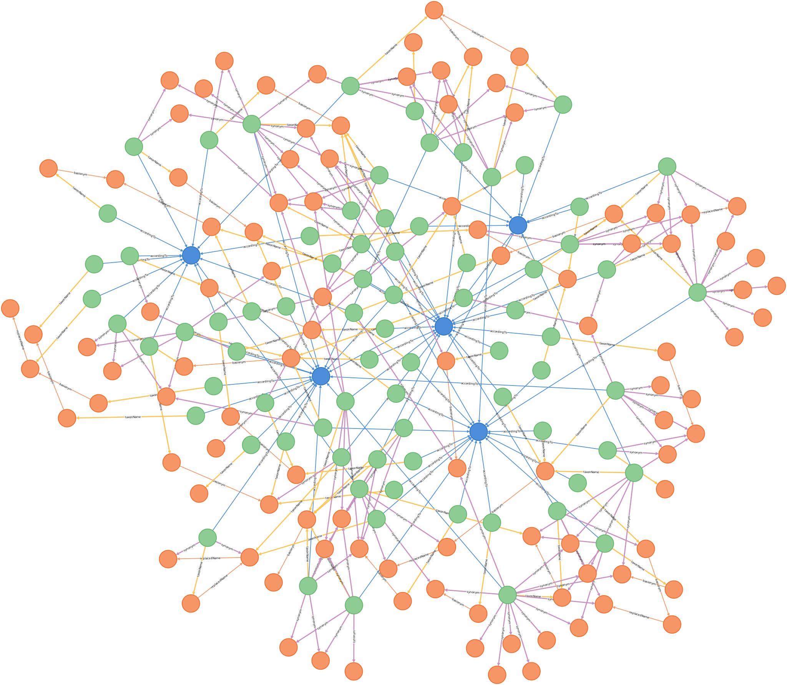
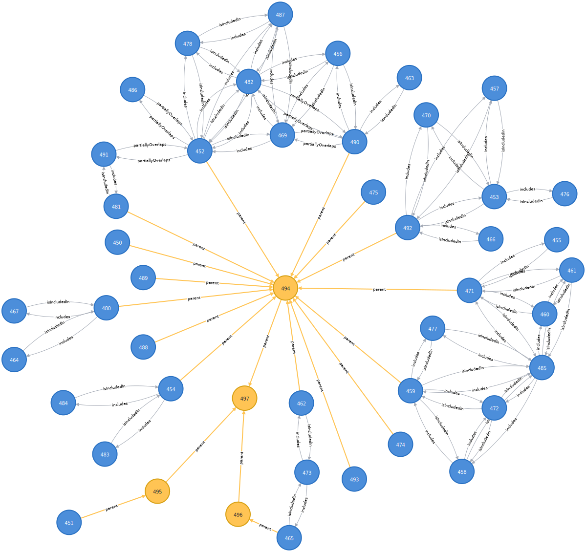

# Implementation experience report

No new features have been added in this revision of TCS. One of the main
objectives of the current effort is to make TCS useful again and all terms in
the current release are widely implemented in applications that are out there.
Terms for which a clear use case could not be identified have been left out of
this release.

A recent important application, the Catalog of Life Data Package (ColDP), has a
data model that is very similar to TCS and includes all TCS terms, the main
difference being that ColDP has a Synonym entity, which TCS does not. When TCS
is expressed in tabular form, a separate table is needed for synonyms, because
of the one-to-many relation between Taxon Concepts and Taxon Names (synonyms are
Taxon Names, just like accepted names), but there will be no identifiers for
synonyms. This is the same way the Name Relation in the ColDP schema works.

ColDP also offers a Name Usage entity "for simpler sharing". The "simpler
sharing" is probably because the ColDP Name Usage is essentially the Darwin Core
Taxon. When the names in a data set are unique, it is possible to roundtrip
between the two schemas of ColDP—i.e., the schema with Taxon and Name and the
schema with Name usage—and between TCS and Darwin Core.

TCS can play the same role for the Darwin Core Taxon that the Darwin Core IRI
(`dwciri`) namespace has for the other Darwin Core entities. Moreover the TCS
Nomenclatural Type can be used as the object for the `dwciri:typeStatus`
property.

 

**Fig. 1.** Taxon concepts (green dots) with their according-to (blue dots) and
all associated names (orange dots). Taxon Concepts are connected to names via
the `taxonName` and `synonym` properties and Taxon Names are connected to each
other through the `basionym` and `replacedName` properties. **A.** Dicranoloma
assimile sec. Klazenga 1999 ([figure-1a.svg](media/figure-1a.svg)), **B.** Dicranum assimile sec. Norris & Koponen
1990 ([figure-1b.svg](media/figure-1b.svg)), **C.** Dicranoloma assimile sec. Tan 1989 ([figure-1c.svg](media/figure-1c.svg)), **D.** Dicranoloma assimile sec.
Eddy 1988 ([figure-1d.svg](media/figure-1d.svg)), **E.** Dicranoloma assimile sec. Tan & Koponen 1983 ([figure-1e.svg](media/figure-1e.svg)).

**Fig. 2.** Graph with all Taxon Concepts, Taxon Names and references.

**Fig. 3.** Graph with all Taxon Concepts and Taxon Names.

**Fig. 4.** Taxon Names and their relationships. **A.** Name without other
combinations ([figure-4a.svg](media/figure-4a.svg)), **B.** basionym with two combinations ([figure-4b.svg](media/figure-4b.svg)), **C.** replacement name and
replaced name, both of which are the basionym of another combination ([figure-4c.svg](media/figure-4c.svg)), **D.**
replacement name of which the replaced name is the replacement name of another
name ([figure-4d.svg](media/figure-4d.svg)).

**Fig. 5.** Same Taxon Name graphs as in the previous figure, but with
`originalName` property connecting combinations to the same "original name" ([figure-5a.svg](media/figure-4a.svg), [figure-5b.svg](media/figure-5b.svg), [figure-5c.svg](media/figure-5c.svg), [figure-5d.svg](media/figure-5d.svg)).

**Fig. 6.** Examples of Taxon Concept Mappings using type specimens of names
that the concepts apply to. **==**: `isCongruentWith`; **>**: `includes`; **<**:
`isIncludedIn`; **><**: `partiallyOverlaps`. **A ∩ B**: specimens included in
both subject and object Taxon Concepts; **A – B**: specimens included in the
subject Taxon Concept but not in the object Taxon Concept; **B – A**: specimens
included in the object Taxon Concept but not in the subject Taxon Concept.

**Fig. 7** Taxon Concepts with mappings based on the type specimens of names
that are included in the concepts (ostensive mappings).

**Fig. 8.** Taxon Concepts with mappings that were added to the data set by the
author of the latest revision (intensional mappings).

**Fig. 9.** Taxon Concepts with intensional mappings and with higher-taxon concepts (yellow dots) and hierarchical (`parent`) relationships from the latest treatment (Klazenga, 1999).

**Fig. 10.** As previous figure, but with "group concepts" (AviBase's "deep
concepts"), representing all Taxon Concepts that are congruent with it and each
other.

**Fig. 11.** Taxon Concepts with ostensive mappings from Fig. 7 with
higher-taxon concepts and classification as in Fig. 9.

