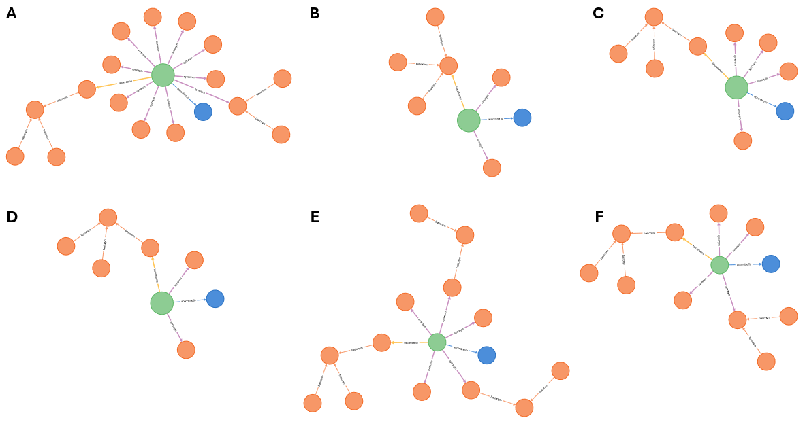
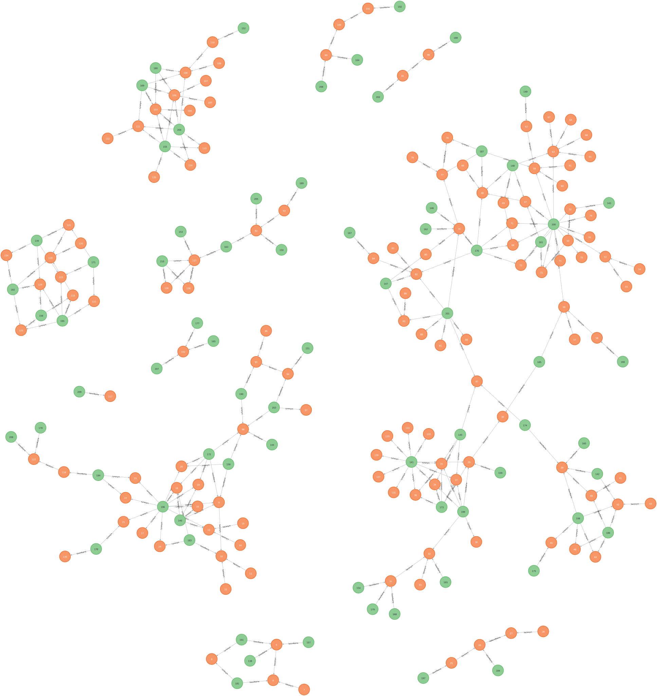
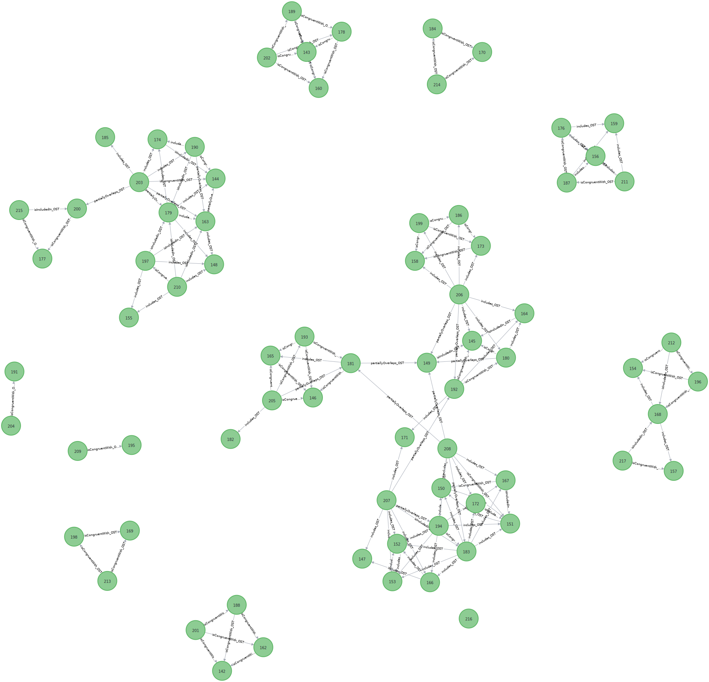
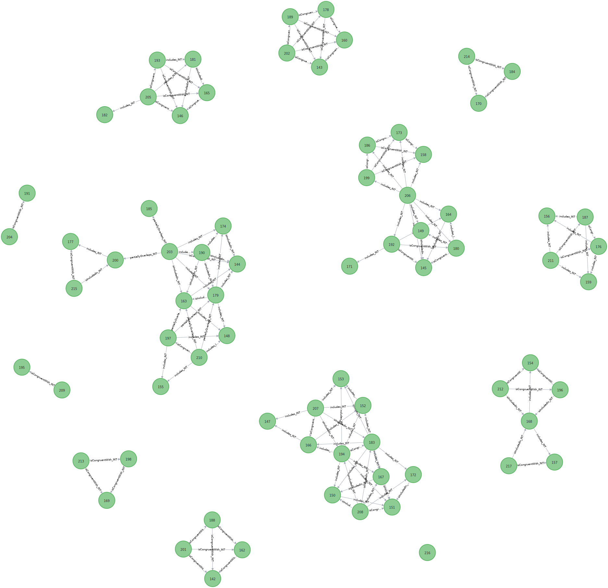

# TCS 2 Implementation Experience Report

**Title**
: TCS 2 Implementation Experience Report

**Date version created**
: 2025-08-09

**Part of TDWG standard**
: http://www.tdwg.org/standards/117

**This version**
: http://rs.tdwg.org/tcs/doc/implementation-experience-report/2025-08-09

**Latest version**
: http://rs.tdwg.org/tcs/doc/implementation-experience-report

**Abstract** 
: The TCS 2 Implementation Experience Report describes how TCS terms are already 
being implemented and provides a worked out example highlighting Taxon Concept 
Mappings, which are a feature of TCS that is not used that often.

**Contributors**
: Niels Klazenga

**Creator**
: TDWG Taxon Concept Schema (TCS) 2 Task Group

## Introduction

One of the main objectives of the current effort is to make TCS useful again and
the current release provides standard terms for concepts that are already widely
used in applications that are out there. No new features have been added in this
revision of TCS. Terms from TCS 1 for which we do not have clear idea yet of how
they can be implemented have not yet been included in this release.

## Relation with ColDP

A recent important application, the Catalogue of Life Data Package (ColDP), has
a data model that is very similar to TCS and includes all TCS terms, the only
conflict being that ColDP has a Synonym entity that requires an ID, which TCS
does not. This might be a legacy from TCS 1 where `has synonym` is a
relationship between Taxon Concepts. In TCS 2, we have split the `has synonym`
relation into the `synonym` property for relationships between Taxon Concept and
Taxon Name—like `taxonName`—and the `intersects` property for relationships
between Taxon Concepts. When TCS is expressed in tabular form, a separate table
is still needed for synonyms, because of the many-to-many relation between Taxon
Concepts and Taxon Names, but this is just a pivot table and there should be no
identifiers for synonyms. This is the same way the Name Relation table in the
ColDP schema has been implemented.

ColDP also offers a Name Usage entity "for simpler sharing", which is more
similar to the Darwin Core Taxon.

## Relation with Darwin Core

TCS can play the same role for the Darwin Core Taxon that the Darwin Core IRI
(`dwciri`) namespace has for the other Darwin Core entities. Moreover the TCS
Nomenclatural Type can be used as the object for the `dwciri:typeStatus`
property.

In order to convert existing Darwin Core Taxon Core data sets to TCS data sets,
a `taxonConceptID` can be created by coalescing the `acceptedNameUsageID`—or the
`taxonID` of the `acceptedNameUsage`—and `taxonID`. If the data set, or record,
lacks a `nameAccordingTo`, the `nameAccordingTo` is the data set itself.

While for sharing purely taxonomic data TCS is the preferred format, at the
interface of taxonomic data and occurrence data, _e.g._, identifications, Darwin
Core will often be preferred. The `dwc:taxonConceptID` can be used to reference
a `tcs:TaxonConcept` from a `dwc:Taxon`. For the purpose of distribution maps,
etc., `dwc:Taxon` and `tcs:TaxonConcept` can be considered equivalent. 

## An example

The following example will (hopefully) serve to demonstrate some of the workings
of TCS and how it can be used. This example deals with five different treatments
(Tan & Koponen, 1983
[[tan_dicranoloma_1983](../bibliography/#tan_dicranoloma_1983)]; Eddy, 1988
[[eddy_sphagnales_1988](../bibliography/#eddy_sphagnales_1988)]; Tan, 1989
[[tan_dicranoloma_1983](../bibliography/#tan_dicranoloma_1983)]; Norris &
Koponen, 1990
[[norris_bryophytes_1990](../bibliography/#norris_bryophytes_1990)]; Klazenga,
1999 [[klazenga_revision_1999](../bibliography/#klazenga_revision_1999)]) of the
moss genus _Dicranoloma_ in Malesia (Malaysia, Indonesia, Brunei, The
Philippines and Papua New Guinea). It contains a total of 71 Taxon Concepts (67
at the species level or below) and 133 Taxon Names. All the data used below
comes from the [JSON-LD
file](https://github.com/tdwg/tcs2/blob/master/examples/tropicos-malesian-dicranoloma.jsonld)
of one of the
[examples](https://github.com/tdwg/tcs2/tree/master/examples#treatments-of-malesian-dicranoloma-in-tropicos).

Some examples of Taxon Concepts with their `accordingTo`, accepted name
(`taxonName`) and synonyms (`synonym`), when entered into a graph database, are
shown in figure 1.

**Figure 1.** Taxon concepts (green dots) with their according-to (blue dots)
and all associated names (orange dots). Taxon Concepts are connected to names
via the `taxonName` and `synonym` properties and Taxon Names are connected to
each other through the `basionym` and `replacedName` properties. **A.**
Dicranoloma assimile sec. Klazenga 1999 ([figure-1a.svg](media/figure-1a.svg)),
**B.** Dicranum assimile sec. Norris & Koponen 1990
([figure-1b.svg](media/figure-1b.svg)), **C.** Dicranoloma assimile sec. Tan
1989 ([figure-1c.svg](media/figure-1c.svg)), **D.** Dicranoloma assimile s.s.
sec. Eddy 1988 ([figure-1d.svg](media/figure-1d.svg)), **E.** Dicranoloma
assimile s.l. sec. Eddy 1988 ([figure-1e.svg](media/figure-1e.svg)), **F.**
Dicranoloma assimile sec. Tan & Koponen 1983
([figure-1f.svg](media/figure-1f.svg)).

The Taxon Concepts in **figure 1** all have the same Taxon Name, _Dicranoloma
assimile_ (Hampe) Renauld, so will show at least some overlap. At the same time,
they have different synonyms, so they are not exactly the same. If we put all
Taxon Concepts and associated references and Taxon Names in the graph, we get a
rather nebulous picture of the relationships between the items in the graph
(**figure 2**). 

**Figure 2.** Graph with all Taxon Concepts (green dots), Taxon Names (orange
dots) and references (blue dots).

Removing the references makes for a much clearer picture (**figure 3**) but
there is still a big agglomerate of connected taxon concepts that contains
almost half of the Taxon Concepts. While it is easy for humans to see where this
cluster can be broken up, it will not be for machines and, more importantly,
even humans cannot do anything about it without changing the Taxon Concepts
while only working with Taxon Concept–Taxon Name relationships (_i.e._ accepted
names and synonyms) alone.

**Figure 3.** Graph with all Taxon Concepts (green dots) and Taxon Names (orange
dots).

To address the problem, let's leave the administration for what it is and see
what else there is to see in the data. For this, we make use of the fact that
all scientific names have type specimens, so we can use the accepted names and
synonyms as a 'specimen circumscription' (_cf._ TCS 1).

To do this properly, we first have to group names with the same type. In TCS,
we've got the `basionym` and `replacedName` properties, representing terms that
are used in the domain, to connect names with the same type. However, the
`basionym` and `replacedName` properties will never connect the same names, and
they are always different names from the subject (a name cannot be its own
basionym or replaced name), so these properties cannot always be used to connect
all homotypic names to the same name.

In the current example we've got names that have no other combinations (**figure
4A**) and combinations that group around a basionym (**figure 4B**), for which
linking up the names through the `basionym` will work fine, but we also have
some more complicated situations, like a replaced name and a replacement name,
both of which are the basionym of another name (**figure 4C**), or a replaced
name with a replacement name where the replacement name is the replaced name of
another name (**figure 4D**). In order to link up these names, we have to do
something different.

**Figure 4.** Taxon Names and their relationships. **A.** Name without other
combinations ([figure-4a.svg](media/figure-4a.svg)), **B.** basionym with two combinations ([figure-4b.svg](media/figure-4b.svg)), **C.** replacement name and
replaced name, both of which are the basionym of another combination ([figure-4c.svg](media/figure-4c.svg)), **D.**
replacement name of which the replaced name is the replacement name of another
name ([figure-4d.svg](media/figure-4d.svg)).

There was no appetite in the Task Group for an `originalName` property,
analogous to the Darwin Core `originalNameUsage`, in TCS, probably because of
the problematic semantics, so we have to infer it from the `basionym` and
`replacedName` relations. This is probably for the best, as for our purposes it
is immaterial which name in a group becomes the "original name", so we do not
have to be concerned with the semantics and can do what works best in the
situation. In this case, the "original name" is the earliest name (like in
`dwc:originalNameUsage`) but (in contrast to `dwc:originalNameUsage`) this name
does not have to be a legitimate name. So, it will be a different name depending
on whether illegitimate and/or invalid names are included in the data set or
not. **Figure 5** shows the examples from figure 4 with the `originalName`
relations included. 

**Figure 5.** Same Taxon Name graphs as in the previous figure, but with
`originalName` property connecting combinations to the same "original name"
([figure-5a.svg](media/figure-4a.svg), [figure-5b.svg](media/figure-5b.svg),
[figure-5c.svg](media/figure-5c.svg), [figure-5d.svg](media/figure-5d.svg)).

One issue that was encountered is that the `basionym` and `replacedName`
properties cannot be used to link autonyms to a group of names with the same
type. This issue is resolved by the `basedOn` property, for which the only
semantics is that it links two names with the same type and that the subject is
a more recent name than the object. Thus, `basedOn` can be used to link names to
a homotypic group of names that cannot be linked using `basionym` and
`replacedName`, e.g. invalid names and autonyms.

There is one other bit of data preparation that needs to be done, which is
adding the accepted name and synonyms of infraspecific taxa to the specimen
circumscription of their parents.

Now we've got everything in place to start mapping Taxon Concepts to each other.
To do so, we first get all the pairs of Taxon Concepts that intersect, _i.e._
have names in common. Then, for each pair, we see which names are in the
intersection (**A &cap; B**) and which names are in one concept and not in the
other (**A &ndash; B** or **B &ndash; A**). This helps us find the more precise
relationships between concepts. For the names that are in the relative
supplements, there is another check to do, as there is only a conflict if the
name is used elsewhere in the other treatment. With this proviso, if there are
only names in the intersection and there are no names that are in one concept
and not in the other, the concepts are congruent (**A** `isCongruentWith`
**B**); if the subject (**A**) has names that are not in the object (**B**) the
subject includes the object (**A** `includes` **B**); if there are names in the
object that are not in the subject, the subject is included in the object (**A**
`isIncludedIn` **B**); and if there are names that are in the subject and not
the object as well as names that are in the object but not the subject, the
concepts partially overlap (**A** `partiallyOverlaps` **B**). Examples of each
of the intersection types found in this example are given in **figure 6**.

**Figure 6.** Examples of Taxon Concept Mappings using type specimens of names
that the concepts apply to. **==**: `isCongruentWith`; **>**: `includes`; **<**:
`isIncludedIn`; **><**: `partiallyOverlaps`. **A ∩ B**: specimens included in
both subject and object Taxon Concepts; **A – B**: specimens included in the
subject Taxon Concept but not in the object Taxon Concept; **B – A**: specimens
included in the object Taxon Concept but not in the subject Taxon Concept.

The Taxon Concepts and their mappings based on the inclusion of type specimens
of names are shown in **figure 7**. The groups of connected concepts, or single
concepts, are, of course, the same as in **figure 3** where we linked Taxon
Concepts via the Taxon Names, because they are based on the same data. What we
have gained, however, is that (1) we now have the more precise mapping relations
and (2) a more expressive language to align taxon concepts (and reconcile
taxonomies) than just 'accepted name' and 'synonym'. Most importantly (3), the
taxon concept mappings are things we are allowed to muck around with, as they
are not part of the taxon concepts.

**Figure 7.** Taxon Concepts with mappings based on the type specimens of names
that are included in the concepts (ostensive mappings).

Taxon concept information has two components (_cf._ Senderov et al., 2018
[[senderov_openbiodiv-o_2018](../bibliography/#senderov_openbiodiv-o_2018)]), an
_ostensive_ component, which is a list of (some of the) organisms that belong to
the taxon concept, and an _intensional_ component, mostly expressed as
characters, which is a definition of the allowable variation within (all) the
organisms that make up the taxon. In TCS 1 these components are represented by
the 'SpecimenCircumscription' and 'CharacterCircumscription' elements (for TCS
2, we are going to take a bit more time to think about circumscription, so these
are not included in this release yet). For ease of use of terms, we call the
taxon concept mappings based on the ostensive and intensional components of
taxon concept information 'ostensive mappings' and 'intensional mappings'
respectively. For many purposes, and certainly in this example, ostensive
mappings can be inferred from the information that is already in the data set,
so that is what we have just done, while intensional mappings need to be
explicitly added to the data set, which is what we are going to do next. 

In this example, in most cases the intensional mapping is the same as the
ostensive mapping. Reasons why intensional mappings can be different from the
ostensive mappings, and thus the data is misleading, include the following:

1. **Different interpretations of specimens.** There is no reason why type
   specimens cannot be misidentified by later workers. This is the case here for
   the type specimen of _Dicranoloma defoliatum_ Froehl., which was included in
   _Dicranoloma brevicapsulare_ sec. Eddy 1988 by Eddy (1988), in _Dicranoloma
   blumei_ sec. Tan 1989 by Tan (1989) and in _Dicranoloma brevisetum_ sec.
   Klazenga 1999 by Klazenga (1999). The `partiallyOverlaps` mappings between
   these three concepts that were caused by the type of _Dicranoloma defoliatum_
   were changed to `isDisjointFrom` mappings in the intensional mappings.

2. **Ambiguous types.** Eddy (1988) treated _Dicranoloma laevifolium_ sec. Eddy
   1988 as a species on its own. Tan (1989) and Norris & Koponen 1990 included
   the type of _Dicranum laevifolium_ Broth. & Geh. in _Dicranoloma billarderii_
   sec. Tan 1989 and _Dicranum billarderii_ sec. Norris & Koponen 1990
   respectively. None of these workers probably saw the type material in
   Brotherus's herbarium, which Klazenga (1999) considered to belong to
   _Dicranoloma braunii_ sec. Klazenga 1999, but based their concepts on the
   description and on other specimens identified as _Dicranoloma laevifolium_.
   It cannot be discounted that we have to do with a mixed type gathering here
   and that the material in Brotherus's herbarium and the material in Geheeb's
   herbarium (which is inaccessible) belongs to different species, which is a
   situation that is not unheard of in bryophytes. In any case, intensionally
   _Dicranoloma braunii_ sec. Klazenga 1999 does not overlap (is disjoint from)
   _Dicranoloma laevifolium_ sec. Eddy 1988, _Dicranoloma billarderii_ sec. Tan
   1989 and _Dicranum billarderii_ sec. Norris & Koponen 1990. The mappings
   between the latter three concepts remain unchanged from the ostensive
   mappings.

3. **Missing data.** This is the case when a name is used in some works and not
   in others. In this example Tan & Koponen (1983) recognise _Dicranoloma
   brachypelma_ sec. Tan & Koponen 1983, while Eddy (1988) and Klazenga (1999)
   include the type of _Leucoloma brachypelma_ Broth. in _Dicranoloma braunii_
   sec. Eddy 1988 and _Dicranoloma braunii_ sec. Klazenga 1999 respectively. Tan
   (1989) and Norris & Koponen (1999) do not mention the type of _leucoloma
   brachypelma_ at all. Because of this, we cannot say with certainty how
   _Dicranoloma braunii_ sec. Tan 1989 and _Dicranum braunii_ sec. Norris &
   Koponen 1990 relate to the other three concepts of _Dicranoloma braunii_
   (Bosch & Sande Lac.) Paris. 

4. **Different geographic scopes.** The five treatments have a different
   geographic focus. While the treaments by Eddy (1988) and Klazenga (1999) are
   for the entire Malay Archipelago, Tan & Koponen (1983) focus on the
   Philippines, Tan (1989) on Borneo (especially Gn. Kinabalu in Sabah) and
   Norris & Koponen (1990) on Papua New Guinea (the Huon Peninsula in Morobe
   Province). This might explain why Tan (1989) and Norris & Koponen (1990) did
   not list _Leucoloma brachypelma_, the type of which is from Java, but not why
   Tan & Koponen (1983) do have it.

   The example also includes species whose main distribution is outside Malesia.
   Tan & Koponen (1983) recognise _Dicranoloma brassii_ sec. Tan & Koponen 1983
   as endemic in New Guinea, while Norris & Koponen (1990) and Klazenga (1999)
   include the type of _Dicranoloma brassii_ E.B.Bartram in _Dicranum dicarpon_
   sec. Norris & Koponen 1990 and _Dicranoloma dicarpon_ sec. Klazenga 1999.
   _Dicranoloma dicarpon_ is a mainly Australasian taxon that reaches into Papua
   New Guinea (and has two records, the syntypes of _Dicranoloma formosanum_
   Broth., in Taiwan), so, while ostensibly _Dicranoloma brassii_ sec. Tan &
   Koponen (1983) is congruent with _Dicranum dicarpon_ sec. Norris & Koponen
   1990 and _Dicranoloma dicarpon_ sec. Klazenga 1999, intensionally it is
   included in those concepts. Eddy (1988) and Tan (1989) include the type of
   _Dicranoloma brassii_ in _Dicranoloma assimile_ sec. Eddy 1988 and
   _Dicranoloma assimile_ sec. Tan 1989 respectively, so concepts of
   _Dicranoloma assimile_ (Hampe) Paris, which are in all five treatments, are
   affected too.

   In another example, _Dicranoloma platycaulon_ sec. Tan 1989 includes the type
   of _Dicranoloma euryloma_ var. _rugifolium_ E.B.Bartram, which is also
   included in _Dicranum rugifolium_ sec. Norris & Koponen 1999 and _Dicranoloma
   assimile_ sec. Klazenga 1999. _Dicranoloma platycaulon_ is restricted to New
   Zealand and South-eastern Australia, so _Dicranoloma platycaulon_ sec. Tan
   1989 is not included in _Dicranum rugifolium_ sec. Norris & Koponen 1990 or
   _Dicranoloma assimile_ sec. Klazenga 1990, as the data seems to suggest, but
   partially overlaps these concepts.

5. **New taxa.** Two new taxon names, _Dicranum cutlackii_ Norris & T.J.Kop. and
   _Dicranoloma steenisii_ Klazenga were published in the period from 1983 to
   1999 in which the five treatments were produced. I have concluded that
   _Dicranum cutlackii_ sec. Norris & Koponen 1990 and _Dicranoloma steenisii_
   sec. Klazenga 1999 are taxa that were overlooked before, rather than split
   off from other concepts, so they do not intersect with concepts from earlier
   treatments, but it is easy to think of situations where it is the other way.
   For new concepts that do not have any names in common with existing concepts,
   it is impossible to say based on the name data alone whether they are truly
   new concepts, which leave existing concepts unchanged, or whether they have
   been split off from already recognised taxa, so they affect the concept that
   keeps the existing name. Extra data needs to be included in the data set to
   tell these situations apart.

The intensional mappings have been added to the
[JSON-LD](https://github.com/tdwg/tcs2/blob/master/examples/tropicos-malesian-dicranoloma.jsonld)
and are shown in **figure 8**.

**Figure 8.** Taxon Concepts with mappings that were added to the data set by
the author of the latest revision (intensional mappings).

We can see that the large agglomerate of connected concepts has been nicely
broken up now that the intersections that are caused by misidentifications and
ambiguous types have been removed. The mappings that do intersect now accurately
reflect the horizontal relationships between the taxon concepts (I can see
that).

To see what this looks like with a taxonomic backbone, let's throw in some
higher taxa and hierarchical relationships (**figure 9**).

**Figure 9.** Taxon Concepts with intensional mappings and with higher-taxon
concepts (yellow dots) and hierarchical (`parent`) relationships from the latest
treatment (Klazenga, 1999).

Now we can see that in the top-left corner there is a group in which the latest
revision (where the concepts of higher taxa come from) recognises three taxa and
another one in the bottom-right corner in which two taxa are recognised. There
is even a group at the bottom just left of the middle in which the latest
revision recognises two species in different genera. The rest of the groups
contain a single concept from the latest revision. If in these groups all
concepts are connected to each other, all concepts in the group are congruent
with each other, but if there are things sticking out, there is also overlap or
inclusion. For example, in the group in the top-right corner, all other
treatments recognise two or three taxa, but the latest treatment lumps those all
together into one.

One more thing we can do is grouping the taxon concepts that are congruent to
each other. This is what Avibase does with the Avibase IDs. The taxon concepts
in these groups (or with the same Avibase ID if we were talking about birds)
have the same (or essentially the same) extension, which is the entire set of
organisms the concept applies to. We could also say that they are the same
taxon, as a taxon is the extension of a taxon concept.

The Avibase publication (Lepage et al., 2014
[[lepage_avibase_2014](../bibliography/#lepage_avibase_2014)]) speaks of "deep
concepts". These "deep concepts" are already in the taxon concepts and are not a
new type of objects that the AviBase ID aplies to. What Avibase does, and what
we are doing here, is deduplication, not creating a new type of object.

The "aggregate Taxon Concepts" thus created are shown in **figure 10**.

**Figure 10.** As previous figure, but with "aggregate Taxon Concepts",
representing Taxon Concepts that are congruent with it and each other.
Individual Taxon Concepts are related to the aggregate Taxon Concepts through
`isCongruentWith` relationships (not shown). Aggregate Taxon Concepts can be
related to each other via `includes`, `isIncludedIn` and `partiallyOverlaps`
relationships.

While the deduplication may not have made a big difference in this example, as
there are relatively many conflicting concepts, it is easy to see how much of a
difference it can make at a larger scale or in less messy groups.

For this example, as will mostly be the case at the level of individual
taxonomic revisions, it was easy to create the intensional mappings for all
pairs of taxon concepts. At a much larger scale this will of course not work
anymore. However, as indicated, in many cases the ostensive mappings we can get
from the name matching are correct and they are mostly the best we've got.
Therefore, it is important to persist these mappings as results of the taxonomy
reconciliation, so that experts can go in and say 'this mapping is incorrect' or
'this mapping was missed', thereby correcting the worst mismatches and missed
matches and incrementally improving the data. Letting in mappings from other
sources, the further upstream the better, would be great too. For this all to
work taxon concepts need to be identifiable in taxonomies (and identifications)
and need to have strong identifiers.