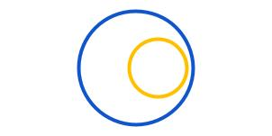
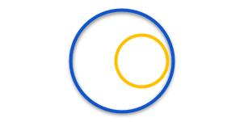

# TCS Taxon Relationship Type Vocabulary

**Note:** The content below is created dynamically from the
[tcsTaxonRelationshipType.yaml](./tcsTaxonRelationshipType.yaml) file. Please
do not edit the markdown directly, but make any changes in the YAML file.

## Index of terms

[Taxon Relationship Type Concept Scheme](#tcreltype) | [Is Congruent With](#tcreltypeiscongruentwith) | [Has proper subset](#tcreltypehaspropersubset) | [Is proper subset of](#tcreltypeispropersubsetof) | [partiallyOverlaps](#tcreltypepartiallyoverlaps) | [Is disjoint from](#tcreltypeisdisjointfrom) | [Intersects](#tcreltypeintersects)

### tcreltype:

<table style="width:100%;">
	<tbody>
		<tr>
			<td>Identifier</td>
			<td>http://rs.tdwg.org/tcs-taxon-relationship-type/values/</td>
		</tr>
		<tr>
			<td>Type</td>
			<td>http://www.w3.org/2004/02/skos/core#ConceptScheme</td>
		</tr>
		<tr>
			<td>Label</td>
			<td>Taxon Relationship Type Concept Scheme</td>
		</tr>
		<tr>
			<td>Definition</td>
			<td><p>A SKOS Concept Scheme for controlled values for  <code>tcs:TaxonRelationshipType</code></p></td>
		</tr>
		<tr>
			<td>Controlled value</td>
			<td>None</td>
		</tr>
	</tbody>
</table>


**Comments**

Publications used in examples:

```turtle
<http://www.herbarium.unc.edu/FloraArchives/WeakleyFlora_2006-Jan.pdf> 
    a bibo:Document ;
    dcterms:bibliographicCitation """A.S. Weakley, Flora of the Carolinas, 
            Virginia, Georgia, and Surrounding Areas, Working Draft of 6 
            January, 2006, University of North Carolina Herbarium, Chapel 
            Hill, 2006, http://www.herbarium.unc.edu/FloraArchives/WeakleyFlora_
            2006-Jan.pdf.""" .

<http://bonap.net/napa#2014> a bibo:Website ;
    dcterms:bibliographicCitation """J.T. Kartesz, The Biota of North America 
            Program (BONAP), 2014, North American Plant Atlas, Chapel Hill, NC, 
            2014, http://bonap.net/napa.""" .

<https://doi.org/10.3233/SW-160220> a bibo:AcademicArticle ;
    dcterms:bibliographicCitation """Franz NM, Chen M, Kianmajd P, Yu S, Bowers 
            S, Weakley AS, Ludäscher B (2016) Names are not good enough: 
            Reasoning over taxonomic change in the Andropogon complex 1. 
            Semantic Web 7, 645–667. doi:10.3233/SW-160220.""" .
```
[&lsqb;TaxonRelationshipType-publications.ttl&rsqb;](examples/TaxonRelationshipType-publications.ttl)

### tcreltype:isCongruentWith

<table style="width:100%;">
	<tbody>
		<tr>
			<td>Identifier</td>
			<td>http://rs.tdwg.org/tcs-taxon-relationship-type/values/isCongruentWith</td>
		</tr>
		<tr>
			<td>Type</td>
			<td>http://www.w3.org/2004/02/skos/core#Concept</td>
		</tr>
		<tr>
			<td>Label</td>
			<td>Is Congruent With</td>
		</tr>
		<tr>
			<td>Definition</td>
			<td><p>The subject and object taxon concepts have a congruent taxonomic meaning,  i.e. there is no conflict between the concepts</p></td>
		</tr>
		<tr>
			<td>Controlled value</td>
			<td>isCongruentWith</td>
		</tr>
	</tbody>
</table>


**Comments**

The `isCongruentWith` relationship is symmetrical, so if A `isCongruentWith`  B then B `isCongruentWith` A, as well as transitive, so if A  `isCongruentWith` B and B `isCongruentWith` C it follows that A  `isCongruentWith` C.


This relationship can also be written as the formula ""A &cong; B** or **A == B**.


**Examples**


```turtle
# Andropogon capillipes sec. BONAP 2014 is congruent with Andropogon capillipes sec. Weakley 2006
[] a :TaxonRelationship ;
    :relationshipType <http://rs.tdwg.org/tcs-taxon-relationship-type/values/hasProperSubset> ;
    :subjectTaxonConcept [ a :TaxonConcept ;
        dcterms:title "Andropogon capillipes sec. BONAP 2014" ;
        :taxonName <https://www.ipni.org/n/12781-2> ;
        :accordingTo <http://bonap.net/napa#2014> ] ;
    :objectTaxonConcept [ a :TaxonConcept ;
        dcterms:title "Andropogon capillipes sec. Weakley 2006" ;
        :taxonName <https://www.ipni.org/n/12781-2> ;
        :accordingTo <http://www.herbarium.unc.edu/FloraArchives/WeakleyFlora_2006-Jan.pdf> ] ;
    :relationshipAccordingTo <https://doi.org/10.3233/SW-160220> .

<https://www.ipni.org/n/12781-2> a :TaxonName ;
    :taxonNameString "Andropogon capillipes" ;
    dwc:scientificNameAuthorship "Nash" .
```

[&lsqb;TaxonRelationshipType-isCongruentWith.ttl&rsqb;](examples/TaxonRelationshipType-isCongruentWith.ttl)

### tcreltype:hasProperSubset

<table style="width:100%;">
	<tbody>
		<tr>
			<td>Identifier</td>
			<td>http://rs.tdwg.org/tcs-taxon-relationship-type/values/hasProperSubset</td>
		</tr>
		<tr>
			<td>Type</td>
			<td>http://www.w3.org/2004/02/skos/core#Concept</td>
		</tr>
		<tr>
			<td>Label</td>
			<td>Has proper subset</td>
		</tr>
		<tr>
			<td>Definition</td>
			<td><p>The subject taxon concept has a more inclusive taxonomic meaning than the object taxon concept</p></td>
		</tr>
		<tr>
			<td>Controlled value</td>
			<td>hasProperSubset</td>
		</tr>
	</tbody>
</table>


**Comments**

The `hasProperSubset` relationship is not symmetric, its inverse  relationship being  `isProperSubsetOf`, so if A `hasProperSubset` B then B  `isProperSubsetOf` A. The `hasProperSubset` relationship  is transitive, so  if A `hasProperSubset` B and B `hasProperSubset` C it follows that A  `hasProperSubset` C.



This relation type can also be written as the formula **A > B**.


**Examples**


```turtle
# Andropogon glomeratus sec. BONAP 2014 has a proper subset Andropogon tenuispatheus sec. Weakley 2006
[] a :TaxonRelationship ;
    :relationshipType <http://rs.tdwg.org/tcs-taxon-relationship-type/values/hasProperSubset> ;
    :subjectTaxonConcept [ a :TaxonConcept ;
        dcterms:title "Andropogon glomeratus sec. BONAP 2014" ;
        :taxonName <https://www.ipni.org/n/12850-2> ;
        :accordingTo <http://bonap.net/napa#2014> ] ;
    :objectTaxonConcept [ a :TaxonConcept ;
        dcterms:title "Andropogon tenuispatheus sec. Weakley 2006" ;
        :taxonName <https://www.ipni.org/n/13093-2> ;
        :accordingTo <http://www.herbarium.unc.edu/FloraArchives/WeakleyFlora_2006-Jan.pdf> ] ;
    :relationshipAccordingTo <https://doi.org/10.3233/SW-160220> .

<https://www.ipni.org/n/12850-2> a :TaxonName ;
    :taxonNameString "Andropogon glomeratus" ;
    dwc:scientificNameAuthorship "Britton, Sterns & Poggenb." .

<https://www.ipni.org/n/13093-2> a :TaxonName ;
    :taxonNameString "Andropogon tenuispatheus" ;
    dwc:scientificNameAuthorship "Nash" .
```

[&lsqb;TaxonRelationshipType-hasProperSubset.ttl&rsqb;](examples/TaxonRelationshipType-hasProperSubset.ttl)

### tcreltype:isProperSubsetOf

<table style="width:100%;">
	<tbody>
		<tr>
			<td>Identifier</td>
			<td>http://rs.tdwg.org/tcs-taxon-relationship-type/values/isProperSubsetOf</td>
		</tr>
		<tr>
			<td>Type</td>
			<td>http://www.w3.org/2004/02/skos/core#Concept</td>
		</tr>
		<tr>
			<td>Label</td>
			<td>Is proper subset of</td>
		</tr>
		<tr>
			<td>Definition</td>
			<td><p>The subject taxon concept has a less inclusive taxonomic meaning than the  object taxon concept</p></td>
		</tr>
		<tr>
			<td>Controlled value</td>
			<td>isProperSubsetOf</td>
		</tr>
	</tbody>
</table>


**Comments**

The `isProperSubsetOf` relationship is not symmetric, its inverse  relationship being  `hasProperSubset`, so if A `isProperSubsetOf` B then B  `hasProperSubset` A. The `isProperSubsetOf` relationship  is transitive, so  if A `isProperSubsetOf` B and B `isProperSubsetOf` C it follows that A  `isProperSubsetOf` C.



This relation type can also be written as the formula **A < B**.


**Examples**


```turtle
# Andropogon hirsutior sec. BONAP 2014 is a proper subset of Andropogon glomeratus sec. Weakley 2006
[] a :TaxonRelationship ;
    :relationshipType <http://rs.tdwg.org/tcs-taxon-relationship-type/values/isProperSubsetOf> ;
    :subjectTaxonConcept [ a :TaxonConcept ;
        dcterms:title "Andropogon hirsutior sec. BONAP 2014" ;
        :taxonName <https://www.ipni.org/n/60458078-2> ;
        :accordingTo <http://bonap.net/napa#2014> ] ;
    :objectTaxonConcept [ a :TaxonConcept ;
        dcterms:title "Andropogon glomeratus sec. Weakley 2006" ;
        :taxonName <https://www.ipni.org/n/12850-2> ;
        :accordingTo <http://www.herbarium.unc.edu/FloraArchives/WeakleyFlora_2006-Jan.pdf> ] ;
    :relationshipAccordingTo <https://doi.org/10.3233/SW-160220> .

<https://www.ipni.org/n/60458078-2> a :TaxonName ;
    :taxonNameString "Andropogon hirsutior" ;
    dwc:scientificNameAuthorship "(Hack.) Weakley & LeBlond" .

<https://www.ipni.org/n/12850-2> a :TaxonName ;
    :taxonNameString "Andropogon glomeratus" ;
    dwc:scientificNameAuthorship "Britton, Sterns & Poggenb." .
```

[&lsqb;TaxonRelationshipType-isProperSubsetOf.ttl&rsqb;](examples/TaxonRelationshipType-isProperSubsetOf.ttl)

### tcreltype:partiallyOverlaps

<table style="width:100%;">
	<tbody>
		<tr>
			<td>Identifier</td>
			<td>http://rs.tdwg.org/tcs-taxon-relationship-type/values/partiallyOverlaps</td>
		</tr>
		<tr>
			<td>Type</td>
			<td>http://www.w3.org/2004/02/skos/core#Concept</td>
		</tr>
		<tr>
			<td>Label</td>
			<td>partiallyOverlaps</td>
		</tr>
		<tr>
			<td>Definition</td>
			<td><p>The subject and object taxon concepts have partially overlapping taxonomic  meanings, <em>i.e.</em> they have some members in common, but each concept in  addition has members that are not included in the other concept</p></td>
		</tr>
		<tr>
			<td>Controlled value</td>
			<td>partiallyOverlaps</td>
		</tr>
	</tbody>
</table>


**Comments**

The `partiallyOverlaps`  relationship is symmetrical, so if A  `partiallyOverlaps` B then B `partiallyOverlaps` A, but not transitive, so,  if A `partiallyOverlaps` B and B `partiallyOverlaps` C, it does not follow  that A `partiallyOverlaps` C.


This relationship can also be written as the formula **A >< B**.


**Examples**


```turtle
[] a :TaxonRelationship ;
    :relationshipType <http://rs.tdwg.org/tcs-taxon-relationship-type/values/partiallyOverlaps> ;
    :subjectTaxonConcept [ a :TaxonConcept ;
        dcterms:title "Andropogon glomeratus sec. BONAP 2014" ;
        :taxonName <https://www.ipni.org/n/12850-2> ;
        :accordingTo <http://bonap.net/napa#2014> ] ;
    :objectTaxonConcept [ a :TaxonConcept ;
        dcterms:title "Andropogon glomeratus sec. Weakley 2006" ;
        :taxonName <https://www.ipni.org/n/12850-2> ;
        :accordingTo <http://www.herbarium.unc.edu/FloraArchives/WeakleyFlora_2006-Jan.pdf> ] ;
    :relationshipAccordingTo <https://doi.org/10.3233/SW-160220> .

<https://www.ipni.org/n/12850-2> a :TaxonName ;
    :taxonNameString "Andropogon glomeratus" ;
    dwc:scientificNameAuthorship "Britton, Sterns & Poggenb." .
```

[&lsqb;TaxonRelationshipType-partiallyOverlaps.ttl&rsqb;](examples/TaxonRelationshipType-partiallyOverlaps.ttl)

### tcreltype:isDisjointFrom

<table style="width:100%;">
	<tbody>
		<tr>
			<td>Identifier</td>
			<td>http://rs.tdwg.org/tcs-taxon-relationship-type/values/isDisjointFrom</td>
		</tr>
		<tr>
			<td>Type</td>
			<td>http://www.w3.org/2004/02/skos/core#Concept</td>
		</tr>
		<tr>
			<td>Label</td>
			<td>Is disjoint from</td>
		</tr>
		<tr>
			<td>Definition</td>
			<td><p>The subject and objects taxon concepts have non-overlapping taxonomic  meanings, <em>i.e.</em> they do not have any members in common</p></td>
		</tr>
		<tr>
			<td>Controlled value</td>
			<td>isDisjointFrom</td>
		</tr>
	</tbody>
</table>


**Comments**

The `isDisjointFrom`  relationship is symmetrical, so if A `isDisjointFrom`  B then B `isDisjointFrom` A, but not transitive, so, if A `isDisjointFrom`  B and B `isDisjointFrom` C, it does not follow that A `isDisjointFrom` C.


This relationship can also be written as the formula **A | B**.


**Examples**


```turtle
# Andropogon glaucopsis sec. BONAP 2014 is disjoint from Andropogon vitginicus sec. Weakley 2006
[] a :TaxonRelationship ;
    :relationshipType <http://rs.tdwg.org/tcs-taxon-relationship-type/values/isDisjointFrom> ;
    :subjectTaxonConcept [ a :TaxonConcept ;
        dcterms:title "Andropogon glaucopsis sec. BONAP 2014" ;
        :taxonName <https://www.ipni.org/n/387942-1> ;
        :accordingTo <http://bonap.net/napa#2014> ] ;
    :objectTaxonConcept [ a :TaxonConcept ;
        dcterms:title "Andropogon vitginicus sec. Weakley 2006" ;
        :taxonName <https://www.ipni.org/n/388740-1> ;
        :accordingTo <http://www.herbarium.unc.edu/FloraArchives/WeakleyFlora_2006-Jan.pdf> ] ;
    :relationshipAccordingTo <https://doi.org/10.3233/SW-160220> .

<https://www.ipni.org/n/387942-1> a :TaxonName ;
    :taxonNameString "Andropogon glaucopsis" ;
    dwc:scientificNameAuthorship "Steud." .

<https://www.ipni.org/n/388740-1> a :TaxonName ;
    :taxonNameString "Andropogon virginicus" ;
    dwc:scientificNameAuthorship "L." .
```

[&lsqb;TaxonRelationshipType-isDisjointFrom.ttl&rsqb;](examples/TaxonRelationshipType-isDisjointFrom.ttl)

### tcreltype:intersects

<table style="width:100%;">
	<tbody>
		<tr>
			<td>Identifier</td>
			<td>http://rs.tdwg.org/tcs-taxon-relationship-type/values/intersects</td>
		</tr>
		<tr>
			<td>Type</td>
			<td>http://www.w3.org/2004/02/skos/core#Concept</td>
		</tr>
		<tr>
			<td>Label</td>
			<td>Intersects</td>
		</tr>
		<tr>
			<td>Definition</td>
			<td><p>The taxonomic meanings of the subject and object taxon concepts intersect,  <em>i.e.</em> they have at least one member in common.</p></td>
		</tr>
		<tr>
			<td>Controlled value</td>
			<td>intersects</td>
		</tr>
	</tbody>
</table>


**Comments**

`intersects` is the opposite of `isDisjointFrom` and the union of  `isCongruentWith`, `hasProperSubset`, `isProperSubsetOf` and  `partiallyOverlaps`, meaning it can be any of these relationships. This  relationship type can be used when the more precise nature of the  relationship is not known, for example when dealing with statements in  traditional synonymies.

<!-- termlist-footer.md ==>
