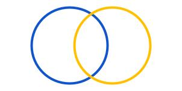
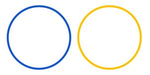

# TCS Term List

## Index of terms

**Taxon Concept**

[tcs:TaxonConcept](#tcstaxonconcept) | [tcs:accordingTo](#tcsaccordingto) | [tcs:taxonName](#tcstaxonname) | [tcs:synonym](#tcssynonym) | [tcs:vernacularName](#tcsvernacularname) | [tcs:taxonomicRank](#tcstaxonomicrank) | [tcs:parent](#tcsparent) | [tcs:child](#tcschild) | [tcs:isCongruentWith](#tcsiscongruentwith) | [tcs:includes](#tcsincludes) | [tcs:isIncludedIn](#tcsisincludedin) | [tcs:partiallyOverlaps](#tcspartiallyoverlaps) | [tcs:isDisjointFrom](#tcsisdisjointfrom) | [tcs:intersects](#tcsintersects) | [dwc:scientificName](#dwcscientificname) | [dwc:vernacularName](#dwcvernacularname) | [dwc:verbatimTaxonRank](#dwcverbatimtaxonrank) | [dcterms:identifier](#dctermsidentifier) | [dcterms:title](#dctermstitle)

**Taxon Concept Mapping**

[tcs:TaxonConceptMapping](#tcstaxonconceptmapping) | [tcs:mappingAccordingTo](#tcsmappingaccordingto) | [tcs:mappingRelation](#tcsmappingrelation) | [tcs:subjectTaxonConcept](#tcssubjecttaxonconcept) | [tcs:objectTaxonConcept](#tcsobjecttaxonconcept)

**Taxon Name**

[tcs:TaxonName](#tcstaxonname) | [tcs:taxonNameString](#tcstaxonnamestring) | [tcs:namePublishedIn](#tcsnamepublishedin) | [tcs:microreference](#tcsmicroreference) | [tcs:nomenclaturalCode](#tcsnomenclaturalcode) | [tcs:nomenclaturalStatus](#tcsnomenclaturalstatus) | [tcs:typification](#tcstypification) | [tcs:basionym](#tcsbasionym) | [tcs:replacedName](#tcsreplacedname) | [tcs:spellingCorrectionOf](#tcsspellingcorrectionof) | [tcs:laterHomonymOf](#tcslaterhomonymof) | [tcs:conservedAgainst](#tcsconservedagainst) | [dwc:scientificNameAuthorship](#dwcscientificnameauthorship) | [dwc:namePublishedInYear](#dwcnamepublishedinyear) | [dwc:namePublishedInYear](#dwcnamepublishedinyear) | [dwc:genericName](#dwcgenericname) | [dwc:infragenericEpithet](#dwcinfragenericepithet) | [dwc:specificEpithet](#dwcspecificepithet) | [dwc:infraspecificEpithet](#dwcinfraspecificepithet) | [dwc:cultivarEpithet](#dwccultivarepithet)

**Nomenclatural Type**

[tcs:NomenclaturalType](#tcsnomenclaturaltype) | [tcs:typifiedName](#tcstypifiedname) | [tcs:typeOfType](#tcstypeoftype) | [tcs:typeName](#tcstypename) | [tcs:typeSpecimen](#tcstypespecimen) | [tcs:typePublishedIn](#tcstypepublishedin)

## Taxon Concept

### tcs:TaxonConcept

<table style="width:100%;">
	<tbody>
		<tr>
			<td>Identifier</td>
			<td>http://rs.tdwg.org/tcs/terms/TaxonConcept</td>
		</tr>
		<tr>
			<td>Type</td>
			<td>http://www.w3.org/2000/01/rdf-schema#Class</td>
		</tr>
		<tr>
			<td>Label</td>
			<td>Taxon Concept</td>
		</tr>
		<tr>
			<td>Definition</td>
			<td><p>An identifiable taxonomic position that can be aligned to other such  positions through TCS concept mapping relationships.</p></td>
		</tr>
		<tr>
			<td>Usage</td>
			<td><p>The <code>taxonName</code> and <code>accordingTo</code> properties are required.</p></td>
		</tr>
		<tr>
			<td>GitHub issue</td>
			<td>https://github.com/tdwg/tcs2/issues/1</td>
		</tr>
	</tbody>
</table>


**Comments**

A taxonomic position is an opinion about the definition of a taxonomic group. A Taxon Concept is identifiable, because it combines a label – `taxonName` in TCS – with a source – `accordingTo`. The `accordingTo` property is required. The `taxonName` property is not strictly required, because its role can, in principle, be taken by other properties, e.g., `dcterms:title` or `dwc:scientificName`, When mentioning a taxon concept, the label and the source are combined, separated by 'sec.' (from, 'secundus', meaning 'according to') or 'sensu' (meaning the same). The term `title` has been borrowed from Dublin Core to provide this taxon concept label. Because of the context provided by the source, taxon concepts are in principle also alignable to other Taxon Concepts using TCS concept mapping relation statements. The concept mapping properties in TCS are `isCongruentWith`, `includes`, `isIncludedIn`, `partiallyOverlaps`, `isDisjointFrom` and `intersects`.

The TCS Taxon Concept is applied more broadly than the term is used in science (e.g. Franz & Peet 2009 [\[franz_perspectives_2009\]](../bibliography/#franz_perspectives_2009)). On the one hand, things that are not generally considered to be biological taxa, e.g. hybrids and cultivars, can be casted as TCS Taxon Concepts. Also Operational Taxonomic Units (OTUs) [\[sokal_principles_1963\]](../bibliography/#sokal_principles_1963) can be exchanged as Taxon Concepts, if there is a reason to do so, e.g. if one wants to align them with other Taxon Concepts later. On the other hand, entries from treatments that are considered to cite concepts from other treatments can be formulated as Taxon Concepts. Every taxon concept from a treatment that is likely to be referenced as the source of taxonomic context, for example a field guide for a determination of a specimen or a national census for an ecological study, can – and it would be very nice if they would – be stated as a Taxon Concept, so they can be aligned with other Taxon Concepts that may provide more or different taxonomic context.

By contrast, entries in the nomenclature section of treatments (synonyms)  and in lists of nomenclatural types are not Taxon Concepts.


**Examples**


```turtle
[] a tcs:TaxonConcept ;
    dcterms:title "Dicranoloma blumei sec. Klazenga 1999" ;
    tcs:accordingTo <https://www.tropicos.org/reference/9020903> 
    tcs:taxonName <https://www.tropicos.org/name/35121475> .

<https://www.tropicos.org/name/35121475> a ;
    tcs:taxonNameString "Dicranoloma blumei" ;
    dwc:scientificNameAuthorship "(Nees) Renauld" .

<https://www.tropicos.org/reference/9020903> a bibo:AcademicArticle ;
    dcterms:bibliographicCitation """Klazenga, N. (1999). A revision of the 
            Malesian species of Dicranoloma (Dicranaceae, Musci). Journal of the 
            Hattori Botanical Laboratory 87: 1-130.""" .
```

[&lsqb;TaxonConcept-1.ttl&rsqb;](../../examples/TaxonConcept-1.ttl)&nbsp;[&lsqb;TaxonConcept-1.jsonld&rsqb;](../../examples/TaxonConcept-1.jsonld)


```turtle
[] a tcs:TaxonConcept ;
    dcterms:title "Orthetrum caledonicum sec. Theischinger and Hawking 2010" ;
    tcs:accordingTo <urn:isbn:978-0-643-09073-6> ;
    tcs:taxonName [ a tcs:TaxonName ; 
            tcs:taxonNameString "Orthetrum caledonicum" ] ;
    tcs:vernacularName [ a tcs:TaxonName ;
            tcs:taxonNameString "Blue Skimmer" ] .

<urn:isbn:978-0-643-09073-6> a bibo:Book ;
    dcterms:bibliographicCitation """Theischinger, G.; Hawking, J. (2010). 
            The complete field guide to dragonflies of Australia. CSIRO 
            Publishing, Collingwood, Australia.""" .
```

[&lsqb;TaxonConcept-2.ttl&rsqb;](../../examples/TaxonConcept-2.ttl)&nbsp;[&lsqb;TaxonConcept-2.jsonld&rsqb;](../../examples/TaxonConcept-2.jsonld)


```turtle
[] a tcs:TaxonConcept ;
    dcterms:title "Calymperes moluccense sec. Yong et al. 2013" ;
    tcs:accordingTo <urn:isbn:978-967-5221-99-6> ;
    tcs:taxonName <https://www.tropicos.org/name/35153806> .

<https://www.tropicos.org/name/35153806> a tcs:TaxonName ;
    tcs:taxonNameString "Calymperes moluccense" ;
    dwc:scientificNameAuthorship "Schwägr." .

<urn:isbn:978-967-5221-99-6> a bibo:Book ;
    dcterms:bibliographicCitation """Yong, K.T.; Tan, B.C.; Ho, B.C.; Ho, Q.Y.; Mohamed, H.
            A revised Moss Checklist of Peninsular Malaysia and Singapore. Research 
            Pamphlet no. 133, Forest Research Institute Malaysia, Kepong, Malaysia.""" .
```

[&lsqb;TaxonConcept-3.ttl&rsqb;](../../examples/TaxonConcept-3.ttl)&nbsp;[&lsqb;TaxonConcept-3.jsonld&rsqb;](../../examples/TaxonConcept-3.jsonld)


```turtle
<https://powo.science.kew.org/taxon/urn:lsid:ipni.org:names:105644-1> a tcs:TaxonConcept ;
    dcterms:title "Begonia salaziensis sec. POWO 2022" ;
    tcs:accordingTo <urn:lsid:ipni.org:publications:17755-2> ;
    tcs:taxonName <https://www.ipni.org/n/105644-1> .

<https://www.ipni.org/n/105644-1> a tcs:TaxonName ;
    tcs:taxonNameString "Begonia salaziensis" ; 
    dwc:scientificNameAuthorship "Warb." ;
    dwc:namePublishedIn "Nat. Pflanzenfam. [Engler & Prantl] iii. 6 a. (1894) 139." .

<urn:lsid:ipni.org:publications:17755-2> a bibo:Book ;
    dcterms:bibliographicCitation """Govaerts, R. (1996). World Checklist of Seed Plants 2(1, 2): 
            1-492. MIM, Deurne.""" .
```

[&lsqb;TaxonConcept-4.ttl&rsqb;](../../examples/TaxonConcept-4.ttl)&nbsp;[&lsqb;TaxonConcept-4.jsonld&rsqb;](../../examples/TaxonConcept-4.jsonld)


```turtle
<https://www.catalogueoflife.org/data/taxon/KF8T#v2022-11-14> a tcs:TaxonConcept ;
    dcterms:title "Balaenoptera musculus sec. Catalogue of Life 2022-11-14" ;
    tcs:accordingTo <https://www.catalogueoflife.org#v2022-11-14> ;
    tcs:taxonName [ a tcs:TaxonName ;
            tcs:taxonNameString "Balaenoptera musculus" ;
            dwc:scientificNameAuthorship "(Linnaeus, 1758)" ] .

<https://www.catalogueoflife.org#v2022-11-14> a bibo:Website ;
    dcterms:isVersionOf "https://www.catalogueoflife.org" ;
    dcterms:title "Catalogue of Life, version 2022-11-14" ;
    bibo:uri "https://www.catalogueoflife.org" .
```

[&lsqb;TaxonConcept-5.ttl&rsqb;](../../examples/TaxonConcept-5.ttl)&nbsp;[&lsqb;TaxonConcept-5.jsonld&rsqb;](../../examples/TaxonConcept-5.jsonld)


```turtle
# Species Hypothesis (SH) from UNITE

<https://doi.plutof.ut.ee/doi/10.15156/BIO/SH1109146.09FU> a tcs:TaxonConcept ;
    dcterms:identifier "SH1109146.09FU" ;
    tcs:accordingTo <https://unite.ut.ee> ;
    tcs:isIncludedIn <https://doi.plutof.ut.ee/doi/10.15156/BIO/TH077737> .

<https://doi.plutof.ut.ee/doi/10.15156/BIO/TH077737> ;
    tcs:accordingTo <https://unite.ut.ee> ;
    tcs:taxonName <https://www.indexfungorum.org/names/NamesRecord.asp?RecordID=17175> .

<https://www.indexfungorum.org/names/NamesRecord.asp?RecordID=17175> a tcs:TaxonNAme ;
    tcs:taxonNameString "Boletus" ;
    dwc:scientificNameAuthorship "L" ;
    dwc:namePublishedIn "Sp. pl. 2: 1176" ;
    dwc:namePublishedInYear "1753" .

<https://unite.ut.ee> a bibo:Website ;
    dcterms:title """UNITE: rDNA ITS based identification of Eukaryotes and 
            their communication via DOIs""" ;
    bibo:uri "https://unite.ut.ee" .
```

[&lsqb;TaxonConcept-6.ttl&rsqb;](../../examples/TaxonConcept-6.ttl)&nbsp;[&lsqb;TaxonConcept-6.jsonld&rsqb;](../../examples/TaxonConcept-6.jsonld)

### tcs:accordingTo

<table style="width:100%;">
	<tbody>
		<tr>
			<td>Identifier</td>
			<td>http://rs.tdwg.org/tcs/terms/accordingTo</td>
		</tr>
		<tr>
			<td>Type</td>
			<td>http://www.w3.org/1999/02/22-rdf-syntax-ns#Property</td>
		</tr>
		<tr>
			<td>Label</td>
			<td>According To</td>
		</tr>
		<tr>
			<td></td>
			<td><b>required:</b> Yes — <b>repeatable:</b> No</td>
		</tr>
		<tr>
			<td>Definition</td>
			<td><p>Reference to the treatment or other source in which a Taxon Concept is  established or used. </p></td>
		</tr>
		<tr>
			<td>Usage</td>
			<td><p><code>accordingTo</code> is an IRI term and is required on a Taxon Concept. A  Taxon Concept can have only one <code>accordingTo</code>. </p></td>
		</tr>
		<tr>
			<td>GitHub issue</td>
			<td>https://github.com/tdwg/tcs2/issues/4</td>
		</tr>
	</tbody>
</table>


**Comments**

Every Taxon Concept is in some sort of treatment and this treatment  provides important context without which we do not know what a taxon name  really means and therefore the `accordingTo` property is required for a TCS  Taxon Concept. In TCS 2, `accordingTo` has to be a reference to some sort  of resource rather than just a person's name. However, TCS is lenient about  the nature of this resource and, apart from references to bibliographic  resources, references to personal communications and determinations are  also acceptable, if there is value in supplying taxon concepts from such  communications as Taxon Concepts.

The value of `accordingTo` has to be an object or IRI. This object can  contain as little as a bibliographic reference but it is much more useful  to provide it in a format that can be understood by reference managers  such as Zotero or Mendeley.


**Examples**


```turtle
# Taxonomic article (object of property only)
<https://doi.org/10.1080/14772000.2013.806371> a bibo:AcademicArticle ;
    dcterms:creator <https://orcid.org/0000-0001-7089-7018>,
            <https://orcid.org/0000-0002-2469-8162> ;
    bibo:authorList ( <https://orcid.org/0000-0001-7089-7018> 
        	<https://orcid.org/0000-0002-2469-8162> ) ;
    dcterms:title """Description of two new species and phylogenetic reassessment of 
            Perelleschus O’Brien & Wibmer, 1986 (Coleoptera: Curculionidae), with 
            a complete taxonomic concept history of Perelleschus sec. Franz & 
            Cardona-Duque, 2013""" ;
    bibo:shortTitle """Description of two new species and phylogenetic reassessment 
            of Perelleschus O’Brien & Wibmer, 1986 (Coleoptera""" ;
    dcterms:isPartOf [ a bibo:Issue ;
        dcterms:date "June 1, 2013" ;
        dcterms:isPartOf [ a bibo:Journal ;
                dcterms:title "Systematics and Biodiversity" ;
                bibo:issn "1477-2000" ] ;
                dcterms:publisher [ a foaf:Organization ;
                    foaf:name "Taylor & Francis" ] ;
            bibo:volume "11" ;
            bibo:issue "2" ] ;
    bibo:pages "209-236" ;
    bibo:doi "10.1080/14772000.2013.806371" ;
    bibo:uri "https://doi.org/10.1080/14772000.2013.806371" .

<https://orcid.org/0000-0001-7089-7018> a foaf:Person ;
    foaf:givenName "Nico M." ;
    foaf:surname "Franz" .

<https://orcid.org/0000-0002-2469-8162> a foaf:Person ;
    foaf:givenName "Juliana" ;
    foaf:surname "Cardona-Duque*" .
```

[&lsqb;TaxonConcept-accordingTo-1.ttl&rsqb;](../../examples/TaxonConcept-accordingTo-1.ttl)&nbsp;[&lsqb;TaxonConcept-accordingTo-1.jsonld&rsqb;](../../examples/TaxonConcept-accordingTo-1.jsonld)


```turtle
# Field guide (object of property only)
<urn:isbn:978-0-307-95790-0> a bibo:Book ;
    dcterms:title "The Sibley guide to birds" ;
    dcterms:date "2014" ;
    dcterms:language "en" ;
    dcterms:publisher [ 
        a foaf:Organization ;
        address:localityName "New York, NY, USA" ;
        foaf:name "Alfred A. Knopf" 
    ] ;
    bibo:isbn "978-0-307-95790-0" ;
    bibo:edition "2" ;
    bibo:numPages "599" ;
    dcterms:creator "_:b1" ;
    bibo:authorList ( "_:b1" ) .

_:b1 a foaf:Person ;
    foaf:givenName "David Allen" ;
    foaf:surname "Sibley" .
```

[&lsqb;TaxonConcept-accordingTo-2.ttl&rsqb;](../../examples/TaxonConcept-accordingTo-2.ttl)&nbsp;[&lsqb;TaxonConcept-accordingTo-2.jsonld&rsqb;](../../examples/TaxonConcept-accordingTo-2.jsonld)


```turtle
# Checklist (object of property only)
<urn:isbn:978-967-5221-99-6> a bibo:Book ;
    dcterms:bibliographicCitation """Yong, K.T.; Tan, B.C.; Ho, B.C.; Ho, Q.Y.; Mohamed, H. (2013). 
            A revised moss checklist of Peninsular Malaysia and Singapore. Research Pamphlet no. 
            133. Forest Research Institute Malaysia, Kepong, Selangor, Malaysia.""" .
```

[&lsqb;TaxonConcept-accordingTo-3.ttl&rsqb;](../../examples/TaxonConcept-accordingTo-3.ttl)&nbsp;[&lsqb;TaxonConcept-accordingTo-3.jsonld&rsqb;](../../examples/TaxonConcept-accordingTo-3.jsonld)

### tcs:taxonName

<table style="width:100%;">
	<tbody>
		<tr>
			<td>Identifier</td>
			<td>http://rs.tdwg.org/tcs/terms/taxonName</td>
		</tr>
		<tr>
			<td>Type</td>
			<td>http://www.w3.org/1999/02/22-rdf-syntax-ns#Property</td>
		</tr>
		<tr>
			<td>Label</td>
			<td>Taxon name</td>
		</tr>
		<tr>
			<td></td>
			<td><b>required:</b> No — <b>repeatable:</b> No</td>
		</tr>
		<tr>
			<td>Definition</td>
			<td><p>The accepted name for the taxonomic group.</p></td>
		</tr>
		<tr>
			<td>Usage</td>
			<td><p><code>taxonName</code> is an IRI term and is required on a TCS Taxon Concept. A Taxon  Concept can only have one <code>taxonName</code>.</p></td>
		</tr>
		<tr>
			<td>GitHub issue</td>
			<td>https://github.com/tdwg/tcs2/issues/2</td>
		</tr>
	</tbody>
</table>


**Comments**

The `taxonName` can be anything from a well-formed scientific name to an  informal name, vernacular name, indigenous knowledge label, or even a label  containing numbers and/or special symbols, such as are often used for OTUs. 

The object of `taxonName` is an object or IRI, so that it can be reused in  other Taxon Concepts. TCS has got the Taxon Name class, which can be used  for any type of name, but people are free to use alternatives, e.g.  `skosxl:Label`, if they want to restrict the use of the Taxon Name class to  scientific (or scientific-y) names only.

### tcs:synonym

<table style="width:100%;">
	<tbody>
		<tr>
			<td>Identifier</td>
			<td>http://rs.tdwg.org/tcs/terms/synonym</td>
		</tr>
		<tr>
			<td>Type</td>
			<td>http://www.w3.org/1999/02/22-rdf-syntax-ns#Property</td>
		</tr>
		<tr>
			<td>Label</td>
			<td>Synonym</td>
		</tr>
		<tr>
			<td></td>
			<td><b>required:</b> No — <b>repeatable:</b> Yes</td>
		</tr>
		<tr>
			<td>Definition</td>
			<td><p>Name considered to apply to the same taxon as the accepted name.</p></td>
		</tr>
		<tr>
			<td>Usage</td>
			<td><p><code>synonym</code> is a Taxon Name; a Taxon Concept can have multiple synonyms.</p></td>
		</tr>
		<tr>
			<td>GitHub issue</td>
			<td>https://github.com/tdwg/tcs2/issues/65</td>
		</tr>
	</tbody>
</table>


**Comments**

Synonyms are names and synonymy is between names but, unless the names have the same nomenclatural type, the context of a Taxon Concept is needed to establish which names are synonyms of each other. Therefore, `synonym` is a property of the Taxon Concept class. `synonym` is used here in the strict meaning that the type of a name falls within a Taxon Concept. The same goes for the accepted name and therefore `synonym` has the same relationship to Taxon Concept as `taxonName`. This means one can use names without having to deal with the original Taxon Concepts for which the name was published as a label. If one wants to include these “original concepts” and indicate a relationship between Taxon Concepts, and the more precise relation is not provided, the `intersects` relation can be used.

The terms 'heterotypic synonym' and 'homotypic synonym' from the nomenclatural codes ('subjective synonym' and 'objective synonym', respectively, in the Zoological Code) are, in the context of Taxon Concepts and Taxon Names, best understood as synonyms (relations between Taxon Concepts and Taxon Names) and combinations (relations between Taxon Names), respectively. In TCS, combinations are dealt with using the `basionym` property. This has the advantage that people do not need to separate heterotypic and homotypic synonyms, or generally deal with nomenclature, which adds a degree of complexity that not all systems need or want. Avoiding terms that are too strictly defined in the nomenclatural codes also has the advantage that the term can, in principle, be applied to things that cannot be heterotypic or homotypic synonyms, e.g., to names that are not validly published under the codes, or names of different taxonomic ranks than the accepted name, and avoids inappropriate use of the terms defined in the nomenclatural codes.


**Examples**


```turtle
[]  a tcs:TaxonConcept ;
    dcterms:title "Dicranoloma blumei sec. Klazenga 1999" ;
    tcs:accordingTo <https://www.tropicos.org/reference/9020903> ;
    tcs:taxonName <https://www.tropicos.org/name/35121475> ;
    tcs:synonym <https://www.tropicos.org/name/35121973> , 
            <https://www.tropicos.org/name/35121477> ,
            <https://www.tropicos.org/name/35121484> ,
            <https://www.tropicos.org/name/35188177> .

<https://www.tropicos.org/name/35121475> a tcs:TaxonName ;
    tcs:taxonNameString "Dicranoloma blumei" ;
    dwc:scientificNameAuthorship "(Nees) Renauld" ;
    dwc:namePublishedIn "Rev. Bryol. 28(4): 69 (1901)" ;
    tcs:basionym <https://www.tropicos.org/name/35121972> .

<https://www.tropicos.org/name/35121972> a tcs:TaxonName ;
    tcs:taxonNameString "Dicranum blumei" ;
    dwc:scientificNameAuthorship "Nees" ; 
    dwc:namePublishedIn """Nova Acta Phys.-Med. Acad. Caes. Leop.-Carol. Nat. 
            Cur. 11(1): 131 (1823)""" .

<https://www.tropicos.org/name/35154856> a tcs:TaxonName ;
    tcs:taxonNameString "Leucoloma blumei" ;
    dwc:scientificNameAuthorship "(Nees) Broth." ; 
    dwc:namePublishedIn "Nat. Pflanzenfam. I(3): 322 (1901)" ;
    tcs:basionym <https://www.tropicos.org/name/35121972> .

<https://www.tropicos.org/name/35121973> a tcs:TaxonName ;
    tcs:taxonNameString "Dicranum blumei var. laxifolium" ;
    dwc:scientificNameAuthorship "Broth. & Geh." ;
    dwc:namePublishedIn "Biblioth. Bot. 44: 4 (1898)" .

<https://www.tropicos.org/name/35121477> a tcs:TaxonName ;
    tcs:taxonNameString "Dicranoloma blumei var. papillisetum" ;
    dwc:scientificNameAuthorship "M. Fleisch." ;
    dwc:namePublishedIn "Nova Guinea 12(2): 112 (1914)" .

<https://www.tropicos.org/name/35188177> a tcs:TaxonName ;
    tcs:taxonNameString "Dicranoloma blumei f. subintegrum" ;
    dwc:scientificNameAuthorship "Dixon" ;
    dwc:namePublishedIn "J. Bot. 80: 4 (1942)" .

<https://www.tropicos.org/name/35121484> a tcs:TaxonName ;
    tcs:taxonNameString "Dicranoloma braunfelsioides" ;
    dwc:scientificNameAuthorship "Herzog" ;
    dwc:namePublishedIn "Hedwigia 61: 288 (1919)" . 

<https://www.tropicos.org/reference/9020903> a bibo:AcademicArticle ;
    dcterms:bibliographicCitation """Klazenga, N. (1999). A revision of the 
            Malesian species of Dicranoloma (Dicranaceae, Musci). Journal of the 
            Hattori Botanical Laboratory 87: 1-130.""" .

# Example shows both homotypic and heterotypic synonyms:
# 
# Dicranoloma blumei, Dicranum blumei and Leucoloma blumei are homotypic 
# synonyms and are linked through the basionym (Dicranum blumei is the basionym 
# of Dicranoloma blumei and Leucoloma blumei).
# 
# Dicranum blumei var. laxifolium, Dicranoloma blumei var. papillisetum, 
# Dicranoloma braunfelsioides and Dicranoloma blumei f. subintegrum are 
# heterotypic synonyms of Dicranoloma blumei (according to this publication) and 
# are provided using the `synonym` property.
```

[&lsqb;TaxonConcept-synonym-1.ttl&rsqb;](../../examples/TaxonConcept-synonym-1.ttl)&nbsp;[&lsqb;TaxonConcept-synonym-1.jsonld&rsqb;](../../examples/TaxonConcept-synonym-1.jsonld)


```turtle
[] a tcs:TaxonConcept ;
    dcterms:title "Hebe colensoi sec. Bayly & Kellow 2006" ;
    tcs:accordingTo <urn:isbn:978-0-909010-12-6> ;
    tcs:taxonName <https://www.ipni.org/n/803678-1> ;
    tcs:synonym <https://www.ipni.org/n/812087-1> .

<https://www.ipni.org/n/803678-1> a tcs:TaxonName ;
    tcs:taxonNameString "Hebe colensoi" ;
    dwc:scientificNameAuthorship "(Hook.f.) Cockayne" ;
    dwc:namePublishedIn "Trans. & Proc. New Zealand Inst. 60: 384 (1929)" ;
    tcs:basionym <https://www.ipni.org/n/811835-1> .

<https://www.ipni.org/n/811835-1> a tcs:TaxonName ;
    tcs:taxonNameString "Veronica colensoi" ;
    dwc:scientificNameAuthorship "Hook.f." ;
    dwc:namePublishedIn "Handb. N. Zeal. Fl. 209. (1864)" .

<https://www.ipni.org/n/812087-1> a tcs:TaxonName ;
    tcs:taxonNameString "Veronica hillii" ;
    dwc:scientificNameAuthorship "Colenso" ;
    dwc:namePublishedIn "Trans. & Proc. New Zealand Inst. 28: 606 (1896)" .
```

[&lsqb;TaxonConcept-synonym-2.ttl&rsqb;](../../examples/TaxonConcept-synonym-2.ttl)&nbsp;[&lsqb;TaxonConcept-synonym-2.jsonld&rsqb;](../../examples/TaxonConcept-synonym-2.jsonld)


```turtle
<https://www.catalogueoflife.org/data/taxon/3YVTF> a tcs:TaxonConcept ;
    dcterms:title "Megalorhipida leucodactylus sec. Gielis & Hobern 2020-07-16" ;
    tcs:accordingTo <https://doi.org/10.48580/dfry-3gd#1.1.23.5> ;
    tcs:taxonName [ a tcs:TaxonName ;
            tcs:taxonNameString "Megalorhipida leucodactylus" ;
            dwc:scientificName "Megalorhipida leucodactylus (Fabricius, 1794)" ;
            tcs:basionym <https://zoobank.org/NomenclaturalActs/39b2f236-3914-4962-9dcc-f594671654bd> ] ;
    tcs:synonym [ a tcs:TaxonName ;
            dwc:scientificName "Aciptilia hawaiiensis Butler, 1881" ] , 
        [ a tcs:TaxonName ;
            dwc:scientificName "Megalorhipida palaestinensis Amsel, 1935" ] ,
        [ a tcs:TaxonName ;
            dwc:scientificName "Pterophorus congrualis Walker, 1864" ] ,
        [ a tcs:TaxonName ;
            dwc:scientificName "Pterophorus defectalis Walker, 1864" ] ,
        [ a tcs:TaxonName ;
            dwc:scientificName "Trichoptilus adelphodes Meyrick, 1887" ] ,
        [ a tcs:TaxonName ;
            dwc:scientificName "Trichoptilus centetes Meyrick, 1886" ] ,
        [ a tcs:TaxonName ;
            dwc:scientificName "Trichoptilus compsochares Meyrick, 1886" ] ,
        [ a tcs:TaxonName ;
            dwc:scientificName "Trichoptilus derelictus Meyrick, 1926" ] ,
        [ a tcs:TaxonName ;
            dwc:scientificName "Trichoptilus ochrodactylus Fish, 1881" ] ,
        [ a tcs:TaxonName ;
            dwc:scientificName "Trichoptilus ralumensis Pagenstecher, 1900" ] ,
        [ a tcs:TaxonName ;
            dwc:scientificName "Pterophorus oxydactylus Walker, 1864" ] ;
    tcs:taxonomicRank <http://rs.gbif.org/vocabulary/gbif/rank/species> ;
    tcs:parent <https://www.catalogueoflife.org/data/taxon/62ZBY> .

<https://zoobank.org/NomenclaturalActs/39b2f236-3914-4962-9dcc-f594671654bd> a tcs:TaxonName ;
    dwc:scientificName "Pterophorus leucodactylus Fabricius, 1794" .
```

[&lsqb;TaxonConcept-synonym-3.ttl&rsqb;](../../examples/TaxonConcept-synonym-3.ttl)&nbsp;[&lsqb;TaxonConcept-synonym-3.jsonld&rsqb;](../../examples/TaxonConcept-synonym-3.jsonld)

### tcs:vernacularName

<table style="width:100%;">
	<tbody>
		<tr>
			<td>Identifier</td>
			<td>http://rs.tdwg.org/tcs/terms/vernacularName</td>
		</tr>
		<tr>
			<td>Type</td>
			<td>http://www.w3.org/1999/02/22-rdf-syntax-ns#Property</td>
		</tr>
		<tr>
			<td>Label</td>
			<td>Vernacular Name</td>
		</tr>
		<tr>
			<td></td>
			<td><b>required:</b> No — <b>repeatable:</b> Yes</td>
		</tr>
		<tr>
			<td>Definition</td>
			<td><p>Common or vernacular name for a taxonomic group, when used besides the  <code>taxonName</code>.</p></td>
		</tr>
		<tr>
			<td>Usage</td>
			<td><p><code>vernacularName</code> is an IRI term; a Taxon Concept can have more than one  <code>vernacularName</code>.</p></td>
		</tr>
		<tr>
			<td>GitHub issue</td>
			<td>https://github.com/tdwg/tcs2/issues/10</td>
		</tr>
	</tbody>
</table>


**Comments**

The `vernacularName` property can be used when a vernacular name is used alongside a scientific name, which is the `taxonName`. If a vernacular name is the only name, the `taxonName` property should be used. The object of the `vernacularName` property can be a Taxon Name, but another label object, such as the GBIF [Vernacular Name](https://rs.gbif.org/extension/gbif/1.0/vernacularname.xml), might be preferrable, especially if there can be multiple vernacular names for a concept.


**Examples**


```turtle
[] a tcs:TaxonConcept ;
    dcterms:title "Graphium macleayanum sec. Orr & Kitching 2010" ;
    tcs:accordingTo <urn:isbn:978-1-74175-108-6> ;
    tcs:taxonName [ a tcs:TaxonName ;
            tcs:taxonNameString "Graphium macleayanum" ] ;
    tcs:vernacularName [ a gbif:VernacularName ;
            dwc:vernacularName "Macleay's Swallowtail" ;
            dcterms:language: "en" ] .

<urn:isbn:978-1-74175-108-6> a bibo:Book ; 
    dcterms:bibliographicCitation """Orr, A. & Kitching, R. (2010). The 
            butterflies of Australia. Jacana Books, Crows Nest, Australia.""" .
```

[&lsqb;TaxonConcept-vernacularName-1.ttl&rsqb;](../../examples/TaxonConcept-vernacularName-1.ttl)&nbsp;[&lsqb;TaxonConcept-vernacularName-1.jsonld&rsqb;](../../examples/TaxonConcept-vernacularName-1.jsonld)


```turtle
[] a tcs:TaxonConcept ;
    dcterms:title "Quercus robur sec. Duistermaat 2020" ;
    tcs:accordingTo <urn:isbn:978-90-01-58956-1> ;
    tcs:taxonName <https://www.ipni.org/n/304293-2> ;
    tcs:vernacularName [ a gbif:VernacularName ;
            dwc:vernacularName "Zomereik" ;
            dcterms:language "nl" ] .

<https://www.ipni.org/n/304293-2> a tcs:TaxonName ;
    tcs:taxonNameString "Quercus robur" .

<urn:isbn:978-90-01-58956-1> a bibo:Book ;
    dcterms:bibliographicCitation """Duistermaat, H. (2020). Heukels 
            Flora van Nederland, edn 24. Noordhoff, Groningen.""" .
```

[&lsqb;TaxonConcept-vernacularName-2.ttl&rsqb;](../../examples/TaxonConcept-vernacularName-2.ttl)&nbsp;[&lsqb;TaxonConcept-vernacularName-2.jsonld&rsqb;](../../examples/TaxonConcept-vernacularName-2.jsonld)


```turtle
<https://vicflora.rbg.vic.gov.au/flora/taxon/93c88fde-ab15-4a9a-a61d-3830a57a0160#2023-03-02> 
    a tcs:TaxonConcept ;
    dcterms:title "Callitris verrucosa sec. VicFlora 2023-03-22" ;
    tcs:accordingTo [ a bibo:Website ;
            dcterms:bibliographicCitation """VicFlora (2023). Flora of Victoria, 
                    Royal Botanic Gardens Victoria. Available online: 
                    https://vicflora.rbg.vic.gov.au (accessed on: 22 Mar. 2023).""" ] ;
    tcs:taxonName <https://www.ipni.org/n/134460-3> ;
    tcs:vernacularName [ a gbif:VernacularName ; 
            dwc:vernacularName "Scrub Cypress-pine" ;
            dcterms:language "en" ;
            gbif:isPreferredName <http://rs.gbif.org/vocab/boolean/true> ] ,
        [ a gbif:VernacularName ; 
            dwc:vernacularName "Mallee Pine" ;
            dcterms:language "en" ;
            gbif:isPreferredName <http://rs.gbif.org/vocab/boolean/false> ] ,
        [ a gbif:VernacularName ; 
            dwc:vernacularName "Cow Pine" ;
            dcterms:language "en" ;
            gbif:isPreferredName <http://rs.gbif.org/vocab/boolean/false> ] ,
        [ a gbif:VernacularName ; 
            dwc:vernacularName "Turpentine Pine" ;
            dcterms:language "en" ;
            gbif:isPreferredName <http://rs.gbif.org/vocab/boolean/false> ] .

<https://www.ipni.org/n/134460-3> a tcs:TaxonName ;
    tcs:taxonNameString "Callitris verrucosa" ;
    dwc:scientificNameAuthorship "(A.Cunn. ex Endl.) F.Muell." .
```

[&lsqb;TaxonConcept-vernacularName-3.ttl&rsqb;](../../examples/TaxonConcept-vernacularName-3.ttl)&nbsp;[&lsqb;TaxonConcept-vernacularName-3.jsonld&rsqb;](../../examples/TaxonConcept-vernacularName-3.jsonld)

### tcs:taxonomicRank

<table style="width:100%;">
	<tbody>
		<tr>
			<td>Identifier</td>
			<td>http://rs.tdwg.org/tcs/terms/taxonomicRank</td>
		</tr>
		<tr>
			<td>Type</td>
			<td>http://www.w3.org/1999/02/22-rdf-syntax-ns#Property</td>
		</tr>
		<tr>
			<td>Label</td>
			<td>Taxonomic Rank</td>
		</tr>
		<tr>
			<td></td>
			<td><b>required:</b> No — <b>repeatable:</b> No</td>
		</tr>
		<tr>
			<td>Definition</td>
			<td><p>The rank at which a taxon is classified.</p></td>
		</tr>
		<tr>
			<td>Usage</td>
			<td><p><code>taxonomicRank</code> is an IRI property; a Taxon Concept or Taxon Name can have only one <code>taxonomicRank</code>.</p></td>
		</tr>
		<tr>
			<td>GitHub issue</td>
			<td>https://github.com/tdwg/tcs2/issues/32</td>
		</tr>
	</tbody>
</table>


**Comments**

The rank is an attribute of elements in a classification and implementations can decide for themselves if it makes more sense to use `taxonomicRank` on a Taxon Concept object or a Taxon Name object, or both. This property takes an object or IRI and it is recommended to use a value from an existing controlled vocabulary. While there is no TDWG vocabulary yet, the GBIF Taxonomic Rank Vocabulary (https://rs.gbif.org/vocabulary/gbif/rank.xml) is recommended.

### tcs:parent

<table style="width:100%;">
	<tbody>
		<tr>
			<td>Identifier</td>
			<td>http://rs.tdwg.org/tcs/terms/parent</td>
		</tr>
		<tr>
			<td>Type</td>
			<td>http://www.w3.org/1999/02/22-rdf-syntax-ns#Property</td>
		</tr>
		<tr>
			<td>Label</td>
			<td>Parent</td>
		</tr>
		<tr>
			<td></td>
			<td><b>required:</b> No — <b>repeatable:</b> No</td>
		</tr>
		<tr>
			<td>Definition</td>
			<td><p>The direct parent in a classification.</p></td>
		</tr>
		<tr>
			<td>Usage</td>
			<td><p><code>parent</code> is another Taxon Concept; a Taxon Concept can have only one  <code>parent</code>.</p></td>
		</tr>
		<tr>
			<td>GitHub issue</td>
			<td>https://github.com/tdwg/tcs2/issues/8</td>
		</tr>
	</tbody>
</table>


**Comments**

The `parent` is another Taxon Concept. This is the parent as indicated in  the `accordingTo` reference, rather than a third-party classification. The  `accordingTo` of the parent will generally, but not necessarily, be the  same as that of the child. 

### tcs:child

<table style="width:100%;">
	<tbody>
		<tr>
			<td>Identifier</td>
			<td>http://rs.tdwg.org/tcs/terms/child</td>
		</tr>
		<tr>
			<td>Type</td>
			<td>http://www.w3.org/1999/02/22-rdf-syntax-ns#Property</td>
		</tr>
		<tr>
			<td>Label</td>
			<td>Child</td>
		</tr>
		<tr>
			<td></td>
			<td><b>required:</b> No — <b>repeatable:</b> Yes</td>
		</tr>
		<tr>
			<td>Definition</td>
			<td><p>A direct subordinate in a classification.</p></td>
		</tr>
		<tr>
			<td>Usage</td>
			<td><p><code>child</code> is another Taxon Concept; a Taxon Concept can more than one  children.</p></td>
		</tr>
		<tr>
			<td>GitHub issue</td>
			<td>https://github.com/tdwg/tcs2/issues/232</td>
		</tr>
	</tbody>
</table>


**Examples**


```turtle
<https://www.catalogueoflife.org/data/taxon/6DBT> a tcs:TaxonConcept ;
    dcterms:title "Panthera sec. Catalogue of Life 2024-01-24" ;
    tcs:accordingTo <https://doi.org/10.48580/dfrdl> ;
    dwc:scientificName "Panthera Oken, 1816" ;
    tcs:child <https://www.catalogueoflife.org/data/taxon/4CGXP> ,
            <https://www.catalogueoflife.org/data/taxon/4CGXQ> ,
            <https://www.catalogueoflife.org/data/taxon/4CGXR> ,
            <https://www.catalogueoflife.org/data/taxon/4CGXS> .

<https://www.catalogueoflife.org/data/taxon/4CGXP> a tcs:TaxonConcept ;
    dcterms:title "Panthera leo sec. Catalogue of Life 2024-01-24" ;
    tcs:accordingTo <https://doi.org/10.48580/dfrdl> ;
    dwc:scientificName "Panthera leo (Linnaeus, 1758)" .

<https://www.catalogueoflife.org/data/taxon/4CGXQ> a tcs:TaxonConcept ;
    dcterms:title "Panthera onca sec. Catalogue of Life 2024-01-24" ;
    tcs:accordingTo <https://doi.org/10.48580/dfrdl> ;
    dwc:scientificName "Panthera onca (Linnaeus, 1758)" .

<https://www.catalogueoflife.org/data/taxon/4CGXR> a tcs:TaxonConcept ;
    dcterms:title "Panthera pardus sec. Catalogue of Life 2024-01-24" ;
    tcs:accordingTo <https://doi.org/10.48580/dfrdl> ;
    dwc:scientificName "Panthera pardus (Linnaeus, 1758)" .

<https://www.catalogueoflife.org/data/taxon/4CGXS> a tcs:TaxonConcept ;
    dcterms:title "Panthera tigris sec. Catalogue of Life 2024-01-24" ;
    tcs:accordingTo <https://doi.org/10.48580/dfrdl> ;
    dwc:scientificName "Panthera tigris (Linnaeus, 1758)" .
```

[&lsqb;TaxonConcept-child-1.ttl&rsqb;](../../examples/TaxonConcept-child-1.ttl)&nbsp;[&lsqb;TaxonConcept-child-1.jsonld&rsqb;](../../examples/TaxonConcept-child-1.jsonld)

### tcs:isCongruentWith

<table style="width:100%;">
	<tbody>
		<tr>
			<td>Identifier</td>
			<td>http://rs.tdwg.org/tcs/terms/isCongruentWith</td>
		</tr>
		<tr>
			<td>Type</td>
			<td>http://www.w3.org/1999/02/22-rdf-syntax-ns#Property</td>
		</tr>
		<tr>
			<td>Label</td>
			<td>Is Congruent With</td>
		</tr>
		<tr>
			<td></td>
			<td><b>required:</b> No — <b>repeatable:</b> Yes</td>
		</tr>
		<tr>
			<td>Definition</td>
			<td><p>The subject and object taxon concepts have a congruent taxonomic meaning,  i.e. there is no conflict between the concepts</p></td>
		</tr>
		<tr>
			<td>Usage</td>
			<td><p><code>isCongruentWith</code> can be used as a property on a Taxon Concept object, or as the value of the <code>mappingRelation</code> property on a Taxon Concept Mapping object. In both cases both the subject and object are Taxon Concepts.</p></td>
		</tr>
		<tr>
			<td>GitHub issue</td>
			<td>https://github.com/tdwg/tcs2/issues/52</td>
		</tr>
	</tbody>
</table>


**Comments**

The `isCongruentWith` relation is symmetrical, so if A `isCongruentWith` B then B `isCongruentWith` A, as well as transitive, so if A `isCongruentWith` B and B `isCongruentWith` C it follows that A `isCongruentWith` C.


This relation can also be written as the formula **A &cong; B** or **A == B**.


**Examples**


```turtle
[] a tcs:TaxonConcept ;
    dcterms:title "Aspleniaceae sec. Rothfels & al. 2012" ;
    tcs:accordingTo <https://doi.org/10.1002/tax.613003> ;
    tcs:taxonName <https://ipni.org/n/30001382-2> ;
    tcs:isCongruentWith [ a tcs:TaxonConcept ;
            dcterms:title "Aspleniaceae sec. Christenhusz & al. 2011" ;
            tcs:accordingTo <https://doi.org/10.11646/phytotaxa.19.1.2> ;
            tcs:taxonName <https://ipni.org/n/30001382-2> ] ,
        [ a tcs:TaxonConcept ;
            dcterms:title "Aspleniaceae sec. Smith & al. 2006" ;
            tcs:accordingTo <https://doi.org/10.2307/25065646> ;
            tcs:acceptedName <https://ipni.org/n/30001382-2> ] ,
        [ a tcs:TaxonConcept ;
            dcterms:title "Aspleniaceae sec. Pichi Sermolli 1977" ;
            tcs:accordingTo <https://doi.org/10.1080/00837792.1977.10670077> ;
            tcs:taxonName <https://ipni.org/n/30001382-2> ] ,
        [ a tcs:TaxonConcept ;
            dcterms:title "Aspleniaceae sec. Nayar 1970" ;
            tcs:accordingTo <https://doi.org/10.2307/1217958> ;
            tcs:taxonName <https://ipni.org/n/30001382-2> ] .
```

[&lsqb;TaxonConcept-isCongruentWith-1.ttl&rsqb;](../../examples/TaxonConcept-isCongruentWith-1.ttl)&nbsp;[&lsqb;TaxonConcept-isCongruentWith-1.jsonld&rsqb;](../../examples/TaxonConcept-isCongruentWith-1.jsonld)


```turtle
_:b0  a tcs:TaxonConcept ;
    dcterms:title "Aspleniaceae sec. Rothfels & al. 2012" ;
    tcs:accordingTo <https://doi.org/10.1002/tax.613003> ;
    tcs:taxonName <https://ipni.org/n/30001382-2> .

[] a tcs:TaxonConceptMapping ;
    tcs:mappingAccordingTo <https://doi.org/10.1002/tax.613003> ;
    tcs:mappingRelation tcs:isCongruentWith ;
    tcs:subjectTaxonConcept _:b0 ;
    tcs:objectTaxonConcept [ a tcs:TaxonConcept ;
            dcterms:title "Aspleniaceae sec. Christenhusz & al. 2011" ;
            tcs:accordingTo <https://doi.org/10.11646/phytotaxa.19.1.2> ;
            tcs:taxonName <https://ipni.org/n/30001382-2> ] .

[] a tcs:TaxonConceptMapping ;
    tcs:mappingAccordingTo <https://doi.org/10.1002/tax.613003> ;
    tcs:mappingRelation tcs:isCongruentWith ;
    tcs:subjectTaxonConcept _:b0 ;
    tcs:objectTaxonConcept [ a tcs:TaxonConcept ;
            dcterms:title "Aspleniaceae sec. Smith & al. 2006" ;
            tcs:accordingTo <https://doi.org/10.2307/25065646> ;
            tcs:acceptedName <https://ipni.org/n/30001382-2> ] .

[] a tcs:TaxonConceptMapping ;
    tcs:mappingAccordingTo <https://doi.org/10.1002/tax.613003> ;
    tcs:mappingRelation tcs:isCongruentWith ;
    tcs:subjectTaxonConcept _:b0 ;
    tcs:objectTaxonConcept [ a tcs:TaxonConcept ;
            dcterms:title "Aspleniaceae sec. Pichi Sermolli 1977" ;
            tcs:accordingTo <https://doi.org/10.1080/00837792.1977.10670077> ;
            tcs:taxonName <https://ipni.org/n/30001382-2> ] .

[] a tcs:TaxonConceptMapping ;
    tcs:mappingAccordingTo <https://doi.org/10.1002/tax.613003> ;
    tcs:mappingRelation tcs:isCongruentWith ;
    tcs:subjectTaxonConcept _:b0 ;
    tcs:objectTaxonConcept [ a tcs:TaxonConcept ;
            dcterms:title "Aspleniaceae sec. Nayar 1970" ;
            tcs:accordingTo <https://doi.org/10.2307/1217958> ;
            tcs:taxonName <https://ipni.org/n/30001382-2> ] .
```

[&lsqb;TaxonConceptMappingRelation-isCongruentWith-2.ttl&rsqb;](../../examples/TaxonConceptMappingRelation-isCongruentWith-2.ttl)&nbsp;[&lsqb;TaxonConceptMappingRelation-isCongruentWith-2.jsonld&rsqb;](../../examples/TaxonConceptMappingRelation-isCongruentWith-2.jsonld)


```turtle
[] a tcs:TaxonConcept ;
    dcterms:title "Dicranum fuscescens sec. Koperski et al. 2000" ;
    tcs:accordingTo <https://www.tropicos.org/reference/9022656> ;
    tcs:taxonName <https://www.tropicos.org/name/35122385> ;
    tcs:isCongruentWith [ a tcs:TaxonConcept ;
        dcterms:title "Dicranum fuscescens sec. Corley et al. (1981)" ;
        tcs:accordingTo <https://www.tropicos.org/reference/9004554> ;
        tcs:taxonName <https://www.tropicos.org/name/35122385> ] .
```

[&lsqb;TaxonConcept-isCongruentWith-3.ttl&rsqb;](../../examples/TaxonConcept-isCongruentWith-3.ttl)&nbsp;[&lsqb;TaxonConcept-isCongruentWith-3.jsonld&rsqb;](../../examples/TaxonConcept-isCongruentWith-3.jsonld)


```turtle
# Andropogon capillipes sec. BONAP 2014 is congruent with Andropogon capillipes sec. Weakley 2006
[] a tcs:TaxonConceptMapping ;
    tcs:mappingAccordingTo <https://doi.org/10.3233/SW-160220> ;
    tcs:mappingRelation tcs:isCongruentWith ;
    tcs:subjectTaxonConcept [ a tcs:TaxonConcept ;
        dcterms:title "Andropogon capillipes sec. BONAP 2014" ;
        tcs:taxonName <https://www.ipni.org/n/12781-2> ;
        tcs:accordingTo <http://bonap.net/napa#2014> ] ;
    tcs:objectTaxonConcept [ a tcs:TaxonConcept ;
        dcterms:title "Andropogon capillipes sec. Weakley 2006" ;
        tcs:taxonName <https://www.ipni.org/n/12781-2> ;
        tcs:accordingTo <http://www.herbarium.unc.edu/FloraArchives/WeakleyFlora_2006-Jan.pdf> ] .
```

[&lsqb;TaxonConceptMappingRelation-isCongruentWith-1.ttl&rsqb;](../../examples/TaxonConceptMappingRelation-isCongruentWith-1.ttl)&nbsp;[&lsqb;TaxonConceptMappingRelation-isCongruentWith-1.jsonld&rsqb;](../../examples/TaxonConceptMappingRelation-isCongruentWith-1.jsonld)

### tcs:includes

<table style="width:100%;">
	<tbody>
		<tr>
			<td>Identifier</td>
			<td>http://rs.tdwg.org/tcs/terms/includes</td>
		</tr>
		<tr>
			<td>Type</td>
			<td>http://www.w3.org/1999/02/22-rdf-syntax-ns#Property</td>
		</tr>
		<tr>
			<td>Label</td>
			<td>Includes</td>
		</tr>
		<tr>
			<td></td>
			<td><b>required:</b> No — <b>repeatable:</b> Yes</td>
		</tr>
		<tr>
			<td>Definition</td>
			<td><p>The subject taxon concept has a more inclusive taxonomic meaning than the object taxon concept</p></td>
		</tr>
		<tr>
			<td>Usage</td>
			<td><p><code>includes</code> can be used as a property on a Taxon Concept object, or as the value of the <code>mappingRelation</code> property on a Taxon Concept Mapping object. In both cases both the subject and object are Taxon Concepts.</p></td>
		</tr>
		<tr>
			<td>GitHub issue</td>
			<td>https://github.com/tdwg/tcs2/issues/53</td>
		</tr>
	</tbody>
</table>


**Comments**

The `includes` relation is not symmetric, its inverse relation being `isIncludedIn`, so if A `includes` B then B `isIncludedIn` A. The `includes` relation  is transitive, so if A `includes` B and B `includes` C it follows that A `includes` C.


This relation type can also be written as the formula **A > B**.


**Examples**


```turtle
[] a tcs:TaxonConcept ;
    dcterms:title "Diplaziopsidaceae sec. Rothfels & al. 2012" ;
    tcs:accordingTo <https://doi.org/10.1002/tax.613003> ;
    tcs:taxonName <https://ipni.org/n/77110538-1> ;
    tcs:includes [ a tcs:TaxonConcept ;
            dcterms:title "Diplaziopsidaceae sec. Christenhusz & al. 2011" ;
            tcs:accordingTo <https://doi.org/10.11646/phytotaxa.19.1.2> ;
            tcs:taxonName <https://ipni.org/n/77110538-1> ] .
```

[&lsqb;TaxonConcept-includes-1.ttl&rsqb;](../../examples/TaxonConcept-includes-1.ttl)&nbsp;[&lsqb;TaxonConcept-includes-1.jsonld&rsqb;](../../examples/TaxonConcept-includes-1.jsonld)


```turtle
[] a tcs:TaxonConceptMapping ;
    tcs:mappingAccordingTo <https://doi.org/10.1002/tax.613003> ;
    tcs:mappingRelation tcs:includes ;
    tcs:subjectTaxonConcept [ a tcs:TaxonConcept ;
            dcterms:title "Diplaziopsidaceae sec. Rothfels & al. 2012" ;
            tcs:accordingTo <https://doi.org/10.1002/tax.613003> ;
            tcs:taxonName <https://ipni.org/n/77110538-1> ] ;
    tcs:objectTaxonConcept [ a tcs:TaxonConcept ;
            dcterms:title "Diplaziopsidaceae sec. Christenhusz & al. 2011" ;
            tcs:accordingTo <https://doi.org/10.11646/phytotaxa.19.1.2> ;
            tcs:taxonName <https://ipni.org/n/77110538-1> ] .
```

[&lsqb;TaxonConceptMappingRelation-includes-2.ttl&rsqb;](../../examples/TaxonConceptMappingRelation-includes-2.ttl)&nbsp;[&lsqb;TaxonConceptMappingRelation-includes-2.jsonld&rsqb;](../../examples/TaxonConceptMappingRelation-includes-2.jsonld)


```turtle
# Andropogon glomeratus sec. BONAP 2014 includes Andropogon tenuispatheus sec. Weakley 2006
[] a tcs:TaxonConceptMapping ;
    tcs:mappingAccordingTo <https://doi.org/10.3233/SW-160220> ;
    tcs:mappingRelation tcs:includes ;
    tcs:subjectTaxonConcept [ a tcs:TaxonConcept ;
        dcterms:title "Andropogon glomeratus sec. BONAP 2014" ;
        tcs:taxonName <https://www.ipni.org/n/12850-2> ;
        tcs:accordingTo <http://bonap.net/napa#2014> ] ;
    tcs:objectTaxonConcept [ a tcs:TaxonConcept ;
        dcterms:title "Andropogon tenuispatheus sec. Weakley 2006" ;
        tcs:taxonName <https://www.ipni.org/n/13093-2> ;
        tcs:accordingTo <http://www.herbarium.unc.edu/FloraArchives/WeakleyFlora_2006-Jan.pdf> ] .

<https://www.ipni.org/n/12850-2> a tcs:TaxonName ;
    tcs:taxonNameString "Andropogon glomeratus" ;
    dwc:scientificNameAuthorship "Britton, Sterns & Poggenb." .

<https://www.ipni.org/n/13093-2> a tcs:TaxonName ;
    tcs:taxonNameString "Andropogon tenuispatheus" ;
    dwc:scientificNameAuthorship "Nash" .
```

[&lsqb;TaxonConceptMappingRelation-includes-1.ttl&rsqb;](../../examples/TaxonConceptMappingRelation-includes-1.ttl)&nbsp;[&lsqb;TaxonConceptMappingRelation-includes-1.jsonld&rsqb;](../../examples/TaxonConceptMappingRelation-includes-1.jsonld)

### tcs:isIncludedIn

<table style="width:100%;">
	<tbody>
		<tr>
			<td>Identifier</td>
			<td>http://rs.tdwg.org/tcs/terms/isIncludedIn</td>
		</tr>
		<tr>
			<td>Type</td>
			<td>http://www.w3.org/1999/02/22-rdf-syntax-ns#Property</td>
		</tr>
		<tr>
			<td>Label</td>
			<td>is included in</td>
		</tr>
		<tr>
			<td></td>
			<td><b>required:</b> No — <b>repeatable:</b> Yes</td>
		</tr>
		<tr>
			<td>Definition</td>
			<td><p>The subject taxon concept has a less inclusive taxonomic meaning than the  object taxon concept</p></td>
		</tr>
		<tr>
			<td>Usage</td>
			<td><p><code>isIncludedIn</code> can be used as a property on a Taxon Concept object, or as the value of the <code>mappingRelation</code> property on a Taxon Concept Mapping object. In both cases both the subject and object are Taxon Concepts.</p></td>
		</tr>
		<tr>
			<td>GitHub issue</td>
			<td>https://github.com/tdwg/tcs2/issues/54</td>
		</tr>
	</tbody>
</table>


**Comments**

The `isIncludedIn` relation is not symmetric, its inverse relation being `includes`, so if A `isIncludedIn` B then B `includes` A. The `isIncludedIn` relation  is transitive, so if A `isIncludedIn` B and B `isIncludedIn` C it follows that A `isIncludedIn` C.


This relation type can also be written as the formula **A < B**.


**Examples**


```turtle
[] a tcs:TaxonConcept ;
    dcterms:title "Athyriaceae sec. Rothfels & al. 2012" ;
    tcs:accordingTo <https://doi.org/10.1002/tax.613003> ;
    tcs:taxonName <https://ipni.org/n/30000361-2> ;
    tcs:isIncludedIn [ a tcs:TaxonConcept ;
            dcterms:title "Athyriaceae sec. Christenhusz & al. 2011" ;
            tcs:accordingTo <https://doi.org/10.11646/phytotaxa.19.1.2> ;
            tcs:taxonName <https://ipni.org/n/30000361-2> ] ,
        [ a tcs:TaxonConcept ;
            dcterms:title "Woodsiaceae sec. Smith & al. 2006" ;
            tcs:accordingTo <https://doi.org/10.2307/25065646> ;
            tcs:taxonName <https://ipni.org/n/30000455-2> ] ,
        [ a tcs:TaxonConcept ;
            dcterms:title "Dryopteridaceae sec. Nayar 1970" ;
            tcs:accordingTo <https://doi.org/10.2307/1217958> ;
            tcs:taxonName <https://www.ipni.org/n/30014148-2> ] ,
        [ a tcs:TaxonConcept ;
            dcterms:title "Dennstaedtiaceae sec. Holttum 1947" ;
            tcs:accordingTo [ a dcterms:BibliographicResource ;
                    dcterms:bibliographicCitation """Holttum, R.E. (1947). A 
                            revised classification of leptosporangiate ferns. 
                            Journal of the Linnean Society. Botany 53: 123–155.""" ] ;
            tcs:taxonName <https://ipni.org/n/17434830-1> ] .
```

[&lsqb;TaxonConcept-isIncludedIn-1.ttl&rsqb;](../../examples/TaxonConcept-isIncludedIn-1.ttl)&nbsp;[&lsqb;TaxonConcept-isIncludedIn-1.jsonld&rsqb;](../../examples/TaxonConcept-isIncludedIn-1.jsonld)


```turtle
_:b1 a tcs:TaxonConcept ;
    dcterms:title "Athyriaceae sec. Rothfels & al. 2012" ;
    tcs:accordingTo <https://doi.org/10.1002/tax.613003> ;
    tcs:taxonName <https://ipni.org/n/30000361-2> .

[] a tcs:TaxonConceptMapping ;
    tcs:mappingAccordingTo <https://doi.org/10.1002/tax.613003> ;
    tcs:mappingRelation tcs:isIncludedIn ;
    tcs:subjectTaxonConcept _:b1 ;
    tcs:objectTaxonConcept [ a tcs:TaxonConcept ;
            dcterms:title "Athyriaceae sec. Christenhusz & al. 2011" ;
            tcs:accordingTo <https://doi.org/10.11646/phytotaxa.19.1.2> ;
            tcs:taxonName <https://ipni.org/n/30000361-2> ] .

[] a tcs:TaxonConceptMapping ;
    tcs:mappingAccordingTo <https://doi.org/10.1002/tax.613003> ;
    tcs:mappingRelation tcs:isIncludedIn ;
    tcs:subjectTaxonConcept _:b1 ;
    tcs:objectTaxonConcept [ a tcs:TaxonConcept ;
            dcterms:title "Woodsiaceae sec. Smith & al. 2006" ;
            tcs:accordingTo <https://doi.org/10.2307/25065646> ;
            tcs:taxonName <https://ipni.org/n/30000455-2> ] .

[] a tcs:TaxonConceptMapping ;
    tcs:mappingAccordingTo <https://doi.org/10.1002/tax.613003> ;
    tcs:mappingRelation tcs:isIncludedIn ;
    tcs:subjectTaxonConcept _:b1 ;
    tcs:objectTaxonConcept [ a tcs:TaxonConcept ;
            dcterms:title "Dryopteridaceae sec. Nayar 1970" ;
            tcs:accordingTo <https://doi.org/10.2307/1217958> ;
            tcs:taxonName <https://www.ipni.org/n/30014148-2> ] .

[] a tcs:TaxonConceptMapping ;
    tcs:mappingAccordingTo <https://doi.org/10.1002/tax.613003> ;
    tcs:mappingRelation tcs:isIncludedIn ;
    tcs:subjectTaxonConcept _:b1 ;
    tcs:objectTaxonConcept [ a tcs:TaxonConcept ;
            dcterms:title "Dennstaedtiaceae sec. Holttum 1947" ;
            tcs:accordingTo [ a dcterms:BibliographicResource ;
                    dcterms:bibliographicCitation """Holttum, R.E. (1947). A 
                            revised classification of leptosporangiate ferns. 
                            Journal of the Linnean Society. Botany 53: 123–155.""" ] ;
            tcs:taxonName <https://ipni.org/n/17434830-1> ] .
```

[&lsqb;TaxonConceptMappingRelation-isIncludedIn-2.ttl&rsqb;](../../examples/TaxonConceptMappingRelation-isIncludedIn-2.ttl)&nbsp;[&lsqb;TaxonConceptMappingRelation-isIncludedIn-2.jsonld&rsqb;](../../examples/TaxonConceptMappingRelation-isIncludedIn-2.jsonld)


```turtle
# Andropogon hirsutior sec. BONAP 2014 is included in Andropogon glomeratus sec. Weakley 2006
[] a tcs:TaxonConceptMapping ;
    tcs:mappingAccordingTo <https://doi.org/10.3233/SW-160220> ;
    tcs:mappingRelation tcs:isIncludedIn ;
    tcs:subjectTaxonConcept [ a tcs:TaxonConcept ;
        dcterms:title "Andropogon hirsutior sec. BONAP 2014" ;
        tcs:taxonName <https://www.ipni.org/n/60458078-2> ;
        tcs:accordingTo <http://bonap.net/napa#2014> ] ;
    tcs:objectTaxonConcept [ a tcs:TaxonConcept ;
        dcterms:title "Andropogon glomeratus sec. Weakley 2006" ;
        tcs:taxonName <https://www.ipni.org/n/12850-2> ;
        tcs:accordingTo <http://www.herbarium.unc.edu/FloraArchives/WeakleyFlora_2006-Jan.pdf> ] .
```

[&lsqb;TaxonConceptMappingRelation-isIncludedIn-1.ttl&rsqb;](../../examples/TaxonConceptMappingRelation-isIncludedIn-1.ttl)&nbsp;[&lsqb;TaxonConceptMappingRelation-isIncludedIn-1.jsonld&rsqb;](../../examples/TaxonConceptMappingRelation-isIncludedIn-1.jsonld)

### tcs:partiallyOverlaps

<table style="width:100%;">
	<tbody>
		<tr>
			<td>Identifier</td>
			<td>http://rs.tdwg.org/tcs/terms/partiallyOverlaps</td>
		</tr>
		<tr>
			<td>Type</td>
			<td>http://www.w3.org/1999/02/22-rdf-syntax-ns#Property</td>
		</tr>
		<tr>
			<td>Label</td>
			<td>partially overlaps</td>
		</tr>
		<tr>
			<td></td>
			<td><b>required:</b> No — <b>repeatable:</b> Yes</td>
		</tr>
		<tr>
			<td>Definition</td>
			<td><p>The subject and object taxon concepts have partially overlapping taxonomic  meanings, <em>i.e.</em> they have some members in common, but each concept in  addition has members that are not included in the other concept</p></td>
		</tr>
		<tr>
			<td>Usage</td>
			<td><p><code>partiallyOverlaps</code> can be used as a property on a Taxon Concept object, or as the value of the <code>mappingRelation</code> property on a Taxon Concept Mapping object. In both cases both the subject and object are Taxon Concepts.</p></td>
		</tr>
		<tr>
			<td>GitHub issue</td>
			<td>https://github.com/tdwg/tcs2/issues/55</td>
		</tr>
	</tbody>
</table>


**Comments**

The `partiallyOverlaps` relation is symmetrical, so if A `partiallyOverlaps` B then B `partiallyOverlaps` A, but not transitive, so, if A `partiallyOverlaps` B and B `partiallyOverlaps` C, it does not follow that A `partiallyOverlaps` C.



This relation can also be written as the formula **A >< B**.


**Examples**


```turtle
[] a tcs:TaxonConcept ;
    dcterms:title "Diplaziopsidaceae sec. Rothfels & al. 2012" ;
    tcs:accordingTo <https://doi.org/10.1002/tax.613003> ;
    tcs:taxonName <https://ipni.org/n/77110538-1> ;
    tcs:partiallyOverlaps [ a tcs:TaxonConcept ;
            dcterms:title "Athyriaceae sec. Christenhusz & al. 2011" ;
            tcs:accordingTo <https://doi.org/10.11646/phytotaxa.19.1.2> ;
            tcs:taxonName <https://ipni.org/n/30000361-2> ] .
```

[&lsqb;TaxonConcept-partiallyOverlaps-1.ttl&rsqb;](../../examples/TaxonConcept-partiallyOverlaps-1.ttl)&nbsp;[&lsqb;TaxonConcept-partiallyOverlaps-1.jsonld&rsqb;](../../examples/TaxonConcept-partiallyOverlaps-1.jsonld)


```turtle
[] a tcs:TaxonConceptMapping ;
    tcs:mappingAccordingTo <https://doi.org/10.1002/tax.613003> ;
    tcs:mappingRelation tcs:partiallyOverlaps ;
    tcs:subjectTaxonConcept [ a tcs:TaxonConcept ;
            dcterms:title "Diplaziopsidaceae sec. Rothfels & al. 2012" ;
            tcs:accordingTo <https://doi.org/10.1002/tax.613003> ;
            tcs:taxonName <https://ipni.org/n/77110538-1> ] ;
    tcs:objectTaxonConcept [ a tcs:TaxonConcept ;
            dcterms:title "Athyriaceae sec. Christenhusz & al. 2011" ;
            tcs:accordingTo <https://doi.org/10.11646/phytotaxa.19.1.2> ;
            tcs:taxonName <https://ipni.org/n/30000361-2> ] .
```

[&lsqb;TaxonConceptMappingRelation-partiallyOverlaps-2.ttl&rsqb;](../../examples/TaxonConceptMappingRelation-partiallyOverlaps-2.ttl)&nbsp;[&lsqb;TaxonConceptMappingRelation-partiallyOverlaps-2.jsonld&rsqb;](../../examples/TaxonConceptMappingRelation-partiallyOverlaps-2.jsonld)


```turtle
# Andropogon glomeratus sec. BONAP 2014 partially overlaps Andropogon glomeratus
# sec. Weakley 2006
[] a tcs:TaxonConceptMapping ;
    tcs:mappingAccordingTo <https://doi.org/10.3233/SW-160220> ;
    tcs:mappingRelation tcs:partiallyOverlaps ;
    tcs:subjectTaxonConcept [ a tcs:TaxonConcept ;
        dcterms:title "Andropogon glomeratus sec. BONAP 2014" ;
        tcs:taxonName <https://www.ipni.org/n/12850-2> ;
        tcs:accordingTo <http://bonap.net/napa#2014> ] ;
    tcs:objectTaxonConcept [ a tcs:TaxonConcept ;
        dcterms:title "Andropogon glomeratus sec. Weakley 2006" ;
        tcs:taxonName <https://www.ipni.org/n/12850-2> ;
        tcs:accordingTo <http://www.herbarium.unc.edu/FloraArchives/WeakleyFlora_2006-Jan.pdf> ] .
```

[&lsqb;TaxonConceptMappingRelation-partiallyOverlaps-1.ttl&rsqb;](../../examples/TaxonConceptMappingRelation-partiallyOverlaps-1.ttl)&nbsp;[&lsqb;TaxonConceptMappingRelation-partiallyOverlaps-1.jsonld&rsqb;](../../examples/TaxonConceptMappingRelation-partiallyOverlaps-1.jsonld)

### tcs:isDisjointFrom

<table style="width:100%;">
	<tbody>
		<tr>
			<td>Identifier</td>
			<td>http://rs.tdwg.org/tcs/terms/isDisjointFrom</td>
		</tr>
		<tr>
			<td>Type</td>
			<td>http://www.w3.org/1999/02/22-rdf-syntax-ns#Property</td>
		</tr>
		<tr>
			<td>Label</td>
			<td>is disjoint from</td>
		</tr>
		<tr>
			<td></td>
			<td><b>required:</b> No — <b>repeatable:</b> Yes</td>
		</tr>
		<tr>
			<td>Definition</td>
			<td><p>The subject and objects taxon concepts have non-overlapping taxonomic  meanings, <em>i.e.</em> they do not have any members in common</p></td>
		</tr>
		<tr>
			<td>Usage</td>
			<td><p><code>isDisjointFrom</code> can be used as a property on a Taxon Concept object, or as the value of the <code>mappingRelation</code> property on a Taxon Concept Mapping object. In both cases both the subject and object are Taxon Concepts.</p></td>
		</tr>
		<tr>
			<td>GitHub issue</td>
			<td>https://github.com/tdwg/tcs2/issues/56</td>
		</tr>
	</tbody>
</table>


**Comments**

The `isDisjointFrom`  relation is symmetrical, so if A `isDisjointFrom`  B then B `isDisjointFrom` A, but not transitive, so, if A `isDisjointFrom`  B and B `isDisjointFrom` C, it does not follow that A `isDisjointFrom` C.



This relation can also be written as the formula **A | B**.


**Examples**


```turtle
[] a tcs:TaxonConcept 
    dcterms:title "Campylopus introflexus sec. Koperski & al. 2000" ; 
    tcs:accordingTo <https://www.tropicos.org/reference/9022656> ;
    tcs:taxonName <https://www.tropicos.org/name/35156181> ;
    tcs:isDisjointFrom [ rdf:value [ a tcs:TaxonConcept ;
                    dcterms:title "Campylopus introflexus sec. Mönkemeyer 1927" ;
                    tcs:accordingTo <https://www.tropicos.org/publication/700> ;
                    tcs:taxonName <https://www.tropicos.org/name/35156181> ] ;
            rdfs:comment """Mit dem Taxon in Mönkemeyer ist der Beschreibung 
                    nach eindeutig *C. pilifer Brid. (C. polytrichoides De 
                    Not.), eine ozeanisch-submediterrane Art, gemeint. In 
                    älteren Floren wird C. introflexus, bevor diese Art von 
                    Störmer (1958) für Europa nachgewiesen wurde, regelmäßig als 
                    Synonym von C. polytrichoides aufgeführt oder in diesem 
                    Sinne verwendet (vgl. u. a. Demaret & Castagne 1961: 
                    203)""" ] .

# Because of the comment it is better to use a Taxon Concept Mapping object
# here.
```

[&lsqb;TaxonConcept-isDisjointFrom-1.ttl&rsqb;](../../examples/TaxonConcept-isDisjointFrom-1.ttl)&nbsp;[&lsqb;TaxonConcept-isDisjointFrom-1.jsonld&rsqb;](../../examples/TaxonConcept-isDisjointFrom-1.jsonld)


```turtle
[] a tcs:TaxonConceptMapping ;
    tcs:mappingAccordingTo <https://www.tropicos.org/reference/9022656> ;
    tcs:mappingRelation tcs:isDisjointFrom ;
    tcs:subjectTaxonConcept [ a tcs:TaxonConcept ;
            dcterms:title "Campylopus introflexus sec. Koperski & al. 2000" ; 
            tcs:accordingTo <https://www.tropicos.org/reference/9022656> ;
            tcs:taxonName <https://www.tropicos.org/name/35156181> ] ;
    tcs:objectTaxonConcept [ a tcs:TaxonConcept ;
            dcterms:title "Campylopus introflexus sec. Mönkemeyer 1927" ;
            tcs:accordingTo <https://www.tropicos.org/publication/700> ;
            tcs:taxonName <https://www.tropicos.org/publication/700> ] ;
    rdfs:comment """Mit dem Taxon in Mönkemeyer ist der Beschreibung nach 
            eindeutig *C. pilifer Brid. (C. polytrichoides De Not.), eine 
            ozeanisch-submediterrane Art, gemeint. In älteren Floren wird C. 
            introflexus, bevor diese Art von Störmer (1958) für Europa 
            nachgewiesen wurde, regelmäßig als Synonym von C. polytrichoides 
            aufgeführt oder in diesem Sinne verwendet (vgl. u. a. Demaret & 
            Castagne 1961: 203)""" .
```

[&lsqb;TaxonConceptMappingRelation-isDisjointFrom-2.ttl&rsqb;](../../examples/TaxonConceptMappingRelation-isDisjointFrom-2.ttl)&nbsp;[&lsqb;TaxonConceptMappingRelation-isDisjointFrom-2.jsonld&rsqb;](../../examples/TaxonConceptMappingRelation-isDisjointFrom-2.jsonld)


```turtle
# Andropogon glaucopsis sec. BONAP 2014 is disjoint from Andropogon virginicus sec. Weakley 2006
[] a tcs:TaxonConceptMapping ;
    tcs:mappingAccordingTo <https://doi.org/10.3233/SW-160220> ;
    tcs:mappingRelation tcs:isDisjointFrom ;
    tcs:subjectTaxonConcept [ a tcs:TaxonConcept ;
        dcterms:title "Andropogon glaucopsis sec. BONAP 2014" ;
        tcs:taxonName <https://www.ipni.org/n/387942-1> ;
        tcs:accordingTo <http://bonap.net/napa#2014> ] ;
    tcs:objectTaxonConcept [ a tcs:TaxonConcept ;
        dcterms:title "Andropogon virginicus sec. Weakley 2006" ;
        tcs:taxonName <https://www.ipni.org/n/388740-1> ;
        tcs:accordingTo <http://www.herbarium.unc.edu/FloraArchives/WeakleyFlora_2006-Jan.pdf> ] .
```

[&lsqb;TaxonConceptMappingRelation-isDisjointFrom-1.ttl&rsqb;](../../examples/TaxonConceptMappingRelation-isDisjointFrom-1.ttl)&nbsp;[&lsqb;TaxonConceptMappingRelation-isDisjointFrom-1.jsonld&rsqb;](../../examples/TaxonConceptMappingRelation-isDisjointFrom-1.jsonld)

### tcs:intersects

<table style="width:100%;">
	<tbody>
		<tr>
			<td>Identifier</td>
			<td>http://rs.tdwg.org/tcs/terms/intersects</td>
		</tr>
		<tr>
			<td>Type</td>
			<td>http://www.w3.org/1999/02/22-rdf-syntax-ns#Property</td>
		</tr>
		<tr>
			<td>Label</td>
			<td>Intersects</td>
		</tr>
		<tr>
			<td></td>
			<td><b>required:</b> No — <b>repeatable:</b> Yes</td>
		</tr>
		<tr>
			<td>Definition</td>
			<td><p>The taxonomic meanings of the subject and object taxon concepts intersect,  <em>i.e.</em> they have at least one member in common.</p></td>
		</tr>
		<tr>
			<td>Usage</td>
			<td><p><code>intersects</code> can be used as a property on a Taxon Concept object, or as the value of the <code>mappingRelation</code> property on a Taxon Concept Mapping object. In both cases both the subject and object are Taxon Concepts.</p></td>
		</tr>
		<tr>
			<td>GitHub issue</td>
			<td>https://github.com/tdwg/tcs2/issues/57</td>
		</tr>
	</tbody>
</table>


**Comments**

`intersects` is the opposite of `isDisjointFrom` and the union of `isCongruentWith`, `includes`, `isIncludedIn` and `partiallyOverlaps`, meaning it can be any of these relations. This relation can be used when the more precise nature of the relationship is not known.

Quasi-nomenclatural statements like 'pro parte synonym', 'partial synonym' and 'misapplication', are Taxon Concept Mappings, no matter how imperfect, and, in TCS, are best dealt with using the `intersects` relation. In fact, all 'traditional synonymy' relationships, cf. Berendsohn & al. (2000 [\[berendsohn_berlin_2003\]](../bibliography/#berendsohn_berlin_2003)), can be accommodated using `intersects`. Also, citations of references in treatments are, in the context of TCS, best accommodated using the `intersects` relation.


**Examples**


```turtle
[] a tcs:TaxonConcept ;
    dcterms:title "Begonia salaziensis sec. Klazenga & al. 1994" ;
    tcs:accordingTo <https://doi/org/10.2307/3668252> ;
    tcs:taxonName <https://ipni.org/n/105644-1> ;
    tcs:intersects [ a tcs:TaxonConcept ;
            dcterms:title "Begonia salaziensis sec. Warburg 1894" ;
            tcs:accordingTo [ a bibo:Chapter ;
                    dcterms:bibliographicCitation """Warburg, O. (1894). Begoniaceae, 
                            in Engler, A. & K. Prantl, Nat. Pflanzenfam. 3(6a): 
                            121-150.""" ] ;
            tcs:taxonName <https://ipni.org/n/105644-1> ] ,
        [ a tcs:TaxonConcept ;
            dcterms:title "Begonia salaziensis sec. Irmscher 1925" ;
            tcs:accordingTo [ a bibo:Chapter ;
                    dcterms:bibliographicCitation """Irmscher, E. (1925). Begoniaceae, 
                            in Engler, A. & K. Prantl, Nat. Pflanzenfam. ed. 2, 21: 
                            548-588.""" ] ;
            tcs:taxonName <https://ipni.org/n/105644-1> ] .

[] a tcs:TaxonConcept ;
    dcterms:title "Begonia seychellensis sec. Klazenga & al. 1994" ;
    tcs:accordingTo <https://doi/org/10.2307/3668252> ;
    tcs:taxonName <https://www.ipni.org/n/105731-1> ;
    tcs:intersects [ a tcs:TaxonConcept ;
        dcterms:title "Begonia comorensis sec. Keraudren-Aymonin 1983" ;
        tcs:accordingTo [ a bibo:Book ;
                dcterms:bibliographicCitation """Keraudren-Aymonin, M. (1983). Flore 
                        de Madagascar et des Comores. Famille 144 – Begoniacées: 7-108""" ] ;
        tcs:taxonName <https://www.ipni.org/n/104440-1> ;
        tcs:synonym <https://www.ipni.org/n/105731-1> ] .
```

[&lsqb;TaxonConcept-intersects-1.ttl&rsqb;](../../examples/TaxonConcept-intersects-1.ttl)&nbsp;[&lsqb;TaxonConcept-intersects-1.jsonld&rsqb;](../../examples/TaxonConcept-intersects-1.jsonld)


```turtle
<https://id.biodiversity.org.au/instance/apni/545068> a tcs:TaxonConcept ;
    dcterms:title "Euphrasia gibbsiae sec. Barker 1982" ;
    tcs:accordingTo <https://www.jstor.org/stable/23873848> ;
    tcs:taxonName <https://www.ipni.org/n/802545-1> ;
    tcs:synonym <https://www.ipni.org/n/802619-1> ;
    tcs:intersects <https://id.biodiversity.org.au/instance/apni/713514> ,
        [ rdf:value [ a tcs:TaxonConcept ;
                    dcterms:title "Euphrasia gibbsiae sec. Willis 1967" ;
                    tcs:accordingTo <https://www.biodiversitylibrary.org/page/49934392> ;
            rdfs:comment """p.p. (as to Tasmanian occurrences and f. 
                    subglabrifolia in Victoria)""" ] ,
        [ rdf:value [ a tcs:TaxonConcept ;
                    dcterms:title "Euphrasia gibbsiae sec. Harris 1970" ;
                    tcs:accordingTo [ a dcterms:BibliographicResource ;
                            dcterms:bibliographicCitation "Harris, Alp. Pl. Austral. (1970)" ] ;
                    tcs:taxonName <https://www.ipni.org/n/802545-1> ] ;
            rdfs:comment """p.p. (excl. "f. comberi" in Victoria)""" ] ,
        [ rdf:value [ a tcs:TaxonConcept ;
                    dcterms:title "Euphrasia striata sec. Bentham 1868" ;
                    tcs:accordingTo [ a dcterms:BibliographicResource ;
                            dcterms:bibliographicCitation "Bentham, Fl. Austral. (1868)" ] ;
                    tcs:taxonName <https://www.ipni.org/n/802876-1> ] ;
            rdfs:comment """p.p. (as to Stuart 1745, Milligan MEL41451, p.p., 
                    Mueller MEL41539)""" ] .

<https://id.biodiversity.org.au/instance/apni/713514> a tcs:TaxonConcept ;
    dcterms:title "Euphrasia gibbsiae sec. Curtis 1967" ;
    tcs:accordingTo <https://id.biodiversity.org.au/reference/apni/23028> ;
    tcs:taxonName <https://www.ipni.org/n/802545-1> .

# This treatment can be found in the BHL at
# https://www.biodiversitylibrary.org/page/61979377.

# This is only a small part of the nomenclature section of the treatment of
# Euphrasia gibbsiae sec. Barker 1982. See
# examples/euphrasia_gibbsiae_sec_barker_1982.ttl for the full example.
```

[&lsqb;TaxonConcept-intersects-2.ttl&rsqb;](../../examples/TaxonConcept-intersects-2.ttl)&nbsp;[&lsqb;TaxonConcept-intersects-2.jsonld&rsqb;](../../examples/TaxonConcept-intersects-2.jsonld)


```turtle
<https://id.biodiversity.org.au/instance/apni/545068> a tcs:TaxonConcept ;
    dcterms:title "Euphrasia gibbsiae sec. Barker 1982" ;
    tcs:accordingTo <https://www.jstor.org/stable/23873848> ;
    tcs:taxonName <https://www.ipni.org/n/802545-1> ;
    tcs:synonym <https://www.ipni.org/n/802619-1> .

[] a tcs:TaxonConceptMapping ;
    tcs:mappingAccordingTo <https://www.jstor.org/stable/23873848> ;
    tcs:mappingRelation tcs:intersects ;
    tcs:subjectTaxonConcept <https://id.biodiversity.org.au/instance/apni/545068> ;
    tcs:objectTaxonConcept <https://id.biodiversity.org.au/instance/apni/713514> .

<https://id.biodiversity.org.au/instance/apni/713514> a tcs:TaxonConcept ;
    dcterms:title "Euphrasia gibbsiae sec. Curtis 1967" ;
    tcs:accordingTo <https://id.biodiversity.org.au/reference/apni/23028> ;
    tcs:taxonName <https://www.ipni.org/n/802545-1> .

[] a tcs:TaxonConceptMapping ;
    tcs:mappingAccordingTo <https://www.jstor.org/stable/23873848> ;
    tcs:mappingRelation tcs:intersects ;
    tcs:subjectTaxonConcept <https://id.biodiversity.org.au/instance/apni/545068> ;
    tcs:objectTaxonConcept [ a tcs:TaxonConcept ;
            dcterms:title "Euphrasia gibbsiae sec. Willis 1970" ;
            tcs:accordingTo <https://www.biodiversitylibrary.org/page/49934392> ;
            tcs:taxonName <https://www.ipni.org/n/802545-1> ] ;
    rdfs:comment """p.p. (as to Tasmanian occurrences and f. subglabrifolia in 
            Victoria)"""

[] a tcs:TaxonConceptMapping ;
    tcs:mappingAccordingTo <https://www.jstor.org/stable/23873848> ;
    tcs:mappingRelation tcs:intersects ;
    tcs:subjectTaxonConcept <https://id.biodiversity.org.au/instance/apni/545068> ;
    tcs:objectTaxonConcept [ a tcs:TaxonConcept ;
            dcterms:title "Euphrasia gibbsiae sec. Harris 1970" ;
            tcs:accordingTo [ a dcterms:BibliographicResource ;
                    dcterms:bibliographicCitation "Harris, Alp. Pl. Austral. (1970)" ] ;
            tcs:taxonName <https://www.ipni.org/n/802545-1> ] ;
    rdfs:comment """p.p. (excl. "f. comberi" in Victoria)""" .

[] a tcs:TaxonConceptMapping ;
    tcs:mappingAccordingTo <https://www.jstor.org/stable/23873848> ;
    tcs:mappingRelation tcs:intersects ;
    tcs:subjectTaxonConcept <https://id.biodiversity.org.au/instance/apni/545068> ;
    tcs:objectTaxonConcept [ a tcs:TaxonConcept ;
            dcterms:title "Euphrasia striata sec. Bentham 1868" ;
            tcs:accordingTo [ a dcterms:BibliographicResource ;
                    dcterms:bibliographicCitation "Bentham, Fl. Austral. (1868)" ] ;
            tcs:taxonName <https://www.ipni.org/n/802876-1> ] ;
    rdfs:comment """p.p. (as to Stuart 1745, Milligan MEL41451, p.p., Mueller 
            MEL41539)""" .
```

[&lsqb;TaxonConceptMappingRelation-intersects-1.ttl&rsqb;](../../examples/TaxonConceptMappingRelation-intersects-1.ttl)&nbsp;[&lsqb;TaxonConceptMappingRelation-intersects-1.jsonld&rsqb;](../../examples/TaxonConceptMappingRelation-intersects-1.jsonld)


```turtle
<https://www.catalogueoflife.org/data/taxon/BRKHX> a tcs:TaxonConcept ;
    dcterms:title "Megalorhipida leucodactylus sec. Gielis & Hobern 2023-01-05" ;
    tcs:accordingTo <https://doi.org/10.48580/dfry-3gd#1.1.23.5> ;
    tcs:taxonName [ a tcs:TaxonName ;
            dwc:scientificName "Megalorhipida leucodactylus (Fabricius, 1794)" ;
            tcs:basionym <https://zoobank.org/NomenclaturalActs/39b2f236-3914-4962-9dcc-f594671654bd> ] ;
    tcs:intersects [ a tcs:TaxonConcept ;
            dcterms:title "Pterophorus congrualis sec. Walker 1864" ;
            tcs:accordingTo <https://www.biodiversitylibrary.org/page/38948425> ;
            tcs:taxonName [ a tcs:TaxonName ;
                    dwc:scientificName "Pterophorus congrualis Walker, 1864" ] ] ,
        [ a tcs:TaxonConcept ;
            dcterms:title "Pterophorus leucodactylus sec. Gielis & al. 2022" ;
            tcs:accordingTo [ a bibo:Book ;
                    dcterms:bibliographicCitation """Gielis, C., Franssen, M., Groenen, 
                            F., & Wangdi, K. (2022). Moths of Bhutan. 1–420.""" ] ;
            tcs:taxonName <https://zoobank.org/NomenclaturalActs/39b2f236-3914-4962-9dcc-f594671654bd> ] ,
        [ a tcs:TaxonConcept ;
            dcterms:title "Pterophorus leucodactylus sec. Ustjuzhanin, Kovtunovich & Streltzov 2022" ;
            tcs:accordingTo [ a bibo:AcademicArticle ;
                    dcterms:bibliographicCitation """Ustjuzhanin, P., Kovtunovich V. & 
                            Streltzov, A. (2022). Review on the fauna of Pterophoridae 
                            of the Republic of Guinea (Lepidoptera: Pterophoridae). 
                            SHILAP Revista De Lepidopterología, 50(199), 435–439.""" ] ;
            tcs:taxonName <https://zoobank.org/NomenclaturalActs/39b2f236-3914-4962-9dcc-f594671654bd> ] .

# This example shows only a fraction of the references that are cited in the
# treatment and lacks some properties of the Taxon Concept. For the full
# treatment, see examples/megalorhipida-leucodactylus-sec-gielis-et-hobern-2020.ttl.
```

[&lsqb;TaxonConcept-intersects-3.ttl&rsqb;](../../examples/TaxonConcept-intersects-3.ttl)&nbsp;[&lsqb;TaxonConcept-intersects-3.jsonld&rsqb;](../../examples/TaxonConcept-intersects-3.jsonld)

### dwc:scientificName

<table style="width:100%;">
	<tbody>
		<tr>
			<td>Identifier</td>
			<td>http://rs.tdwg.org/dwc/terms/scientificName</td>
		</tr>
		<tr>
			<td>Type</td>
			<td>http://www.w3.org/1999/02/22-rdf-syntax-ns#Property</td>
		</tr>
		<tr>
			<td>Label</td>
			<td>Scientific Name</td>
		</tr>
		<tr>
			<td></td>
			<td><b>required:</b> No — <b>repeatable:</b> No</td>
		</tr>
		<tr>
			<td>Definition</td>
			<td><p>The full scientific name, with authorship and date information if known.  When forming part of an Identification, this should be the name in lowest  level taxonomic rank that can be determined. This term should not contain  identification qualifications, which should instead be supplied in the  IdentificationQualifier term.</p></td>
		</tr>
		<tr>
			<td>Usage</td>
			<td><p><code>scientificName</code> can be used instead of the <code>taxonName</code> property on a Taxon Concept or the <code>taxonNameString</code> property on the Taxon Name.</p></td>
		</tr>
		<tr>
			<td>GitHub issue</td>
			<td>https://github.com/tdwg/tcs2/issues/17</td>
		</tr>
	</tbody>
</table>

### dwc:vernacularName

<table style="width:100%;">
	<tbody>
		<tr>
			<td>Identifier</td>
			<td>http://rs.tdwg.org/dwc/terms/vernacularName</td>
		</tr>
		<tr>
			<td>Type</td>
			<td>http://www.w3.org/1999/02/22-rdf-syntax-ns#Property</td>
		</tr>
		<tr>
			<td>Label</td>
			<td>Vernacular Name</td>
		</tr>
		<tr>
			<td></td>
			<td><b>required:</b> No — <b>repeatable:</b> No</td>
		</tr>
		<tr>
			<td>Definition</td>
			<td><p>A common or vernacular name.</p></td>
		</tr>
	</tbody>
</table>

### dwc:verbatimTaxonRank

<table style="width:100%;">
	<tbody>
		<tr>
			<td>Identifier</td>
			<td>http://rs.tdwg.org/dwc/terms/verbatimTaxonRank</td>
		</tr>
		<tr>
			<td>Type</td>
			<td>http://www.w3.org/1999/02/22-rdf-syntax-ns#Property</td>
		</tr>
		<tr>
			<td>Label</td>
			<td>Verbatim taxon rank</td>
		</tr>
		<tr>
			<td></td>
			<td><b>required:</b> No — <b>repeatable:</b> No</td>
		</tr>
		<tr>
			<td>Definition</td>
			<td><p>The taxonomic rank of the most specific name in the dwc:scientificName as it appears in the original record.</p></td>
		</tr>
		<tr>
			<td>GitHub issue</td>
			<td>https://github.com/tdwg/tcs2/issues/6</td>
		</tr>
	</tbody>
</table>


**Comments**

This term can be used for taxonomic rank designations that are not in the controlled vocabulary that is used. Implementations can decide for themselves if it makes more sense to use this term on a Taxon Concept object or a Taxon Name object, or both.

### dcterms:identifier

<table style="width:100%;">
	<tbody>
		<tr>
			<td>Identifier</td>
			<td>http://purl.org/dc/terms/identifier</td>
		</tr>
		<tr>
			<td>Type</td>
			<td>http://www.w3.org/1999/02/22-rdf-syntax-ns#Property</td>
		</tr>
		<tr>
			<td>Label</td>
			<td>Identifier</td>
		</tr>
		<tr>
			<td></td>
			<td><b>required:</b> No — <b>repeatable:</b> No</td>
		</tr>
		<tr>
			<td>Definition</td>
			<td><p>An unambiguous reference to the resource within a given context.</p></td>
		</tr>
		<tr>
			<td>GitHub issue</td>
			<td>https://github.com/tdwg/tcs2/issues/222</td>
		</tr>
	</tbody>
</table>


**Comments**

`dcterms:identifier` can be used in addition to or instead of a label for Taxon Concepts in systems with well-known identifiers, e.g. AviBase and UNITE.


### dcterms:title

<table style="width:100%;">
	<tbody>
		<tr>
			<td>Identifier</td>
			<td>http://purl.org/dc/terms/title</td>
		</tr>
		<tr>
			<td>Type</td>
			<td>http://www.w3.org/1999/02/22-rdf-syntax-ns#Property</td>
		</tr>
		<tr>
			<td>Label</td>
			<td>Taxon concept label</td>
		</tr>
		<tr>
			<td></td>
			<td><b>required:</b> No — <b>repeatable:</b> No</td>
		</tr>
		<tr>
			<td>Definition</td>
			<td><p>A name given to the resource.</p></td>
		</tr>
		<tr>
			<td>GitHub issue</td>
			<td>https://github.com/tdwg/tcs2/issues/222</td>
		</tr>
	</tbody>
</table>


**Comments**

In TCS `dcterms:title` is used for the taxonomic concept label [\[senderov_openbiodiv-o_2018\]](../bibliography#senderov_openbiodiv-o_2018), which consists of the Taxon Name and a reference to  the publication where the concept is circumscribed, separated by 'sec.',  which stands for 'secundus' ('according to'). It is used to indicate one  specific meaning of a name – a Taxon Concept – rather than the cumulative  nomenclatural and taxonomic legacy associated with the name.


## Taxon Concept Mapping

### tcs:TaxonConceptMapping

<table style="width:100%;">
	<tbody>
		<tr>
			<td>Identifier</td>
			<td>http://rs.tdwg.org/tcs/terms/TaxonConceptMapping</td>
		</tr>
		<tr>
			<td>Type</td>
			<td>http://www.w3.org/2000/01/rdf-schema#Class</td>
		</tr>
		<tr>
			<td>Label</td>
			<td>Taxon concept mapping</td>
		</tr>
		<tr>
			<td>Definition</td>
			<td><p>Alignment or mapping of two Taxon Concepts in different taxonomies or different versions of a taxonomy</p></td>
		</tr>
		<tr>
			<td>Usage</td>
			<td><p>When using this class all properties are required</p></td>
		</tr>
		<tr>
			<td>GitHub issue</td>
			<td>https://github.com/tdwg/tcs2/issues/43</td>
		</tr>
	</tbody>
</table>


**Comments**

The Taxon Concept Mapping class is syntactic sugar that allows for adding extra data to a taxon concept mapping statement. As it allows for adding an 'according to' to a concept mapping it can be used for third-party mappings. While structurally very similar to the Darwin Core Resource Relationship class, it is different in that instances of the Taxon Concept Mapping class are meaningful as standalone objects.

### tcs:mappingAccordingTo

<table style="width:100%;">
	<tbody>
		<tr>
			<td>Identifier</td>
			<td>http://rs.tdwg.org/tcs/terms/mappingAccordingTo</td>
		</tr>
		<tr>
			<td>Type</td>
			<td>http://www.w3.org/1999/02/22-rdf-syntax-ns#Property</td>
		</tr>
		<tr>
			<td>Label</td>
			<td>Mapping according to</td>
		</tr>
		<tr>
			<td></td>
			<td><b>required:</b> Yes — <b>repeatable:</b> No</td>
		</tr>
		<tr>
			<td>Definition</td>
			<td><p>Reference to the source of the taxon concept mapping.</p></td>
		</tr>
		<tr>
			<td>Usage</td>
			<td><p><code>mappingAccordingTo</code> is an IRI term and is required; a Taxon  Concept Mapping can have only one <code>mappingAccordingTo</code>.</p></td>
		</tr>
		<tr>
			<td>GitHub issue</td>
			<td>https://github.com/tdwg/tcs2/issues/47</td>
		</tr>
	</tbody>
</table>

### tcs:mappingRelation

<table style="width:100%;">
	<tbody>
		<tr>
			<td>Identifier</td>
			<td>http://rs.tdwg.org/tcs/terms/mappingRelation</td>
		</tr>
		<tr>
			<td>Type</td>
			<td>http://www.w3.org/1999/02/22-rdf-syntax-ns#Property</td>
		</tr>
		<tr>
			<td>Label</td>
			<td>Mapping relation</td>
		</tr>
		<tr>
			<td></td>
			<td><b>required:</b> Yes — <b>repeatable:</b> No</td>
		</tr>
		<tr>
			<td>Definition</td>
			<td><p>The kind of mapping relation between the two concepts</p></td>
		</tr>
		<tr>
			<td>Usage</td>
			<td><p>This property is required; one MUST use one of the mapping properties <code>isCongruentWith</code>, <code>includes</code>, <code>isIncludedIn</code>, <code>partiallyOverlaps</code>, <code>isDisjointFrom</code> or <code>intersects</code>.</p></td>
		</tr>
		<tr>
			<td>GitHub issue</td>
			<td>https://github.com/tdwg/tcs2/issues/44</td>
		</tr>
	</tbody>
</table>

### tcs:subjectTaxonConcept

<table style="width:100%;">
	<tbody>
		<tr>
			<td>Identifier</td>
			<td>http://rs.tdwg.org/tcs/terms/subjectTaxonConcept</td>
		</tr>
		<tr>
			<td>Type</td>
			<td>http://www.w3.org/1999/02/22-rdf-syntax-ns#Property</td>
		</tr>
		<tr>
			<td>Label</td>
			<td>Subject Taxon Concept</td>
		</tr>
		<tr>
			<td></td>
			<td><b>required:</b> Yes — <b>repeatable:</b> No</td>
		</tr>
		<tr>
			<td>Definition</td>
			<td><p>Taxon Concept that is the subject in the mapping statement.</p></td>
		</tr>
		<tr>
			<td>Usage</td>
			<td><p><code>subjectTaxonConcept</code> is a TCS Taxon Concept; a Taxon Concept Mapping  statement can have only one <code>subjectTaxonConcept</code>.</p></td>
		</tr>
		<tr>
			<td>GitHub issue</td>
			<td>https://github.com/tdwg/tcs2/issues/45</td>
		</tr>
	</tbody>
</table>


**Comments**

This is the Taxon Concept at the left-hand side of the statement.

### tcs:objectTaxonConcept

<table style="width:100%;">
	<tbody>
		<tr>
			<td>Identifier</td>
			<td>http://rs.tdwg.org/tcs/terms/objectTaxonConcept</td>
		</tr>
		<tr>
			<td>Type</td>
			<td>http://www.w3.org/1999/02/22-rdf-syntax-ns#Property</td>
		</tr>
		<tr>
			<td>Label</td>
			<td>Object Taxon Concept</td>
		</tr>
		<tr>
			<td></td>
			<td><b>required:</b> Yes — <b>repeatable:</b> No</td>
		</tr>
		<tr>
			<td>Definition</td>
			<td><p>Taxon Concept that is the object in the mapping statement.</p></td>
		</tr>
		<tr>
			<td>Usage</td>
			<td><p><code>objectTaxonConcept</code> is a TCS Taxon Concept; a Taxon Concept Mapping  statement can have only one <code>objectTaxonConcept</code>.</p></td>
		</tr>
		<tr>
			<td>GitHub issue</td>
			<td>https://github.com/tdwg/tcs2/issues/46</td>
		</tr>
	</tbody>
</table>


**Comments**

This is the Taxon Concept at the right-hand side of the statement.

## Taxon Name

### tcs:TaxonName

<table style="width:100%;">
	<tbody>
		<tr>
			<td>Identifier</td>
			<td>http://rs.tdwg.org/tcs/terms/TaxonName</td>
		</tr>
		<tr>
			<td>Type</td>
			<td>http://www.w3.org/2000/01/rdf-schema#Class</td>
		</tr>
		<tr>
			<td>Label</td>
			<td>Taxon Name</td>
		</tr>
		<tr>
			<td>Definition</td>
			<td><p>A name or label applied to a taxon or taxonomic group.</p></td>
		</tr>
		<tr>
			<td>Usage</td>
			<td><p>A TCS Taxon Name requires either a <code>taxonNameString</code> or  <code>dwc:scientificName</code>.</p></td>
		</tr>
		<tr>
			<td>GitHub issue</td>
			<td>https://github.com/tdwg/tcs2/issues/15</td>
		</tr>
	</tbody>
</table>


**Comments**

The word 'name' here is taken in its dictionary meaning and not in the sense of a particular nomenclatural code. This means that the Taxon Name class can, in principle, be used for any type of name, not just names that are validly published under the relevant nomenclatural code.


**Examples**


```turtle
<urn:lsid:zoobank.org:act:355AAA50-D89F-466E-A216-96B7A17D5AD4> a tcs:TaxonName ;
    tcs:taxonNameString "Carabus nitens" ;
    dwc:scientificNameAuthorship "Linnaeus, 1758" .
```

[&lsqb;TaxonName-1.ttl&rsqb;](../../examples/TaxonName-1.ttl)&nbsp;[&lsqb;TaxonName-1.jsonld&rsqb;](../../examples/TaxonName-1.jsonld)


```turtle
<https://www.ipni.org/n/316069-1> a tcs:TaxonName ;
    tcs:taxonNameString "Rafflesia arnoldii" ;
    dwc:scientificNameAuthorship "R.Br." ;
    dwc:namePublishedIn "Account Rafflesia 7, tt. 15-22 (1821)" .
```

[&lsqb;TaxonName-2.ttl&rsqb;](../../examples/TaxonName-2.ttl)&nbsp;[&lsqb;TaxonName-2.jsonld&rsqb;](../../examples/TaxonName-2.jsonld)


```turtle
<http://www.indexfungorum.org/names/NamesRecord.asp?RecordID=178962> a tcs:TaxonName ;
    tcs:taxonNameString "Amanita phalloides" ;
    dwc:scientificNameAuthorship "(Vaill. ex Fr.) Link" ;
    dwc:namePublishedIn "Handb. Erk. Gew. 3: 272 (1833)" .
```

[&lsqb;TaxonName-3.ttl&rsqb;](../../examples/TaxonName-3.ttl)&nbsp;[&lsqb;TaxonName-3.jsonld&rsqb;](../../examples/TaxonName-3.jsonld)


```turtle
# Example from TCS 1
<https://www.ipni.org/n/50985479-1> a tcs:TaxonName ;
    tcs:nomenclaturalCode <http://rs.gbif.org/vocabulary/gbif/nomenclatural_code/ICN> ;
    tcs:taxonomicNameString "Rhododendron sect. Sciadorhodion" ;
    dwc:scientificNameAuthorship "Rehder & Wilson" ;
    dwc:namePublishedIn "Monogr. Azaleas 79 (1921)" ;
    tcs:namePublishedIn [ a bibo:Book ;
        dcterms:bibliographicCitation """Wilson, E.H. & Rehder, A. (1921). A 
                monograph of the azaleas. Publication of the Arnold Arboretum 
                No. 9 Harvard University, Cambridge MA.""" ] ;
    tcs:microReference "79" ;
    dwc:namePublishedInYear "1921" ;
    dwc:genericName "Rhododendron" ;
    dwc:infragenericName "Sciadorhodion" .
```

[&lsqb;TaxonName-4.ttl&rsqb;](../../examples/TaxonName-4.ttl)&nbsp;[&lsqb;TaxonName-4.jsonld&rsqb;](../../examples/TaxonName-4.jsonld)

### tcs:taxonNameString

<table style="width:100%;">
	<tbody>
		<tr>
			<td>Identifier</td>
			<td>http://rs.tdwg.org/tcs/terms/taxonNameString</td>
		</tr>
		<tr>
			<td>Type</td>
			<td>http://www.w3.org/1999/02/22-rdf-syntax-ns#Property</td>
		</tr>
		<tr>
			<td>Label</td>
			<td>Taxon Name String</td>
		</tr>
		<tr>
			<td></td>
			<td><b>required:</b> No — <b>repeatable:</b> No</td>
		</tr>
		<tr>
			<td>Definition</td>
			<td><p>The complete name string without any authority or year components.</p></td>
		</tr>
		<tr>
			<td>Usage</td>
			<td><p><code>taxonNameString</code> is a literal. Either <code>taxonomicNameString</code> or  <code>dwc:scientificName</code> is required on a TCS Taxon Name and a Taxon Name can  have only one of either.</p></td>
		</tr>
		<tr>
			<td>GitHub issue</td>
			<td>https://github.com/tdwg/tcs2/issues/16</td>
		</tr>
	</tbody>
</table>


**Comments**

The `taxonNameString` property differs from the `scientificName` property  in Darwin Core in that all kinds of names are allowed. Also, in the case of  scientific names, contrary to the `dwc:scientificName`, `taxonNameString`  does not include the authorship. In botanical names, it does include the  rank prefixes for infrageneric and infraspecific epithets as they are  considered part of the name.

### tcs:namePublishedIn

<table style="width:100%;">
	<tbody>
		<tr>
			<td>Identifier</td>
			<td>http://rs.tdwg.org/tcs/terms/namePublishedIn</td>
		</tr>
		<tr>
			<td>Type</td>
			<td>http://www.w3.org/1999/02/22-rdf-syntax-ns#Property</td>
		</tr>
		<tr>
			<td>Label</td>
			<td>Name Published In</td>
		</tr>
		<tr>
			<td></td>
			<td><b>required:</b> No — <b>repeatable:</b> No</td>
		</tr>
		<tr>
			<td>Definition</td>
			<td><p>Reference to the publication in which the name was first published.</p></td>
		</tr>
		<tr>
			<td>GitHub issue</td>
			<td>https://github.com/tdwg/tcs2/issues/29</td>
		</tr>
	</tbody>
</table>


**Comments**

In botany, this would be the protologue. This is the IRI counterpart of  the Darwin Core `namePublishedIn`.

### tcs:microreference

<table style="width:100%;">
	<tbody>
		<tr>
			<td>Identifier</td>
			<td>http://rs.tdwg.org/tcs/terms/microreference</td>
		</tr>
		<tr>
			<td>Type</td>
			<td>http://www.w3.org/1999/02/22-rdf-syntax-ns#Property</td>
		</tr>
		<tr>
			<td>Label</td>
			<td>Microreference</td>
		</tr>
		<tr>
			<td></td>
			<td><b>required:</b> No — <b>repeatable:</b> No</td>
		</tr>
		<tr>
			<td>Definition</td>
			<td><p>Specifies any minor reference parts, e.g. page number.</p></td>
		</tr>
		<tr>
			<td>Usage</td>
			<td><p><code>microreference</code> is a string literal; a Taxon Name can have only one  <code>microreference</code> and only when <code>namePublishedIn</code> is used as well.</p></td>
		</tr>
		<tr>
			<td>GitHub issue</td>
			<td>https://github.com/tdwg/tcs2/issues/30</td>
		</tr>
	</tbody>
</table>


**Comments**

In taxonomic works it is convention to cite the exact location in a work  where a new name is published. The `microreference` property lets one do  that on the Taxon Name object, so that the `namePublishedIn` reference can  be reused.

### tcs:nomenclaturalCode

<table style="width:100%;">
	<tbody>
		<tr>
			<td>Identifier</td>
			<td>http://rs.tdwg.org/tcs/terms/nomenclaturalCode</td>
		</tr>
		<tr>
			<td>Type</td>
			<td>http://www.w3.org/1999/02/22-rdf-syntax-ns#Property</td>
		</tr>
		<tr>
			<td>Label</td>
			<td>Nomenclatural Code</td>
		</tr>
		<tr>
			<td></td>
			<td><b>required:</b> No — <b>repeatable:</b> No</td>
		</tr>
		<tr>
			<td>Definition</td>
			<td><p>Nomenclatural code that applies to the group of organisms the taxonomic name  is for.</p></td>
		</tr>
		<tr>
			<td>Usage</td>
			<td><p><code>nomenclaturalCode</code> takes an IRI or object; a Taxon Name can have only one  <code>nomenclaturalCode</code>.</p></td>
		</tr>
		<tr>
			<td>GitHub issue</td>
			<td>https://github.com/tdwg/tcs2/issues/33</td>
		</tr>
	</tbody>
</table>


**Comments**

This is the IRI equivalent of the Darwin Core `nomenclaturalCode`. In the  absence of a TDWG vocabulary, it is recommended to use a value from the GBIF  Nomenclatural Codes Vocabulary  (https://rs.gbif.org/vocabulary/gbif/nomenclatural_code.xml).

### tcs:nomenclaturalStatus

<table style="width:100%;">
	<tbody>
		<tr>
			<td>Identifier</td>
			<td>http://rs.tdwg.org/tcs/terms/nomenclaturalStatus</td>
		</tr>
		<tr>
			<td>Type</td>
			<td>http://www.w3.org/1999/02/22-rdf-syntax-ns#Property</td>
		</tr>
		<tr>
			<td>Label</td>
			<td>Nomenclatural Status</td>
		</tr>
		<tr>
			<td></td>
			<td><b>required:</b> No — <b>repeatable:</b> No</td>
		</tr>
		<tr>
			<td>Definition</td>
			<td><p>Status related to the original publication of the name and its conformance to the relevant rules of nomenclature.</p></td>
		</tr>
		<tr>
			<td>Usage</td>
			<td><p><code>nomenclaturalStatus</code> takes an IRI or object; a Taxon Name can have only one  <code>nomenclaturalStatus</code>.</p></td>
		</tr>
		<tr>
			<td>GitHub issue</td>
			<td>https://github.com/tdwg/tcs2/issues/35</td>
		</tr>
	</tbody>
</table>


**Comments**

This is the IRI equivalent of the Darwin Core `nomenclaturalStatus`. In the  absence of a TDWG vocabulary, it is recommended to use a value from the GBIF  Nomenclatural Status Vocabulary  (https://rs.gbif.org/vocabulary/gbif/nomenclatural_status.xml).

### tcs:typification

<table style="width:100%;">
	<tbody>
		<tr>
			<td>Identifier</td>
			<td>http://rs.tdwg.org/tcs/terms/typification</td>
		</tr>
		<tr>
			<td>Type</td>
			<td>http://www.w3.org/1999/02/22-rdf-syntax-ns#Property</td>
		</tr>
		<tr>
			<td>Label</td>
			<td>Typification</td>
		</tr>
		<tr>
			<td></td>
			<td><b>required:</b> No — <b>repeatable:</b> No</td>
		</tr>
		<tr>
			<td>Definition</td>
			<td><p>Designation of a nomenclatural type for a name</p></td>
		</tr>
		<tr>
			<td>GitHub issue</td>
			<td>https://github.com/tdwg/tcs2/issues/223</td>
		</tr>
	</tbody>
</table>


**Comments**

The `typification` property can be used for citation of a type (or types) as written in the publication in which the typified name was published. Alternatively, or in addition, the Nomenclatural Type object can be used for to link a typified name to a type name or type specimen.

### tcs:basionym

<table style="width:100%;">
	<tbody>
		<tr>
			<td>Identifier</td>
			<td>http://rs.tdwg.org/tcs/terms/basionym</td>
		</tr>
		<tr>
			<td>Type</td>
			<td>http://www.w3.org/1999/02/22-rdf-syntax-ns#Property</td>
		</tr>
		<tr>
			<td>Label</td>
			<td>Basionym</td>
		</tr>
		<tr>
			<td></td>
			<td><b>required:</b> No — <b>repeatable:</b> No</td>
		</tr>
		<tr>
			<td>Definition</td>
			<td><p>Original name on which the present name is based.</p></td>
		</tr>
		<tr>
			<td>Usage</td>
			<td><p>A <code>basionym</code> is another Taxon Name; a Taxon Name can have only one <code>basionym</code>.</p></td>
		</tr>
		<tr>
			<td>GitHub issue</td>
			<td>https://github.com/tdwg/tcs2/issues/36</td>
		</tr>
	</tbody>
</table>


**Comments**

A basionym is the epithet-bringing name.  The `basionym` property is only used for new combinations ('comb. nov.'). If the new name is a replacement name ('nom. nov.') the `replacedName` property should be used instead. It should also be noted that a basionym is always a different name: a name cannot be its own basionym.


**Examples**


```turtle
<https://id.biodiversity.org.au/name/apni/166271> a tcs:TaxonName ;
    rdf:seeAlso <https://www.ipni.org/n/17571690-1> ;
    tcs:taxonNameString "Doodia australis" ;
    dwc:scientificNameAuthorship "(Parris) Parris" ;
    dwc:namePublishedIn "Fl. Australia 48: 710 (1998)" ;
    tcs:basionym <https://id.biodiversity.org.au/name/apni/117170> .

<https://id.biodiversity.org.au/name/apni/117170> a tcs:TaxonName ;
    rdf:seeAlso <https://www.ipni.org/n/17567870-1> ;
    tcs:taxonNameString "Doodia media subsp. australis" ;
    dwc:scientificNameAuthorship "Parris" ;
    dwc:namePublishedIn "New Zealand J. Bot. 10(4): 593 (1972)" .
```

[&lsqb;TaxonName-basionym-1.ttl&rsqb;](../../examples/TaxonName-basionym-1.ttl)&nbsp;[&lsqb;TaxonName-basionym-1.jsonld&rsqb;](../../examples/TaxonName-basionym-1.jsonld)


```turtle
[] a tcs:TaxonName ;
    tcs:taxonNameString "Osphranter rufus" ;
    dwc:scientificNameAuthorship "(Desmaret, 1882)" ;
    tcs:basionym _:b1 .

[] a tcs:TaxonName ;
    tcs:taxonNameString "Macropus rufus" ;
    dwc:scientificNameAuthorship "(Desmaret, 1882)" ;
    tcs:basionym: _:b1 .

_:b1 a tcs:TaxonName ;
    tcs:taxonNameString "Kangurus rufus" ;
    dwc:scientificNameAuthorship "Desmaret, 1882" .
```

[&lsqb;TaxonName-basionym-2.ttl&rsqb;](../../examples/TaxonName-basionym-2.ttl)&nbsp;[&lsqb;TaxonName-basionym-2.jsonld&rsqb;](../../examples/TaxonName-basionym-2.jsonld)

### tcs:replacedName

<table style="width:100%;">
	<tbody>
		<tr>
			<td>Identifier</td>
			<td>http://rs.tdwg.org/tcs/terms/replacedName</td>
		</tr>
		<tr>
			<td>Type</td>
			<td>http://www.w3.org/1999/02/22-rdf-syntax-ns#Property</td>
		</tr>
		<tr>
			<td>Label</td>
			<td>Replaced name</td>
		</tr>
		<tr>
			<td></td>
			<td><b>required:</b> No — <b>repeatable:</b> No</td>
		</tr>
		<tr>
			<td>Definition</td>
			<td><p>The legitimate or illegitimate, previously published name on which a  replacement name (nomen novum) is based.</p></td>
		</tr>
		<tr>
			<td>Usage</td>
			<td><p><code>replacedName</code> is another Taxon Name; a Taxon Name can have only one  <code>replacedName</code>.</p></td>
		</tr>
		<tr>
			<td>GitHub issue</td>
			<td>https://github.com/tdwg/tcs2/issues/37</td>
		</tr>
	</tbody>
</table>


**Comments**

In the Botanical Code the term 'replaced synonym' is used. A 'replacement  name' is a name that is published as a substitute for an earlier published  name that is either illegitimate or for which a new combination cannot be  created in the place a taxon is transferred to because of an older blocking  name.


**Examples**


```turtle
<https://www.tropicos.org/name/35183593> a tcs:TaxonName ;
    tcs:taxonNameString "Dicranum bartramianum" ;
    dwc:scientificNameAuthorship "B.H.Allen" ;
    dwc:namePublishedIn "Cryptog. Bryol. Lichénol. 8: 323" ;
    dwc:namePublishedInYear "1987" ;
    tcs:replacedName <https://www.tropicos.org/name/35120798> .

<https://www.tropicos.org/name/35120798> a tcs:TaxonName ;
    tcs:taxonNameString "Dicnemon robustum" ;
    dwc:scientificNameAuthorship "E.B.Bartram" ;
    dwc:namePublishedIn "Bryologist 48: 112" ;
    dwc:namePublishedInYear "1945" .

# blocking name
<https://www.tropicos.org/name/35124067> a tcs:TaxonName ;
    tcs:taxonNameString "Dicranum robustum" ;
    dwc:scientificNameAuthorship "Hook.f. & Wilson" ;
    dwc:namePublishedIn "London J. Bot. 3: 542" ;
    dwc:namePublishedInYear "1844" .

# combination of Dicnemon robustum
<https://www.tropicos.org/name/35162373> a tcs:TaxonName ;
    tcs:taxonNameString "Eucamptodon robustum" ;
    dwc:scientificNameAuthorship "(E.B.Bartram) E.B.Bartram" ;
    dwc:namePublishedIn "Brittonia 11: 88" ;
    dwc:namePublishedInYear "1959" ;
    tcs:basionym <https://www.tropicos.org/name/35120798> .

# combination of Dicranum bartramianum
<https://www.tropicos.org/name/35204723> a tcs:TaxonName ;
    tcs:taxonNameString "Dicranoloma bartramianum" ;
    dwc:scientificNameAuthorship "(B.H.Allen) Klazenga" ;
    dwc:namePublishedIn "J. Hattory Bot. Lab. 87: 57" ;
    dwc:namePublishedInYear "1999" ;
    tcs:basionym <https://www.tropicos.org/name/35183593> .
```

[&lsqb;TaxonName-replacedName-1.ttl&rsqb;](../../examples/TaxonName-replacedName-1.ttl)&nbsp;[&lsqb;TaxonName-replacedName-1.jsonld&rsqb;](../../examples/TaxonName-replacedName-1.jsonld)


```turtle
<https://www.tropicos.org/name/35000146> a tcs:TaxonName ;
    tcs:taxonNameString "Braunfelsia" ;
    dwc:scientificNameAuthorship "Paris" ;
    dwc:namePublishedIn "Index Bryol.: 148" ;
    dwc:namePublishedInYear "1894" ;
    tcs:replacedName <https://www.tropicos.org/name/35001206> .

<https://www.tropicos.org/name/35001206> a tcs:TaxonName ;
    tcs:taxonNameString "Solmsia" ;
    dwc:scientificNameAuthorship "Hampe" ;
    dwc:namePublishedIn "Nuovo Giorn. Bot. Ital. 4(4): 273, 281" ;
    dwc:namePublishedInYear "1872" ;
    tcs:nomenclaturalStatus <http://rs.gbif.org/vocabulary/gbif/nomenclatural_status/illegitimum> .

# prior homonym
<https://www.ipni.org/n/39527-1> a tcs:TaxonName ;
    tcs:taxonNameString "Solmsia" ;
    dwc:scientificNameAuthorship "Baill." ;
    dwc:namePublishedIn "Adansonia 10: 37" ;
    dwc:namePublishedInYear "1871" .
```

[&lsqb;TaxonName-replacedName-2.ttl&rsqb;](../../examples/TaxonName-replacedName-2.ttl)&nbsp;[&lsqb;TaxonName-replacedName-2.jsonld&rsqb;](../../examples/TaxonName-replacedName-2.jsonld)


```turtle
<https://www.ipni.org/n/17567870-1> a tcs:TaxonName ;
    tcs:taxonNameString "Doodia media subsp. australis" ;
    dwc:scientificNameAuthorship: "Parris" ;
    dwc:namePublishedIn "New Zealand J. Bot. 10(4): 593" ;
    dwc:namePublishedInYear "1972" ;
    rdf:seeAlso <https://www.ipni.org/n/167675-3> ,
            <https://id.biodiversity.org.au/name/apni/117170> .

<https://www.ipni.org/n/17571690-1> a tcs:TaxonName ;
    tcs:taxonNameString "Doodia australis" ;
    dwc:scientificNameAuthorship "(Parris) Parris" ;
    dwc:namePublishedIn "Fl. Australia 48: 710" ;
    dwc:namePublishedInYear "1998" ;
    tcs:basionym <https://www.ipni.org/n/17567870-1> ;
    rdf:seeAlso <https://id.biodiversity.org.au/name/apni/166271> .

<https://www.ipni.org/n/77110594-1> a tcs:TaxonName ;
    tcs:taxonNameString "Blechnum parrisiae" ;
    dwc:scientificNameAuthorship "Christenh." ;
    dwc:namePublishedIn "Phytotaxa 19: 20" ;
    dwc:namePublishedInYear "2011" ;
    tcs:replacedName <https://www.ipni.org/n/17567870-1> ;
    rdf:seeAlso <https://id.biodiversity.org.au/instance/apni/51432623> .
```

[&lsqb;TaxonName-replacedName-3.ttl&rsqb;](../../examples/TaxonName-replacedName-3.ttl)&nbsp;[&lsqb;TaxonName-replacedName-3.jsonld&rsqb;](../../examples/TaxonName-replacedName-3.jsonld)


```turtle
<https://www.ipni.org/n/471632-1> a tcs:TaxonName ;
    tcs:taxonNameString "Acacia tenuifolia" ;
    dwc:scientificNameAuthorship "F.Muell." ;
    dwc:namePublishedIn "Trans. Philos. Soc. Victoria 1: 37" ;
    dwc:namePublishedInYear "1855" ;
    tcs:nomenclaturalStatus <http://rs.gbif.org/vocabulary/gbif/nomenclatural_status/illegitimum> ;
    rdf:seeAlso <https://www.ipni.org/n/81578-3> ,
            <https://id.biodiversity.org.au/name/apni/71120> .

<https://www.ipni.org/n/469641-1> a tcs:TaxonName ;
    tcs:taxonNameString "Acacia aculeatissima" ;
    dwc:scientificNameAuthorship "J.F.Macbr." ;
    dwc:namePublishedIn "Contr. Gray Herb. 59: 6" ;
    dwc:namePublishedInYear "1919" ;
    tcs:replacedName <https://www.ipni.org/n/471632-1> ;
    rdf:seeAlso <https://www.ipni.org/n/56412-3> ,
            <https://id.biodiversity.org.au/name/apni/58056> .

<https://www.ipni.org/n/60428094-2> a tcs:TaxonName ;
    tcs:taxonNameString "Racosperma aculeatissimum" ;
    dwc:scientificNameAuthorship "(J.F.Macbr.) Pedley" ;
    dwc:namePublishedIn "Austrobaileya 6(3): 447" ;
    dwc:namePublishedInYear "2003" ;
    tcs:basionym <https://www.ipni.org/n/469641-1> ;
    rdf:seeAlso <https://id.biodiversity.org.au/name/apni/190652> .
```

[&lsqb;TaxonName-replacedName-4.ttl&rsqb;](../../examples/TaxonName-replacedName-4.ttl)&nbsp;[&lsqb;TaxonName-replacedName-4.jsonld&rsqb;](../../examples/TaxonName-replacedName-4.jsonld)

### tcs:spellingCorrectionOf

<table style="width:100%;">
	<tbody>
		<tr>
			<td>Identifier</td>
			<td>http://rs.tdwg.org/tcs/terms/spellingCorrectionOf</td>
		</tr>
		<tr>
			<td>Type</td>
			<td>http://www.w3.org/1999/02/22-rdf-syntax-ns#Property</td>
		</tr>
		<tr>
			<td>Label</td>
			<td>Spelling correction of</td>
		</tr>
		<tr>
			<td></td>
			<td><b>required:</b> No — <b>repeatable:</b> Yes</td>
		</tr>
		<tr>
			<td>Definition</td>
			<td><p>Name for which this name is a correction</p></td>
		</tr>
		<tr>
			<td>Usage</td>
			<td><p><code>spellingCorrectionOf</code> is another Taxon Name object</p></td>
		</tr>
		<tr>
			<td>GitHub issue</td>
			<td>https://github.com/tdwg/tcs2/issues/224</td>
		</tr>
	</tbody>
</table>


**Comments**

The `spellingCorrectionOf` property can be used if the originally published  name string, or another established name string, is not spelt correctly  according to the current version of the relevant Code. It can link an  established spelling of a name to the correctly spelt name where other name  relation properties cannot.


**Examples**


```turtle
<https://www.tropicos.org/name/35121514> a tcs:TaxonName ;
    tcs:taxonNameString "Dicranoloma dicarpon" ;
    tcs:authorship "(Nees) Paris" ;
    dwc:namePublishedIn "Index Bryol. ed. 2, 2: 26" ;
    dwc:namePublishedInYear "1904" ;
    tcs:basionym <https://www.tropicos.org/name/35122214> ;
    tcs:spellingCorrectionOf <https://id.biodiversity.org.au/name/ausmoss/10152639> .

<https://www.tropicos.org/name/35122214> a tcs:TaxonName ;
    tcs:taxonNameString "Dicranum dicarpon" ;
    tcs:authorship "Nees" ;
    dwc:namePublishedIn "Syst. Veg. ed. 16, 4(2):322" ;
    dwc:namePublishedInYear "1827" .

<https://id.biodiversity.org.au/name/ausmoss/10152639> a tcs:TaxonName ;
    tcs:taxonNameString "Dicranoloma dicarpum" .

# Dicranoloma dicarpon is a common species of moss in Australia and New 
# Zealand. The correct spelling of the epithet is 'dicarpon', because that is 
# how it was spelt in the basionym, Dicranum dicarpon. However, the combination 
# in Dicranoloma was originally spelt as 'Dicranoloma dicarpum' and that is 
# the spelling that has been consistently used for the last almost 120 years. 
# All records in GBIF, for example, will be as 'Dicranoloma dicarpum'.
```

[&lsqb;TaxonName-spellingCorrectionOf-1.ttl&rsqb;](../../examples/TaxonName-spellingCorrectionOf-1.ttl)&nbsp;[&lsqb;TaxonName-spellingCorrectionOf-1.jsonld&rsqb;](../../examples/TaxonName-spellingCorrectionOf-1.jsonld)


```turtle
<https://www.ipni.org/n/77110594-1> a tcs:TaxonName ;
    tcs:taxonNameString "Blechnum parrisiae" ;
    dwc:scientificNameAuthorship "Christenh." ;
    dwc:namePublishedIn "Phytotaxa 19: 20" ;
    dwc:namePublishedInYear "2011" ;
    tcs:replacedName <https://www.ipni.org/n/17567870-1> ;
    tcs:spellingCorrectionOf <https://id.biodiversity.org.au/instance/apni/781107> ;
    rdf:seeAlso <https://id.biodiversity.org.au/instance/apni/51432623> .

<https://id.biodiversity.org.au/instance/apni/781107> a tcs:TaxonName ;
    tcs:taxonNameString "Blechnum parrisii" .
```

[&lsqb;TaxonName-spellingCorrectionOf-2.ttl&rsqb;](../../examples/TaxonName-spellingCorrectionOf-2.ttl)&nbsp;[&lsqb;TaxonName-spellingCorrectionOf-2.jsonld&rsqb;](../../examples/TaxonName-spellingCorrectionOf-2.jsonld)

### tcs:laterHomonymOf

<table style="width:100%;">
	<tbody>
		<tr>
			<td>Identifier</td>
			<td>http://rs.tdwg.org/tcs/terms/laterHomonymOf</td>
		</tr>
		<tr>
			<td>Type</td>
			<td>http://www.w3.org/1999/02/22-rdf-syntax-ns#Property</td>
		</tr>
		<tr>
			<td>Label</td>
			<td>Later homonym of</td>
		</tr>
		<tr>
			<td></td>
			<td><b>required:</b> No — <b>repeatable:</b> No</td>
		</tr>
		<tr>
			<td>Definition</td>
			<td><p>An older legitimate name with the same spelling but a different nomenclatural type</p></td>
		</tr>
		<tr>
			<td>Usage</td>
			<td><p><code>laterHomonymOf</code> is another Taxon Name object</p></td>
		</tr>
		<tr>
			<td>GitHub issue</td>
			<td>https://github.com/tdwg/tcs2/issues/229</td>
		</tr>
	</tbody>
</table>


**Comments**

If there are more than two homonyms, the oldest one should be given here. In zoology, this is the _senior homonym_.

### tcs:conservedAgainst

<table style="width:100%;">
	<tbody>
		<tr>
			<td>Identifier</td>
			<td>http://rs.tdwg.org/tcs/terms/conservedAgainst</td>
		</tr>
		<tr>
			<td>Type</td>
			<td>http://www.w3.org/1999/02/22-rdf-syntax-ns#Property</td>
		</tr>
		<tr>
			<td>Label</td>
			<td>Conserved Against</td>
		</tr>
		<tr>
			<td></td>
			<td><b>required:</b> No — <b>repeatable:</b> Yes</td>
		</tr>
		<tr>
			<td>Definition</td>
			<td><p>Name(s) against which this name is conserved.</p></td>
		</tr>
		<tr>
			<td>Usage</td>
			<td><p>The <code>conservedAgainst</code> property takes another Taxon Name; a Taxon Name can  be conserved against more than one other Taxon Names.</p></td>
		</tr>
		<tr>
			<td>GitHub issue</td>
			<td>https://github.com/tdwg/tcs2/issues/39</td>
		</tr>
	</tbody>
</table>


**Comments**

A scientific name below the rank of family is not conserved against all  other names, but only against one or more names that in turn are rejected  against the conserved name. A name can be conserved against more than one  other name, so this property is repeatable.


**Examples**


```turtle
<https://www.tropicos.org/name/35000378> a tcs:TaxonName ;
    tcs:taxonNameString "Dicranoloma" ;
    dwc:scientificNameAuthorship "(Renauld) Renauld" ;
    tcs:namePublishedInYear "1909" ;
    tcs:conservedAgainst <https://www.tropicos.org/name/35000771> ,
            <https://www.tropicos.org/name/35000146> .

<https://www.tropicos.org/name/35000771> a tcs:TaxonName ;
    tcs:taxonNameString "Megalostylium" ;
    dwc:scientificNameAuthorship "Dozy & Molk." ;
    dwc:namePublishedInYear "1848" . 

<https://www.tropicos.org/name/35000146> a tcs:TaxonName ;
    tcs:taxonNameString "Braunfelsia" ;
    dwc:scientificNameAuthorship "Paris" ;
    dwc:namePublishedInYear "1894" .
```

[&lsqb;TaxonName-conservedAgainst.ttl&rsqb;](../../examples/TaxonName-conservedAgainst.ttl)&nbsp;[&lsqb;TaxonName-conservedAgainst.jsonld&rsqb;](../../examples/TaxonName-conservedAgainst.jsonld)

### dwc:scientificNameAuthorship

<table style="width:100%;">
	<tbody>
		<tr>
			<td>Identifier</td>
			<td>http://rs.tdwg.org/dwc/terms/scientificNameAuthorship</td>
		</tr>
		<tr>
			<td>Type</td>
			<td>http://www.w3.org/1999/02/22-rdf-syntax-ns#Property</td>
		</tr>
		<tr>
			<td>Label</td>
			<td>Scientific Name Authorship</td>
		</tr>
		<tr>
			<td></td>
			<td><b>required:</b> No — <b>repeatable:</b> No</td>
		</tr>
		<tr>
			<td>Definition</td>
			<td><p>The authorship information for the <code>scientificName</code> formatted according to  the conventions of the applicable <code>nomenclaturalCode</code>.</p></td>
		</tr>
		<tr>
			<td>Usage</td>
			<td><p><code>scientificNameAuthorship</code> can be used if the <code>taxonNameString</code> is a  scientific name.</p></td>
		</tr>
		<tr>
			<td>GitHub issue</td>
			<td>https://github.com/tdwg/tcs2/issues/24</td>
		</tr>
	</tbody>
</table>

### dwc:namePublishedInYear

<table style="width:100%;">
	<tbody>
		<tr>
			<td>Identifier</td>
			<td>http://rs.tdwg.org/dwc/terms/namePublishedInYear</td>
		</tr>
		<tr>
			<td>Type</td>
			<td>http://www.w3.org/1999/02/22-rdf-syntax-ns#Property</td>
		</tr>
		<tr>
			<td>Label</td>
			<td>Name Published In</td>
		</tr>
		<tr>
			<td></td>
			<td><b>required:</b> No — <b>repeatable:</b> No</td>
		</tr>
		<tr>
			<td>Definition</td>
			<td><p>A reference for the publication in which the dwc:scientificName was  originally established under the rules of the associated  dwc:nomenclaturalCode.</p></td>
		</tr>
		<tr>
			<td>GitHub issue</td>
			<td>https://github.com/tdwg/tcs2/issues/29</td>
		</tr>
	</tbody>
</table>


**Comments**

This is the string equivalent of the TCS `namePublishedIn`. It can be used if one wants to give the protologue as a string, as in many botanical publications.

### dwc:namePublishedInYear

<table style="width:100%;">
	<tbody>
		<tr>
			<td>Identifier</td>
			<td>http://rs.tdwg.org/dwc/terms/namePublishedInYear</td>
		</tr>
		<tr>
			<td>Type</td>
			<td>http://www.w3.org/1999/02/22-rdf-syntax-ns#Property</td>
		</tr>
		<tr>
			<td>Label</td>
			<td>Name Published In Year</td>
		</tr>
		<tr>
			<td></td>
			<td><b>required:</b> No — <b>repeatable:</b> No</td>
		</tr>
		<tr>
			<td>Definition</td>
			<td><p>The four-digit year in which the <code>scientificName</code> was published.</p></td>
		</tr>
		<tr>
			<td>Usage</td>
			<td><p>This is the publication year for the present name combination, not the basionym should this be a new combination.</p></td>
		</tr>
		<tr>
			<td>GitHub issue</td>
			<td>https://github.com/tdwg/tcs2/issues/31</td>
		</tr>
	</tbody>
</table>

### dwc:genericName

<table style="width:100%;">
	<tbody>
		<tr>
			<td>Identifier</td>
			<td>http://rs.tdwg.org/dwc/terms/genericName</td>
		</tr>
		<tr>
			<td>Type</td>
			<td>http://www.w3.org/1999/02/22-rdf-syntax-ns#Property</td>
		</tr>
		<tr>
			<td>Label</td>
			<td>Generic Name</td>
		</tr>
		<tr>
			<td></td>
			<td><b>required:</b> No — <b>repeatable:</b> No</td>
		</tr>
		<tr>
			<td>Definition</td>
			<td><p>The genus part of the <code>scientificName</code> without authorship.</p></td>
		</tr>
		<tr>
			<td>Usage</td>
			<td><p>This property should only be used for names below the rank of genus.</p></td>
		</tr>
		<tr>
			<td>GitHub issue</td>
			<td>https://github.com/tdwg/tcs2/issues/19</td>
		</tr>
	</tbody>
</table>

### dwc:infragenericEpithet

<table style="width:100%;">
	<tbody>
		<tr>
			<td>Identifier</td>
			<td>http://rs.tdwg.org/dwc/terms/infragenericEpithet</td>
		</tr>
		<tr>
			<td>Type</td>
			<td>http://www.w3.org/1999/02/22-rdf-syntax-ns#Property</td>
		</tr>
		<tr>
			<td>Label</td>
			<td>Infrageneric Epithet</td>
		</tr>
		<tr>
			<td></td>
			<td><b>required:</b> No — <b>repeatable:</b> No</td>
		</tr>
		<tr>
			<td>Definition</td>
			<td><p>The infrageneric part of combinations at ranks above species but below  genus.</p></td>
		</tr>
		<tr>
			<td>Usage</td>
			<td><p>Names at ranks between species and genus, e.g. subgenera and sections, are  composed of two parts; the genus and the infrageneric epithet. This property  should therefore always be accompanied by the <code>genericName</code> property. If the  <code>infragenericEpithet</code> property is present, the <code>specificEpithet</code> and  <code>infraspecificEpithet</code> properties should not be present. </p></td>
		</tr>
		<tr>
			<td>GitHub issue</td>
			<td>https://github.com/tdwg/tcs2/issues/20</td>
		</tr>
	</tbody>
</table>

### dwc:specificEpithet

<table style="width:100%;">
	<tbody>
		<tr>
			<td>Identifier</td>
			<td>http://rs.tdwg.org/dwc/terms/specificEpithet</td>
		</tr>
		<tr>
			<td>Type</td>
			<td>http://www.w3.org/1999/02/22-rdf-syntax-ns#Property</td>
		</tr>
		<tr>
			<td>Label</td>
			<td>Specific Epithet</td>
		</tr>
		<tr>
			<td></td>
			<td><b>required:</b> No — <b>repeatable:</b> No</td>
		</tr>
		<tr>
			<td>Definition</td>
			<td><p>The name of the first or species epithet of the scientificName.</p></td>
		</tr>
		<tr>
			<td>Usage</td>
			<td><p>Names at ranks of species and below are composed of two or three words; the  genus name, the specific epithet and possibly an infraspecific epithet.  This property should therefore always be accompanied by the <code>genus</code> property.  If the <code>specificEpithet</code> property is present the <code>infragenericEpithet</code>  property should not be present.</p></td>
		</tr>
		<tr>
			<td>GitHub issue</td>
			<td>https://github.com/tdwg/tcs2/issues/21</td>
		</tr>
	</tbody>
</table>

### dwc:infraspecificEpithet

<table style="width:100%;">
	<tbody>
		<tr>
			<td>Identifier</td>
			<td>http://rs.tdwg.org/dwc/terms/infraspecificEpithet</td>
		</tr>
		<tr>
			<td>Type</td>
			<td>http://www.w3.org/1999/02/22-rdf-syntax-ns#Property</td>
		</tr>
		<tr>
			<td>Label</td>
			<td>Infraspecific Epithet</td>
		</tr>
		<tr>
			<td></td>
			<td><b>required:</b> No — <b>repeatable:</b> No</td>
		</tr>
		<tr>
			<td>Definition</td>
			<td><p>The name of the lowest or terminal infraspecific epithet of the  <code>scientificName</code>, excluding any rank designation.</p></td>
		</tr>
		<tr>
			<td>Usage</td>
			<td><p>Names at ranks below species are composed of three words; the genus name,  the specific epithet and an infraspecific epithet. This property should  therefore always be accompanied by the <code>genus</code> and <code>specificEpithet</code>  properties. If the <code>infraspecificEpithet</code> property is present the  <code>infragenericEpithet</code> property should not be present.</p></td>
		</tr>
		<tr>
			<td>GitHub issue</td>
			<td>https://github.com/tdwg/tcs2/issues/22</td>
		</tr>
	</tbody>
</table>

### dwc:cultivarEpithet

<table style="width:100%;">
	<tbody>
		<tr>
			<td>Identifier</td>
			<td>http://rs.tdwg.org/dwc/terms/cultivarEpithet</td>
		</tr>
		<tr>
			<td>Type</td>
			<td>http://www.w3.org/1999/02/22-rdf-syntax-ns#Property</td>
		</tr>
		<tr>
			<td>Label</td>
			<td>Cultivar Epithet</td>
		</tr>
		<tr>
			<td></td>
			<td><b>required:</b> No — <b>repeatable:</b> No</td>
		</tr>
		<tr>
			<td>Definition</td>
			<td><p>Part of the name of a cultivar, cultivar group or grex that follows the  scientific name.</p></td>
		</tr>
		<tr>
			<td>Usage</td>
			<td><p>The cultivar epithet follows a well-formed botanical name. Only include the string of the epithet. i.e. omit the single quotes around cultivar  names, the word 'Group' that denotes cultivar group and the + sign  used in chimeras.</p></td>
		</tr>
		<tr>
			<td>GitHub issue</td>
			<td>https://github.com/tdwg/tcs2/issues/23</td>
		</tr>
	</tbody>
</table>

## Nomenclatural Type

### tcs:NomenclaturalType

<table style="width:100%;">
	<tbody>
		<tr>
			<td>Identifier</td>
			<td>http://rs.tdwg.org/tcs/terms/NomenclaturalType</td>
		</tr>
		<tr>
			<td>Type</td>
			<td>http://www.w3.org/2000/01/rdf-schema#Class</td>
		</tr>
		<tr>
			<td>Label</td>
			<td>Nomenclatural Type</td>
		</tr>
		<tr>
			<td>Definition</td>
			<td><p>Element to which a scientific name is permanently attached.</p></td>
		</tr>
		<tr>
			<td>Usage</td>
			<td><p>A Nomenclatural Type requires a <code>typifiedName</code> and either a <code>typeName</code> or  <code>typeSpecimen</code>.</p></td>
		</tr>
		<tr>
			<td>GitHub issue</td>
			<td>https://github.com/tdwg/tcs2/issues/58</td>
		</tr>
	</tbody>
</table>


**Comments**

A nomenclatural type fixes the usage of a name to the taxonomic group that  contains the type. One or more Nomenclatural Types make up the typification  of a Taxon Name. In Darwin Core, NomenclaturalType can be used as object  with `dwciri:typeStatus`.


**Examples**


```turtle
# Examples from TCS 1
[] a tcs:NomenclaturalType ;
    tcs:typifiedName <https://www.ipni.org/n/50985479-1> ;
    tcs:typeOfType <http://rs.gbif.org/vocabulary/gbif/type_status/lectotype> ;
    tcs:typeName <https://www.ipni.org/n/333193-1> ;
    tcs:typePublishedIn [ a bibo:Article ;
    	  dcterms:bibliographicCitation """Copeland, H.F. (1943). A study, anatomical and 
                taxonomic, of the genera of Rhododendroideae. Am. Midl. Nat. 30: 533-625""" ] .

[] a tcs:NomenclaturalType ;
    tcs:typifiedName <https://www.ipni.org/n/333193-1> ;
    tcs:typeOfType <http://rs.gbif.org/vocabulary/gbif/type_status/lectotype> ;
    tcs:typeSpecimen [ a dwc:MaterialCitation ;
        dwc:verbatimLocality "Japan, Honshu, Nikko" ;
        dwc:recordedBy "Bisset" ;
        dwc:recordNumber "233" ;
        dwc:eventDate "1876-05-23" ;
        dwc:institutionCode "E" ] ;
    tcs:typePublishedIn [ a bibo:Article ; 
        dcterms:bibliographicCitation """Judd, W.S.; Kron, K.A. (1995). A revision of Rhododendron 
                VI. Subgenus Pentanthera (sections Sciadorhodon, Rhodora and Viscidula). Edinburgh 
                Journal of Botany 52: 1-54.""" ] .

# name used in TaxonName examples; more data there
<https://www.ipni.org/n/50985479-1> a tcs:TaxonName ;
    tcs:taxonNameString "Rhododendron sect. Sciadorhodion" ;
    dwc:scientificNameAuthorship "Rehder & Wilson" .

<https://www.ipni.org/n/333193-1> a tcs:TaxonName ;
    tcs:taxonNameString "Rhododendron quinquefolium" ;
    dwc:scientificNameAuthorship "Bisset & S.Moore" .
```

[&lsqb;NomenclaturalType.ttl&rsqb;](../../examples/NomenclaturalType.ttl)&nbsp;[&lsqb;NomenclaturalType.jsonld&rsqb;](../../examples/NomenclaturalType.jsonld)

### tcs:typifiedName

<table style="width:100%;">
	<tbody>
		<tr>
			<td>Identifier</td>
			<td>http://rs.tdwg.org/tcs/terms/typifiedName</td>
		</tr>
		<tr>
			<td>Type</td>
			<td>http://www.w3.org/1999/02/22-rdf-syntax-ns#Property</td>
		</tr>
		<tr>
			<td>Label</td>
			<td>Typified Name</td>
		</tr>
		<tr>
			<td></td>
			<td><b>required:</b> Yes — <b>repeatable:</b> No</td>
		</tr>
		<tr>
			<td>Definition</td>
			<td><p>The scientific name for which the specimen or other name is the type.</p></td>
		</tr>
		<tr>
			<td>Usage</td>
			<td><p><code>typifiedName</code> is a Taxon Name and is required; a Nomenclatural Type can  typify only one Taxon Name.</p></td>
		</tr>
		<tr>
			<td>GitHub issue</td>
			<td>https://github.com/tdwg/tcs2/issues/59</td>
		</tr>
	</tbody>
</table>


**Comments**

The `typifiedName` property links the Nomenclatural Type back to the Taxon  Name. Also, when coming from the Preserved Specimen, the typified name is  the most important piece of information, because there is no point in  knowing what kind of type a specimen is without knowing for what name it  is the type. Therefore, `typifiedName` is a required property.

### tcs:typeOfType

<table style="width:100%;">
	<tbody>
		<tr>
			<td>Identifier</td>
			<td>http://rs.tdwg.org/tcs/terms/typeOfType</td>
		</tr>
		<tr>
			<td>Type</td>
			<td>http://www.w3.org/1999/02/22-rdf-syntax-ns#Property</td>
		</tr>
		<tr>
			<td>Label</td>
			<td>Type of Type</td>
		</tr>
		<tr>
			<td></td>
			<td><b>required:</b> No — <b>repeatable:</b> No</td>
		</tr>
		<tr>
			<td>Definition</td>
			<td><p>The kind of type this specimen is, e.g. holotype, isotype etc.</p></td>
		</tr>
		<tr>
			<td>Usage</td>
			<td><p><code>typeOfType</code> is an IRI term and should take its value from a controlled  vocabulary. A Nomenclatural Type can have only one <code>typeOfType</code></p></td>
		</tr>
		<tr>
			<td>GitHub issue</td>
			<td>https://github.com/tdwg/tcs2/issues/60</td>
		</tr>
	</tbody>
</table>


**Comments**

This is an IRI property. In the absence of a TDWG controlled vocabulary,  it is recommended to use a value from the GBIF Nomenclatural Type Status  Vocabulary (https://rs.gbif.org/vocabulary/gbif/type_status.xml).

### tcs:typeName

<table style="width:100%;">
	<tbody>
		<tr>
			<td>Identifier</td>
			<td>http://rs.tdwg.org/tcs/terms/typeName</td>
		</tr>
		<tr>
			<td>Type</td>
			<td>http://www.w3.org/1999/02/22-rdf-syntax-ns#Property</td>
		</tr>
		<tr>
			<td>Label</td>
			<td>Type Name</td>
		</tr>
		<tr>
			<td></td>
			<td><b>required:</b> No — <b>repeatable:</b> No</td>
		</tr>
		<tr>
			<td>Definition</td>
			<td><p>The name that is the type.</p></td>
		</tr>
		<tr>
			<td>Usage</td>
			<td><p><code>typeName</code> is a Taxon Name. A nomenclatural type can have only one  <code>typeName</code>.</p></td>
		</tr>
		<tr>
			<td>GitHub issue</td>
			<td>https://github.com/tdwg/tcs2/issues/61</td>
		</tr>
	</tbody>
</table>


**Comments**

Taxon names at ranks above species level can be typified by the name of a  lower taxon. Ultimately, by following the chain of type names, all names  resolve to a type species and thus a type specimen. 

### tcs:typeSpecimen

<table style="width:100%;">
	<tbody>
		<tr>
			<td>Identifier</td>
			<td>http://rs.tdwg.org/tcs/terms/typeSpecimen</td>
		</tr>
		<tr>
			<td>Type</td>
			<td>http://www.w3.org/1999/02/22-rdf-syntax-ns#Property</td>
		</tr>
		<tr>
			<td>Label</td>
			<td>Type Specimen</td>
		</tr>
		<tr>
			<td></td>
			<td><b>required:</b> No — <b>repeatable:</b> No</td>
		</tr>
		<tr>
			<td>Definition</td>
			<td><p>The specimen that is the type.</p></td>
		</tr>
		<tr>
			<td>Usage</td>
			<td><p><code>typeSpecimen</code> takes an IRI – or object – that refers to a specimen. A  Nomenclatural Type can only have one <code>typeSpecimen</code>.</p></td>
		</tr>
		<tr>
			<td>GitHub issue</td>
			<td>https://github.com/tdwg/tcs2/issues/62</td>
		</tr>
	</tbody>
</table>


**Comments**

Names at ranks of species and below are typified by a specimen. This property is mutually exclusive with `typeName`. This is an IRI property. One could use the Darwin Core Preserved Specimen or Material Citation. While a Taxon Name can have more than one type specimens, each of these type specimens requires its own Nomenclatural Type record, so a Nomenclatural Type can have only one `typeSpecimen`.

### tcs:typePublishedIn

<table style="width:100%;">
	<tbody>
		<tr>
			<td>Identifier</td>
			<td>http://rs.tdwg.org/tcs/terms/typePublishedIn</td>
		</tr>
		<tr>
			<td>Type</td>
			<td>http://www.w3.org/1999/02/22-rdf-syntax-ns#Property</td>
		</tr>
		<tr>
			<td>Label</td>
			<td>Type Published In</td>
		</tr>
		<tr>
			<td></td>
			<td><b>required:</b> No — <b>repeatable:</b> No</td>
		</tr>
		<tr>
			<td>Definition</td>
			<td><p>Publication where the type was nominated</p></td>
		</tr>
		<tr>
			<td>Usage</td>
			<td><p><code>typePublishedIn</code> is an IRI term. A Nomenclatural Type can have at most one  <code>typePublishedIn</code>. </p></td>
		</tr>
		<tr>
			<td>GitHub issue</td>
			<td>https://github.com/tdwg/tcs2/issues/63</td>
		</tr>
	</tbody>
</table>


**Comments**

`typePublishedIn` is relevant for lectotypes, neotypes, epitypes and  conserved types. For other kinds of type the publication where the type is  designated is the publication where the name was published.

<!-- footer -->